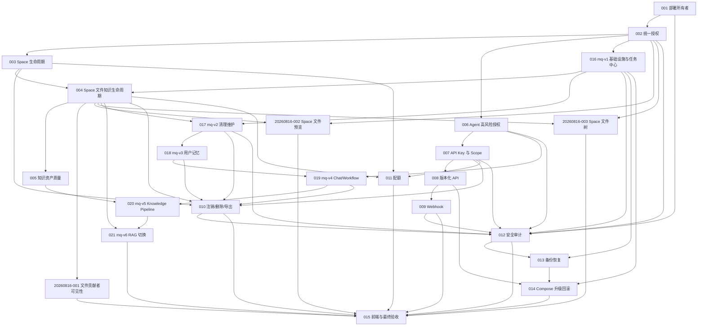

# Implement Unified Knowledge Platform and Async Task Architecture

## Summary

把统一知识管理平台与 RabbitMQ 统一异步任务架构合并为一条可执行实施主线。平台领域、安全和开放能力仍由 `REQ-20260725-001` / `ADR-20260725-001` 定义；存量重型异步任务迁移由 `REQ-20260725-002` / `ADR-20260725-002` 定义。两者共享统一授权、Space/文件/知识状态、审计、备份、部署和最终发布门禁，不再作为两份可独立排期的开发计划执行。

## Type

Feature + Refactor + Infrastructure Migration

## Source Requirements

- `REQ-20260725-001`：统一知识管理平台与开放能力。
- `REQ-20260725-002`：统一异步任务与 RabbitMQ 消息队列。
- `ADR-20260725-001`：统一知识平台领域与安全架构。
- `ADR-20260725-002`：RabbitMQ 统一异步任务架构。
- `TEST-20260725-001`：统一知识平台专项测试要求。
- `TEST-20260725-002`：统一异步任务与消息队列专项测试要求。
- `TEST-20260816-001`：Space 文件提交人与修改人可见性测试要求。
- `TEST-20260816-002`：Space 文件在线预览测试要求。
- `TEST-20260816-003`：Space 文件树与共享浏览体验测试要求。

## Status

Todo。全部实现、专项测试、集成门禁和观察窗口完成后，才能重命名为 `.done.md`。

## Integrated Scope and Coverage

### Platform requirements

| ID | Requirement | Task(s) |
|---|---|---|
| P1 | 单实例私有部署/SaaS 共用权限模型，不实现完整租户，不强制 HTTPS | 001, 002, 014, 015 |
| P2 | 首用户成为不可转移部署所有者，历史最小 `user_id` 迁移并恢复 | 001 |
| P3 | ADMIN 无私人数据全局豁免；所有者越权访问必须审计 | 002, 012 |
| P4 | 个人网盘与 Space 双模型；PERSONAL 永久私有；TEAM 唯一 OWNER | 003, 004 |
| P5 | 文件进入 Space 自动知识化，移出后停止检索并清理派生物 | 004, 017, 020, 021 |
| P6 | 知识资产校验通过自动生效，异常进入 `NEEDS_REVIEW` | 005, 020 |
| P7 | Agent 低风险自动执行；Web/API Key 高风险总授权只作用于 Tool | 006, 019 |
| P8 | 用户级 API Key，云盘/知识独立 Scope、目录根和 Space 快照范围 | 007 |
| P9 | `/api/v1`、无版本最新代理、旧 API 30 天后只读 | 008 |
| P10 | Webhook 至少一次、Scope 正文、签名、幂等和 SSRF 策略 | 009 |
| P11 | 注销 3 天、ADMIN 恢复、异步删除和加密数据导出 | 010, 017, 018, 019 |
| P12 | 用户组配额、TEAM 独立配额、物理内容只计一次、自然月用量 | 011 |
| P13 | 审计默认 7 天且可永久保留 | 012, 016, 017 |
| P14 | 每日 04:00 在线全备、隔离恢复后轮换、默认保留 1 份 | 013 |
| P15 | Compose 手动升级、备份门禁、维护模式和回滚 | 014, 016 |
| P16 | 所有能力具备生产 UI、测试证据和发布门禁 | 015, 016, 021 |
| P17 | Space 文件列表和版本历史展示可靠的提交人/最后修改人归因 | 20260816-001 |
| P18 | Space 当前文件和历史版本可在成员权限内在线预览 | 20260816-002 |
| P19 | Space 按目录浏览并复用 Personal 的核心 File Explorer 体验，同时保持双逻辑模型、独立授权和默认知识化 | 20260816-003 |

### Async/MQ requirements

| ID | Requirement | Task(s) |
|---|---|---|
| M1 | RabbitMQ、统一任务四表、Outbox/Inbox、租约/重试/取消、任务中心 | 016 |
| M2 | 物理清理与维护修复迁移 | 017 |
| M3 | 用户记忆、画像和向量任务迁移 | 018 |
| M4 | 知识 Chat 与 Workflow 生命周期迁移 | 019 |
| M5 | Knowledge Pipeline 迁移 | 020 |
| M6 | Space RAG、稳定 Point ID、批量扇出和最终切换 | 021 |

Coverage: platform 19/19，async/MQ 6/6，总计 25/25，100%。

## Integration Decisions

1. 保持两个需求和两个 ADR 的职责边界，不合并或重编号原文档；本文件是唯一实施编排事实源。
2. `REQ-20260725-002` 中“所有业务异步任务”限定为该需求纳入的六个存量重型异步域。Webhook、备份等新平台能力继续按各自 ADR 的持久状态机/Outbox 设计；若将来迁入 RabbitMQ，必须另行更新需求和 ADR。
3. 统一授权先于统一任务中心。TASK-016 的任务查询、重试、取消权限必须复用 TASK-002 的主体/资源/动作授权，不得建立第二套管理员豁免。
4. Space/文件领域状态由 TASK-003/004 定义；TASK-017/020/021 负责把相应重型执行迁入统一任务中心，不得在 MQ Consumer 中重新定义领域状态。
5. MySQL 同时是平台业务状态和异步任务事实源。RabbitMQ 只负责唤醒和削峰，不替代审计、备份或恢复事实。
6. 仓库只保留一个 `scripts/deploy.sh`：TASK-016 创建版本化发布、健康检查、冒烟和镜像自动回滚；TASK-014 在同一脚本/运维入口上补齐备份门禁、维护模式和整个平台升级/恢复规则，不创建第二套部署脚本。
7. 五份 TEST 都是必需专项门禁。任务按自身链接执行专项测试；TASK-015 最终发布必须同时满足 TEST-20260725-001/002 与 TEST-20260816-001/002/003。
8. 所有任务 ID 不变。实施顺序由依赖决定，而不是由编号大小决定。

## Current State

- 已有用户、角色、用户组、个人/Space 文件、RAG、知识画像、对话记忆、Workflow Tool Gateway、Compose 和测试基础。
- 权限、开放能力、账号生命周期、配额、审计、备份和升级仍是局部实现。
- 异步工作由 `ThreadPoolTaskExecutor`、`@Async`、定时恢复器和多个领域任务表分别承载。
- `/api/async` 仅聚合部分领域任务；没有统一尝试历史、租约续期、通用取消和跨进程消费。
- 生产仍可能由 `BootstrapAdminInitializer` 创建管理员；ADMIN 权限旁路和旧逐 Tool Grant 仍需删除。
- Space 后端已有当前文件和历史版本预览接口，但 Space 文件页面尚未提供预览入口。
- `space_file.created_by` 和 `file_version.created_by` 已有部分归因数据，但文件 VO/UI 未完整展示，且缺少不受 RAG 技术状态污染的最后修改人/用户修改时间。
- Space 后端已有目录节点、`parentId` 和树/子节点能力，但当前 Space 页面仍把全量文件平铺展示，上传和导入未绑定当前目录；Personal 与 Space 也没有带独立授权上下文的共享 File Explorer。

## Desired State

- 所有请求通过统一主体、资源、动作和 Scope 授权。
- 文件、Space、知识、Agent 和开放接口共享明确状态机与审计边界。
- 纳入 MQ 迁移的六个重型异步域全部登记 MySQL 统一任务，通过 RabbitMQ 分域执行。
- RabbitMQ 中断、重复投递、Worker 崩溃和迟到结果不会丢任务或覆盖新资源版本。
- 单机 Compose 具备真实恢复验证、受控升级、版本化部署、自动镜像回滚和完整发布证据。
- Space 成员可安全预览当前文件和历史版本，并能看到可靠、可解释且不泄露账号资料的提交人/最后修改人信息。
- Space 成员可按目录浏览和管理文件；Personal 与 Space 共享核心文件浏览体验，但继续使用双逻辑模型、独立授权和不同知识化规则。

## Architecture and Type Constraints

- Controller/Listener 只做协议适配；业务不变量在 Service/领域层强制。
- MySQL 是权威事实源；MinIO/Qdrant/RabbitMQ 副作用通过 Outbox、幂等键、资源版本和对账恢复。
- Listener 不包含大段领域分支，通过 `taskType` 注册表调用同步领域执行函数。
- Java DTO/VO/Entity 使用明确类型；稳定公共契约不用未约束 `Map`。
- TypeScript 不新增 `any`；外部 JSON 只能在最窄边界使用 `unknown` 并立即验证。
- Flyway 使用 expand-contract；已执行迁移不修改、不自动降级。
- 前端状态和控件隐藏不能代替后端授权。

## Types to Reuse

- Identity/Space/File：`User`、`Space`、`SpaceMember`、`File`、`SpaceFile`、`FileVersion`。
- Authorization：`PermissionGroup`、`PermissionGrant`、`UserPermissionKeys`。
- Knowledge：`SpaceRagDocument`、`SpaceRagChunkRef`、`SpaceKnowledge*`。
- Recovery：`PhysicalFileCleanupTask`、`CrossStoreOperation`。
- Workflow：`WorkflowContracts.RiskLevel`、`WorkflowToolRegistry`、`ToolInvocationContext`。
- Async UI：现有 `AsyncTaskVO`、`/api/async`、`TasksPage`，作为兼容入口扩展。

## Types to Create

- Platform：`DeploymentOwner`、`AccessSubject`、`ResourceAction`、`AdminResourceGrant`、`AgentRiskAuthorization`、`UserApiKey`、`ApiKeyScope`。
- Open/Lifecycle：`WebhookSubscription`、`WebhookEvent`、`WebhookDelivery`、`AccountDeletionJob`、`DataExportJob`、`UsageLedger`。
- Operations：`SecurityAuditEvent`、`BackupRun`、`RestoreVerification`、`UpgradeRun`。
- Async：`AsyncTask`、`AsyncTaskAttempt`、`MqOutbox`、`MqInbox` 及稳定状态/错误/消息信封类型。

## Integrated Dependency Graph

## Execution Waves

### Wave 1: Identity and authorization

1. TASK-20260725-001：部署所有者与首用户迁移。
2. TASK-20260725-002：统一授权并移除 ADMIN 全局权限豁免。
3. TASK-20260725-003：Space 生命周期与所有权。
4. TASK-20260725-006 → TASK-20260725-007 → TASK-20260725-008：Agent 授权、API Key、版本化 API；可在 TASK-003 之后与 MQ 主线按依赖并行。

### Wave 2: Async foundation and Space lifecycle

5. TASK-20260725-016：在统一授权之上建立 RabbitMQ、统一任务中心和首版 `deploy.sh`。
6. TASK-20260725-004：在 Space 状态与统一任务基座上定义文件/知识生命周期。
7. TASK-20260725-005：知识资产质量状态。
8. TASK-20260725-017：迁移清理和维护执行；完成 TASK-004 的跨存储重型执行闭环。

### Wave 3: Domain migration

9. TASK-20260725-018：用户记忆任务迁移。
10. TASK-20260725-019：Chat/Workflow 任务迁移，复用 TASK-006 高风险授权。
11. TASK-20260725-020：Knowledge Pipeline 迁移，复用 TASK-005 质量状态。
12. TASK-20260725-021：RAG、Point ID、父子任务与最终 MQ 切换。

mq-v1 至 mq-v6 仍按版本顺序独立实现、测试、提交、推送和观察；中间插入的平台任务不改变版本顺序。

### Wave 4: Platform lifecycle and operations

13. TASK-20260725-009：Webhook。
14. TASK-20260725-010：账号注销、删除与导出；必须在 cleanup、memory、chat/workflow 迁移后验证迟到任务隔离。
15. TASK-20260725-011：用户组与 TEAM 配额。
16. TASK-20260725-012：统一安全审计，覆盖平台动作和统一任务人工操作/清理。
17. TASK-20260725-013：完整备份与恢复，包含 RabbitMQ 配置/Secret 和 MySQL 任务事实恢复验证。
18. TASK-20260725-014：扩展 TASK-016 的同一个部署入口，增加备份门禁、维护模式和整个平台升级回滚。

### Wave 5: Space visibility and final release

19. TASK-20260816-001：补齐 Space 文件提交人与最后修改人归因；依赖 TASK-002/004，可与后续平台运维任务并行。
20. TASK-20260816-002：接入 Space 当前文件和历史版本在线预览；依赖 TASK-002/004，可与 TASK-20260816-001 并行。
21. TASK-20260816-003：实现 Space 文件树和 Personal/Space 共享 File Explorer 边界；依赖 TASK-002/004，可与 TASK-20260816-001/002 并行。
22. TASK-20260725-015：统一前端、全链路验收和发布。开始条件是 TASK-001～014、TASK-016～021 与 TASK-20260816-001/002/003 全部完成，不以 TASK 编号连续性代替依赖检查。

## Removal Specification

- 删除 `BootstrapAdminInitializer`、专属测试、配置引用和部署说明。
- 删除 `AccessControlMapper` 中基于 ADMIN 的全局允许分支。
- 撤销全部旧逐 Tool/参数 Grant；删除 `WorkflowConfirmationController/Service/Mapper/Record`、DTO、相似参数授权逻辑及最终旧表。
- mq-v6 观察窗口结束后，移除或永久关闭纳入范围的重型业务 `@Async` 创建/领取入口；旧领域表/兼容列只在独立 contract 任务中删除。
- 不删除旧领域任务历史，不把旧任务伪造成有 attempt 时间线的新任务。
- 使用 `rg` 验证无死代码、旧配置和过时文档引用。

## Shared Validation Gates

### Per-task

- 每个任务生成独立测试记录并回写 TASK 状态、证据、迁移号、配置和剩余风险。
- 编码完成但未通过必需测试只能标记 `pending-verification`。
- 任一 P0 安全、数据完整性、恢复或异步幂等测试失败，不得进入依赖它的下一任务。

### Per MQ version

- 满足 TEST-20260725-002 的通用门禁和当前版本矩阵。
- 后端、前端（若受影响）、Flyway、Compose、故障注入和 Feature Flag 回切均通过。
- 独立 commit/push 后才能开始下一 MQ 版本。

### Final release

- TEST-20260725-001、TEST-20260725-002、TEST-20260816-001、TEST-20260816-002 与 TEST-20260816-003 全部通过。
- `mvn test`、`npm test`、`npm run build`、Compose 配置/健康和浏览器 E2E 通过。
- Rabbit 中断、重复投递、Worker 崩溃、下游超时、应用降版、备份恢复和升级失败均有可复现证据。
- 25 项需求映射全部有实现和测试证据；Removal Specification 全部关单。
- 无未处置 DLQ、无旧新执行路径双跑、无 Point ID 跨逻辑文件覆盖。

## Risks and Rollback

- 单节点 RabbitMQ 不提供 HA；Broker 故障期间任务留在 MySQL/Outbox，恢复后补发。
- 协作取消不能立刻停止不可中断外部调用；结果发布前必须重新检查租约、取消和资源版本。
- MQ 应用回滚只切换旧镜像与 Feature Flag，不降级 Flyway、不删除卷。
- 数据损坏仅在人工判定后走 TASK-013 的备份恢复流程，不能由 `deploy.sh` 自动恢复数据库。
- 部署所有者无限访问、持久高风险授权、7 天默认审计、1 份默认 READY 备份和不强制 HTTPS 仍是已接受产品风险，必须在 UI/文档中披露。

## Ready to Implement

文档整合完成后，代码实施仍从 TASK-20260725-001 开始。执行者必须按本文件依赖图选择下一个任务；不得分别按“平台 001～015”和“MQ 016～021”两条独立计划推进。
