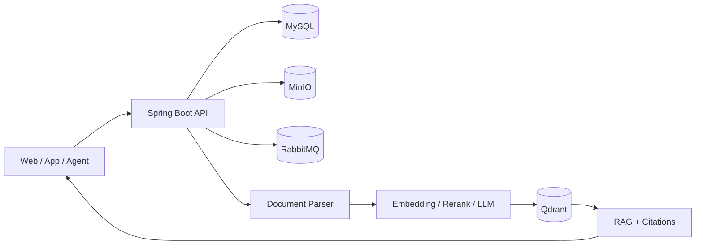

<div align="center">


# YLcloud

### File Resource Management & AI Knowledge Q&A

Manage files. Search knowledge. Trace every answer.

[简体中文](./README.md) · [English](./README.en.md)

[](https://github.com/YLorb/YLcloud)
[](https://openjdk.org/)
[](https://spring.io/projects/spring-boot)
[](https://react.dev/)
[](https://www.typescriptlang.org/)
[](https://docs.docker.com/compose/)

[](https://www.mysql.com/)
[](https://min.io/)
[](https://qdrant.tech/)
[](https://www.rabbitmq.com/)
[](./USER_GUIDE.zh-CN.md)

</div>

## Positioning

YLcloud is a file resource management, knowledge organization, and Q&A platform for individuals and small-to-medium teams. Its focus is to provide searchable, citable, and permission-controlled file governance.

It combines file management, collaborative Spaces, document knowledge processing, and RAG Q&A under one authorization boundary, so users and AI can only access explicitly permitted resources.

## Key Features

| Capability | Description |
| --- | --- |
| File management | Folders, multipart uploads, deduplication, previews, versions, sharing, and recycle bin |
| Space collaboration | Team directories, member roles, access control, and physical-file reuse |
| Knowledge processing | Parsing, OCR, structure-aware chunking, profiles, and processing states |
| RAG Q&A | BM25 + vector routes, RRF fusion, reranking, and traceable citations |
| Reliable tasks | RabbitMQ, idempotent jobs, persistent states, retries, and recovery |
| Agent extensions | Workflows, controlled tool calls, and optional sandboxed execution |

## Architecture



## Quick Install

Install Docker Desktop, or Docker Engine with Compose v2.

| Windows | Linux / macOS |
| --- | --- |
| `scripts\install.bat` | `chmod +x scripts/install.sh`<br>`./scripts/install.sh` |

The installer creates local configuration and secure random secrets, validates Compose, builds images, and waits for healthy services. Existing configuration is preserved.

```text
# Initialize and validate only
scripts\install.bat --check
./scripts/install.sh --check

# Reuse existing images
scripts\install.bat --skip-build
./scripts/install.sh --skip-build
```

| Service | Default URL |
| --- | --- |
| YLcloud Web | <http://127.0.0.1:5173> |
| Backend API | <http://127.0.0.1:8080> |
| MinIO Console | <http://127.0.0.1:9001> |

> The first user registered against an empty database becomes the deployment owner. The default offline model mode is only for connectivity checks; real RAG usage requires model configuration and quality validation.

The full user and deployment guide is currently maintained in Chinese: [USER_GUIDE.zh-CN.md](./USER_GUIDE.zh-CN.md).

## Technology Stack

| Layer | Technologies and versions |
| --- | --- |
| Web | React 18.3 · TypeScript 5.6 · Vite 5.4 · Tailwind CSS 4 · Radix UI |
| API | Java 17 · Spring Boot 3.3.5 · MyBatis 3.0.3 · Flyway 10.10 |
| Data | MySQL 8.3 · MinIO · Qdrant 1.15.4 · RabbitMQ 4.3.4 |
| AI / RAG | BGE Embedding · Cross-Encoder Rerank · BM25 · RRF · OpenAI-compatible APIs |
| Documents | Apache Tika 2.9 · PyMuPDF · Tesseract · OCR / VLM |
| Deployment | Docker Compose · Nginx · File-based Secrets |

## Roadmap

- Complete the existing APIs and establish permission, audit, and integration foundations for safe external-agent file operations.
- Build a more capable internal agent for managing files and knowledge bases directly from Web and App clients.
- Split non-core capabilities into optional components and reduce the default application footprint.
- Expand support for model providers, cloud APIs, and local models.
- Add session-based authentication, SSO, and OAuth 2.0 login.

---

<div align="center">

[中文使用指南](./USER_GUIDE.zh-CN.md) · [Issues](https://github.com/YLorb/YLcloud/issues) · [Repository](https://github.com/YLorb/YLcloud)

</div>
