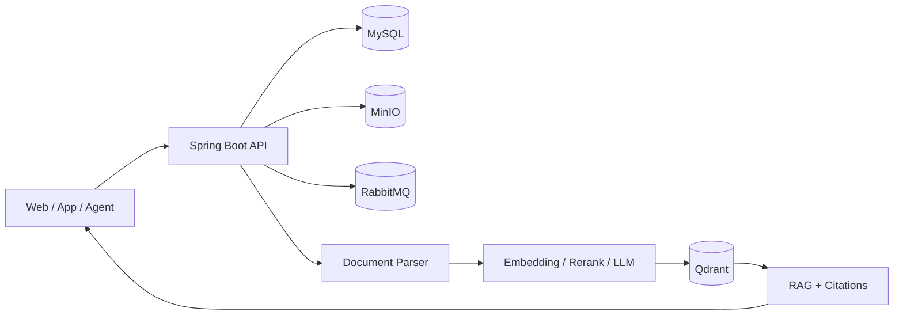

<div align="center">


# YLcloud

### 文件资源管理与 AI 知识问答平台

让文件可管理，让知识可检索，让答案可追溯。

[简体中文](./README.md) · [English](./README.en.md)

[](https://github.com/YLorb/YLcloud)
[](https://openjdk.org/)
[](https://spring.io/projects/spring-boot)
[](https://react.dev/)
[](https://www.typescriptlang.org/)
[](https://docs.docker.com/compose/)

[](https://www.mysql.com/)
[](https://min.io/)
[](https://qdrant.tech/)
[](https://www.rabbitmq.com/)
[](./USER_GUIDE.zh-CN.md)

</div>

## 项目定位

个人/中小型团队的文件资源管理&知识文档整理与问答。重心在为个人与团队提供可检索、可引用、权限可控的文件资源管控平台。

YLcloud 将文件管理、团队 Space、文档知识化和 RAG 问答整合到同一套权限边界中，让用户和 AI 只能访问被明确授权的资源。

## 核心能力

| 能力 | 说明 |
| --- | --- |
| 文件资源管理 | 文件夹、分片上传、秒传、预览、版本、分享与回收站 |
| Space 协作 | 团队目录、成员角色、权限控制与物理文件复用 |
| 知识文档整理 | 文档解析、OCR、结构化切分、知识画像与处理状态 |
| RAG 问答 | BM25 + 向量多路召回、RRF、Rerank 和引用溯源 |
| 任务可靠性 | RabbitMQ、幂等任务、状态持久化、重试与故障恢复 |
| Agent 扩展 | Workflow、受控 Tool 调用与可选 Sandbox 隔离执行 |

## 架构概览



## 快速安装

准备 Docker Desktop，或 Docker Engine 与 Compose v2。

| Windows | Linux / macOS |
| --- | --- |
| `scripts\install.bat` | `chmod +x scripts/install.sh`<br>`./scripts/install.sh` |

安装脚本会自动创建本地配置和安全随机 Secret，校验 Compose，构建镜像并等待服务健康；已有配置不会被覆盖。

```text
# 仅初始化并检查
scripts\install.bat --check
./scripts/install.sh --check

# 复用已有镜像
scripts\install.bat --skip-build
./scripts/install.sh --skip-build
```

| 服务 | 默认地址 |
| --- | --- |
| YLcloud Web | <http://127.0.0.1:5173> |
| Backend API | <http://127.0.0.1:8080> |
| MinIO Console | <http://127.0.0.1:9001> |

> 空数据库中的第一个注册用户会成为部署所有者。默认离线模型模式只用于连通测试；真实 RAG 使用前需要配置模型并完成效果验证。

完整的部署、登录、上传、Space、知识库、问答和系统设置说明见 [中文使用指南](./USER_GUIDE.zh-CN.md)。

## 技术栈

| 层次 | 技术与版本 |
| --- | --- |
| Web | React 18.3 · TypeScript 5.6 · Vite 5.4 · Tailwind CSS 4 · Radix UI |
| API | Java 17 · Spring Boot 3.3.5 · MyBatis 3.0.3 · Flyway 10.10 |
| 数据 | MySQL 8.3 · MinIO · Qdrant 1.15.4 · RabbitMQ 4.3.4 |
| AI / RAG | BGE Embedding · Cross-Encoder Rerank · BM25 · RRF · OpenAI-compatible API |
| 文档处理 | Apache Tika 2.9 · PyMuPDF · Tesseract · OCR / VLM |
| 部署 | Docker Compose · Nginx · File-based Secrets |

## TODO

- 完善现有 API 功能，并为后续向外提供安全、可靠的外部Agent暴露操控文件资源能力埋点；
- 搭建更完整、更智能的内部Agent，提供在web/app直接操控文件资源与知识库的能力；
- 将非核心功能拆解成组件，轻量化应用；
- 完善对各家模型的支持；
- 新增Session登录/SSO单点登录/OAuth2登录。

---

<div align="center">

[使用指南](./USER_GUIDE.zh-CN.md) · [问题反馈](https://github.com/YLorb/YLcloud/issues) · [项目主页](https://github.com/YLorb/YLcloud)

</div>
