# 代码理解：网盘、Space、RAG 与 AI Agent

## 1. 阅读范围

本文整理四组相互衔接的能力：个人网盘基础、Space 协作文件管理、Space 文件进入 RAG 知识库后的索引与查询链路，以及 AI Agent 基于知识、记忆和工具执行复杂任务的过程。

其中，个人网盘包含文件上传、秒传、目录树、重命名、移动、复制、回收站、预览、下载、分享和分片上传；Space 部分包含成员权限、文件树和多来源导入；RAG 部分包含解析、切片、Embedding、向量索引、知识检索、回答生成和故障修复；AI Agent 部分包含会话提交、意图计划、Graph Workflow、Tool Gateway、风险授权、异步调和和故障恢复。Webhook 和开放 API 仍不在本文范围内。

## 2. 核心数据模型

网盘没有把“文件内容”和“用户看到的文件节点”混在一起，而是拆成两层：

| 数据 | 职责 | 关键字段 |
| --- | --- | --- |
| `file_info` / `File` | 描述真实文件内容，对应 MinIO 对象 | `fileUuid`、`hash`、`md5`、`sha1`、`size`、`count` |
| `user_file` / `UserFileDTO` | 描述用户的目录树节点 | `id`、`userId`、`parentId`、`fileUuid`、`fileName`、`dir`、`status` |
| `file_share` / `FileShare` | 保存分享码与逻辑文件的绑定 | `shareCode`、`userFileId`、`ownerId`、`status` |
| `upload_task` / `UploadTask` | 记录分片上传任务 | `uploadId`、`totalChunks`、`uploadedChunks`、`status` |
| `upload_chunk` / `UploadChunk` | 记录已成功上传的分片 | `uploadId`、`chunkIndex`、`chunkMd5`、`objectName` |

这种设计的关键是：多个 `user_file` 可以引用同一个 `file_info`。因此，秒传和复制只需新建逻辑节点，不需要重复保存文件内容。

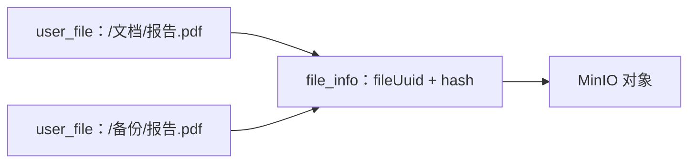

## 3. 功能一：普通文件上传与秒传

### 实现的具体功能

- 向指定目录上传文件。
- 检查文件名、大小、父目录和写权限。
- 计算 MD5、SHA1 和 SHA256。
- SHA256 命中已有内容时执行秒传。
- 通过 `Idempotency-Key` 防止重复提交产生多条文件记录。
- 在 MinIO 写入与 MySQL 事务之间进行跨存储补偿。

### 实现思路

1. `FileController.upload` 接收 `MultipartFile`、`parentId` 和幂等键。
2. `FileService.upload` 获取当前用户，校验文件及父目录。
3. 对父目录节点加锁，防止并发上传绕过同名检查。
4. 计算文件摘要，用 SHA256 查询 `file_info`。
5. 未命中：先写 MinIO，再写 `file_info` 和 `user_file`。
6. 命中：增加物理文件引用计数，只新建 `user_file`。
7. 更新路径、配额和生命周期记录，返回 `FileVO`。

### 实现代码

Controller 仅完成 HTTP 参数绑定。`FileService.upload` 的完整方法体（含权限、事务、幂等、秒传和跨存储补偿）已直接写入 [[#15.2 个人网盘上传的 Service 实现]]。

## 4. 功能二：目录和文件树管理

### 实现的具体功能

- 创建目录或空文件。
- 按父目录查询子节点。
- 按图片、视频、音乐、文档等类型聚合查询。
- 重命名、移动、复制，以及对最多 100 个节点进行批量操作。
- 校验节点归属、目标目录权限、同名冲突和目录循环移动。

### 实现思路

目录和文件都是 `user_file` 节点，用 `parentId` 构成树，用 `dir` 区分目录与普通文件。列表查询只返回当前用户在目标父目录下的有效节点。移动是修改 `parentId`，复制是新建逻辑节点并复用物理文件。

文件列表、重命名和移动的完整 Service 方法已直接写入 [[#15.3 文件树的查询、重命名与移动]]。

## 5. 功能三：预览与下载

### 实现的具体功能

- 下载用户有权访问的普通文件。
- 在线预览图片、PDF、视频、音频和文本。
- 对文本文件设置大小上限，避免一次读入过大内容。
- 根据扩展名设置 `Content-Type`，通过 MinIO 流式输出内容。

### 实现思路

先通过 `fileUuid + parentId + 当前用户` 定位逻辑文件并校验 READ/DOWNLOAD 权限，再查询物理文件。文本预览直接返回文本；媒体、PDF 等返回带权限校验的 stream URL。

`FileService.previewFile`、`previewFileStream`、`requirePreviewableFile` 和 `readTextPreview` 的完整方法体已直接写入 [[#15.13 文件预览与分享的完整方法]]。

## 6. 功能四：分享

### 实现的具体功能

- 为有效的逻辑文件生成分享码。
- 同一文件已有有效分享时直接复用。
- 匿名预览或下载时，根据分享码反查绑定文件，不接受任意文件 ID。

### 实现思路

`FileService.shareFile` 和 `generateUniqueShareCode` 的完整方法体已直接写入 [[#15.13 文件预览与分享的完整方法]]，其中保留文件状态、MODIFY 权限、已有分享回放、唯一码生成和 Mapper 失败处理。

## 7. 功能五：删除与回收站

### 实现的具体功能

- 普通删除将逻辑节点移入回收站。
- 查询当前用户的回收站文件。
- 恢复文件时重新校验父目录和同名冲突。
- 彻底删除逻辑节点，最后一个引用消失后再进入物理文件清理流程。

### 实现思路

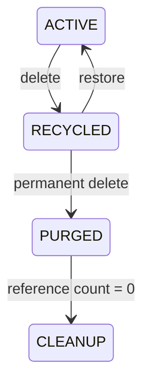

回收站只改变 `user_file` 的逻辑状态，不会立即删除 MinIO 对象。否则，其他复制节点、秒传节点或分享引用会一同失效。

## 8. 功能六：大文件分片上传

### 实现的具体功能

- 文件分片、失败重试和断点续传。
- 初始化阶段检查整文件 hash，支持大文件秒传。
- 每个分片按 `uploadId + chunkIndex` 幂等上传。
- 查询服务端已上传分片，客户端只补传缺失部分。
- 合并后重新计算整体摘要，防止传输或合并导致内容错误。
- 合并使用数据库 CAS/租约，防止并发生成重复记录。

### 实现思路

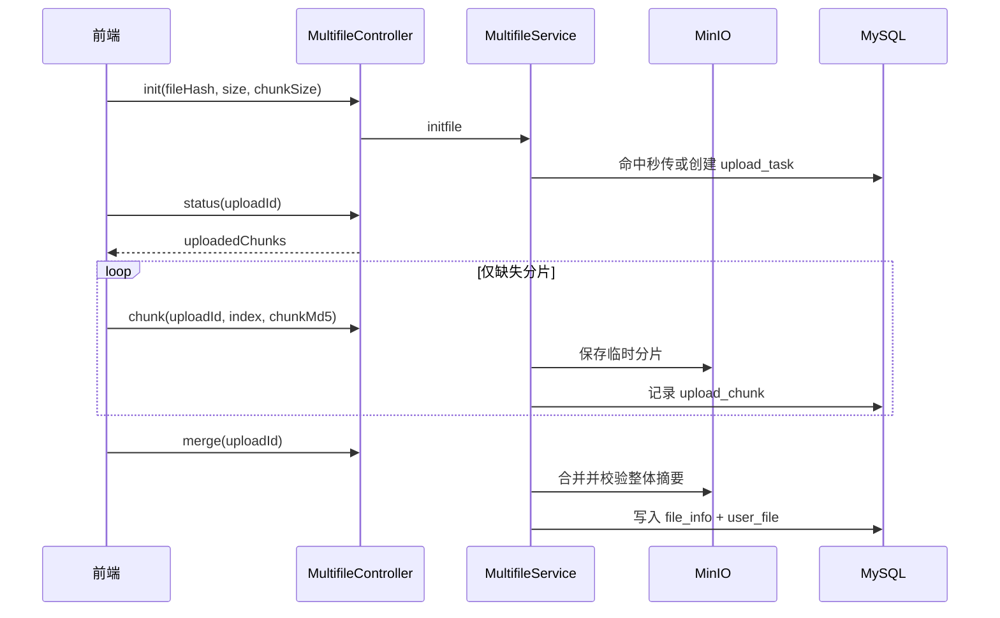

`MultifileService.initfile`、`uploadChunk` 和 `merge` 的完整方法体已直接写入 [[#15.5 分片上传、断点续传与合并]]。

## 9. 后端调用链

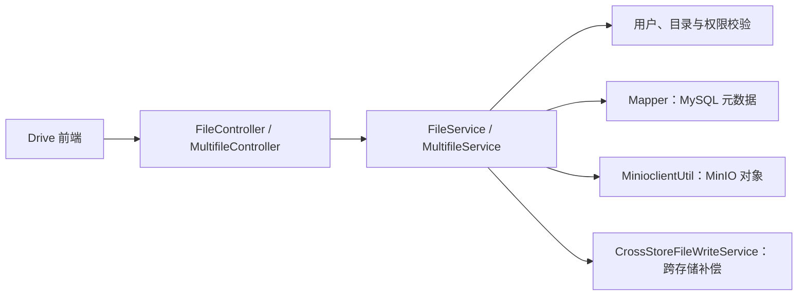

## 10. 主要代码位置

| 文件 | 职责 |
| --- | --- |
| `cloud-server/src/main/java/com/ylcloud/controller/FileController.java` | 个人文件 REST 接口 |
| `cloud-server/src/main/java/com/ylcloud/service/FileService.java` | 上传、文件树、预览、下载、分享、回收站的业务规则 |
| `cloud-server/src/main/java/com/ylcloud/controller/MultifileController.java` | 分片上传 REST 接口 |
| `cloud-server/src/main/java/com/ylcloud/service/MultifileService.java` | 分片任务、续传、合并和摘要校验 |
| `cloud-server/src/main/java/com/ylcloud/utils/MinioclientUtil.java` | MinIO 上传、流式读取、分片合并和清理 |
| `cloud-frontend/src/api.ts` | 前端文件 API 封装 |
| `cloud-frontend/src/features/files/multipartUpload.ts` | 前端分片上传编排、进度和断点恢复 |

## 11. 理解代码时需要记住的不变量

- 对外展示的文件节点 ID 与物理文件 `fileUuid` 是两个概念。
- 同一用户、同一父目录下的有效节点不能重名。
- 任何文件操作都不能只根据 `fileUuid` 执行，必须同时校验用户的逻辑节点和权限。
- 移入回收站不等于删除 MinIO 对象。
- 引用计数归零之前，物理文件不能被清理。
- MinIO 和 MySQL 不共享本地事务，必须使用幂等记录、事务后回调和补偿清理保持最终一致。

## 12. Space 协作空间

### 实现的具体功能

- 创建和查询 PERSONAL/TEAM Space，管理 Space 基本信息和生命周期。
- 管理 Space 成员及 OWNER、ADMIN、MEMBER 等角色权限。
- 在 Space 内创建目录、浏览文件树、搜索、重命名、移动和删除文件。
- 直接上传文件，或将个人网盘文件以引用方式导入 Space。
- 抓取 Web 链接，转换为 Markdown 文档后加入 Space。
- 普通文件进入 Space 后自动创建初始版本并进入 RAG 索引生命周期。

### 与个人网盘的区别

| 对比项 | 个人网盘 | Space |
| --- | --- | --- |
| 逻辑节点 | `user_file` | `space_file` |
| 权限边界 | 用户所有权 | Space 成员和角色 |
| 树节点 ID | `user_file.id` | `space_file.id` |
| 物理内容 | 通过 `fileUuid` 引用 `file_info` | 同样通过 `fileUuid` 引用 `file_info` |
| 知识化 | 默认不自动建索引 | 普通文件默认触发 RAG |

### 实现思路

Space 的文件树由 `space_file.parentId` 组织，所有操作先通过 `SpaceFileAccessService` 或 `SpacePermissionService` 校验成员身份和操作权限。

文件来源有三种：

1. **Space 直接上传**：计算摘要、Sandbox 预检、写入 MinIO，创建 `file_info` 和 `space_file`。
2. **个人文件导入**：校验用户可读权限后复用已有 `file_info`，只创建新的 `space_file` 引用。
3. **Web 链接导入**：限制 HTTP/HTTPS 地址，抓取页面并生成 Markdown，再按新文件保存。

三条路径最终都会执行 `spaceRagService.handleFileImported(spaceFile, userId)`，让文件进入同一套 RAG 任务链路。

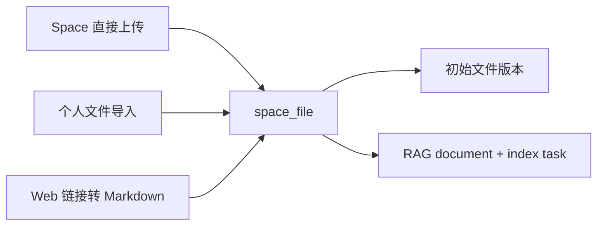

### 实现代码

`SpaceFileService.uploadFile` 的完整方法体已直接写入 [[#15.6 Space 文件上传与 RAG 触发]]。`SpaceFileService.importUserFile` 的完整方法体已直接写入 [[#15.14 个人文件导入 Space 与 RAG 任务创建]]，其中保留 Space 权限、父目录锁、个人文件可读性、内容防重、Sandbox 预检、TEAM 配额、内容占位、引用计数、初始版本和 RAG 触发等全部分支。

### Space 主要代码位置

| 文件 | 职责 |
| --- | --- |
| `SpaceController.java` / `SpaceService.java` | Space 创建、查询、更新和生命周期 |
| `SpaceMemberController.java` / `SpaceMemberService.java` | 成员邀请、角色修改、移除和所有权规则 |
| `SpacePermissionService.java` / `SpaceFileAccessService.java` | Space 成员和文件操作权限判定 |
| `SpaceFileController.java` / `SpaceFileService.java` | Space 文件树、上传、导入、搜索和删除 |
| `FileVersionService.java` | Space 文件版本上传、预览、下载和恢复 |

## 13. RAG 知识库

### 实现的具体功能

- Space 文件上传或导入后自动建立知识库文档。
- 完成文档解析、切片、Embedding 和 Qdrant 向量索引。
- 在指定 Space 范围内执行问题改写、知识检索和 LLM 回答生成。
- 返回命中 chunk、上下文、文档引用和各阶段耗时。
- 管理 chunkSize、chunkOverlap、topK、temperature 等 Space 级配置。
- 查看文档与任务状态，支持重建、失败重试和向量修复。

### 索引实现思路

1. Space 文件事务内调用 `handleFileImported`。
2. 目录不参与知识化；普通文件创建 `space_rag_document` 和 PENDING 任务。
3. 任务在事务提交后通过 MQ 或本地执行器异步调度。
4. 读取 MinIO 文件，调用 Document Parser 解析正文。
5. `StructuredChunker` 切分文本，Embedding 服务把 chunk 转换为向量。
6. 向 Qdrant 写入向量，并验证向量数量、维度和 point count。
7. 所有硬性校验通过后，才启用 chunk ref 并将文档置为 `RAG_READY`。

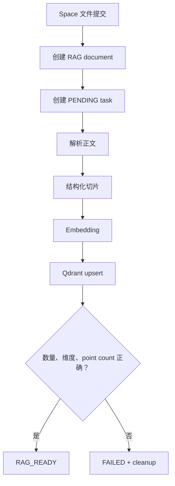

### 索引触发代码

`SpaceRagService.handleFileImported` 会先过期化占用中的旧任务，再创建 document、检查正在运行的文件任务、创建持久化索引任务，并按 MQ 配置决定是否在事务提交后本地调度。完整方法体已直接写入 [[#15.14 个人文件导入 Space 与 RAG 任务创建]]。

### RAG 查询实现思路

1. 校验用户是 Space 成员，并检查站点 AI 开关和 Space RAG 开关。
2. 根据 Space 配置和检索模式确定 `topK`。
3. `QueryRewriteService` 结合当前问题和历史对话生成查询计划。
4. `searchChunks` 在 `spaceId` 范围内搜索可用 chunk。
5. `RagChatService` 使用检索上下文调用 LLM 生成回答。
6. 记录查询日志，组装引用、命中 chunk 和分阶段耗时。

`SpaceRagService.query` 的完整 Service 方法已直接写入 [[#15.7 RAG 查询的完整方法]]。

### RAG 状态、失败与修复

- 正文为空、chunk 为空、Embedding 数量或维度错误、向量包含 NaN/Infinity，都不能标记成功。
- Qdrant 写入后必须验证 point count 与 chunk 数量一致。
- 索引失败后任务进入 `FAILED`，文档不对外检索，不用元数据伪造成功结果。
- `retryTask` 重试单任务，`rebuildFile/rebuildSpace` 重建索引，`repairFileVectors/repairSpaceVectors` 修复向量一致性。
- 管理类操作要求 OWNER/ADMIN，普通成员只能查询已授权内容。

### RAG 主要代码位置

| 文件 | 职责 |
| --- | --- |
| `SpaceRagController.java` | RAG 配置、查询、文档、任务、重建和修复入口 |
| `SpaceRagService.java` | RAG 文档生命周期、索引编排和查询主流程 |
| `RagTaskExecutorService.java` | 异步执行文件、Space、修复和删除任务 |
| `RagIndexTransactionService.java` | 索引构建、成功切换和失败清理状态转移 |
| `QdrantVectorStoreService.java` | 向量写入、搜索、计数和删除 |
| `RagChatService.java` | 使用召回上下文调用 LLM 生成答案 |
| `QueryRewriteService.java` | 基于问题和历史对话生成检索计划 |

## 14. AI Agent

### 14.1 Agent 的定位

AI Agent 不只是“调用大模型回答问题”。在本项目中，Agent 会根据用户目标选择或生成执行计划，在授权范围内读取 Space 知识、检索用户记忆、调用工具，并将中间状态与最终结果持久化。

Agent 的输入主要包括：

- 用户问题或任务目标。
- 会话的短期上下文。
- 用户选定且有权访问的 Space。
- RAG 检索到的文档 chunk 和引用。
- 与当前任务相关的用户长期记忆。
- 当前身份允许调用的工具与 Scope。

Agent 的输出包括最终回答、来源引用、执行状态、工具结果和 Trace。没有检索到可用文档时，引用列表可以为空；对高风险操作，不能仅凭模型决定直接执行。

### 14.2 实现的具体功能

- 创建知识对话会话，并在会话中异步提交 Agent 任务。
- 为请求保存用户消息和占位的 assistant 消息，支持进度查询、失败重试和用户取消。
- 简单知识问答直接使用 RAG 检索与生成链路。
- 复杂任务创建持久化 Workflow Run，执行意图计划、节点调度、工具调用和结果汇总。
- 支持 START、LLM、TOOL、CONDITION、LOOP、MERGE 和 END 等图节点。
- 支持节点超时、重试、取消、执行预算、持久化快照和故障恢复。
- 通过 Tool Gateway 访问知识库、用户记忆、Space 文件管理与外部服务。
- 对删除文件、删除记忆、发送邮件等高风险操作进行额外授权校验和安全审计。

### 14.3 RAG 问答与 Agent Workflow 的关系

| 路径 | 适用场景 | 主要行为 |
| --- | --- | --- |
| 直接 RAG | “根据知识库回答问题”类简单请求 | 构建上下文、检索 chunk、调用 LLM、返回引用 |
| Agent Workflow | 需要多步计划、工具调用、写操作或长时间执行的任务 | 创建 Run，执行 Graph Workflow，持久化节点状态，调用工具，再生成最终回答 |

`KnowledgeChatQueryService` 是两条路径共用的业务入口。当 Workflow 开启时，消息交给 `WorkflowMessageLifecycleService`；未开启或走简单查询时，由 `KnowledgeRagQueryService` 直接完成回答。

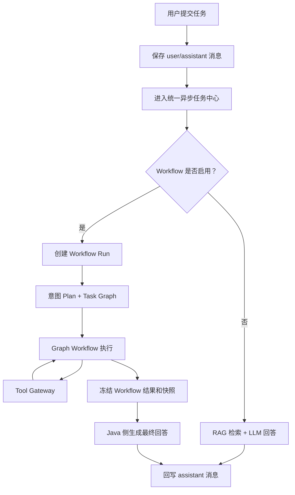

### 14.4 Agent 任务提交

请求入口是 `POST /api/assistant/sessions/{sessionId}/queries`。Controller 从登录上下文获取用户，不接受客户端伪造的用户 ID。`KnowledgeChatQueryService.submit` 的完整方法体已直接写入 [[#15.8 Agent 消息提交的完整方法]]。

### 14.5 意图计划与 Task Graph

Workflow 服务中的 `IntentPlanner` 把用户目标分解为主任务和子任务，每个任务包含意图、依赖、置信度、相关性和不确定性。计划不会直接执行，而是先通过 `TaskGraphValidator` 验证。

- 固定置信度门槛为 `0.7`。
- 最多进行四轮语义重试。
- 低置信且无关的子任务会被丢弃。
- 低置信的可选子任务会被标记为 `SKIPPED_UNCERTAIN`。
- 安全性无法确定的主任务不会降级为工具调用。
- 模型持续不可用时，只保留纯 Context 处理，不生成危险 Tool 路由。

`IntentPlanner.resolve` 的完整 Python 方法体已直接写入 [[#15.12 Workflow 意图计划的真实实现]]。

### 14.6 Graph Workflow 执行思路

Planner 输出会被编译为统一 Workflow 图。`GraphWorkflowExecutor` 不依赖模型自由跳转，而是按编译后的稳定拓扑序、节点 outcome 和 edge 条件执行。

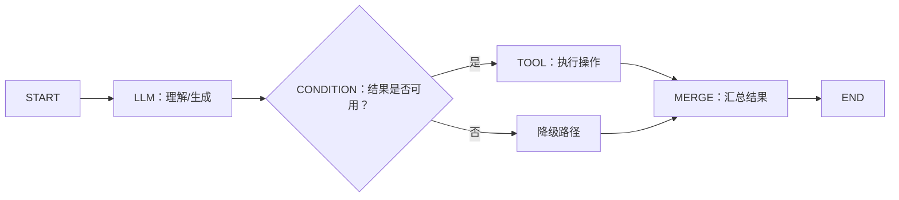

`GraphWorkflowExecutor.run` 包含 Loop SCC、Outcome Router、取消清理路由、CAS 提交、Trace 和孤儿 Worker 恢复。完整方法体已直接写入 [[#15.15 Graph Workflow 执行器的完整方法]]。

### 14.7 Java 与 Workflow 服务的调用关系

Java 业务服务保留用户、会话、Space 权限、最终消息和业务工具的权威。Python Workflow 服务负责计划与图执行，不直接绕过 Java 修改业务数据。

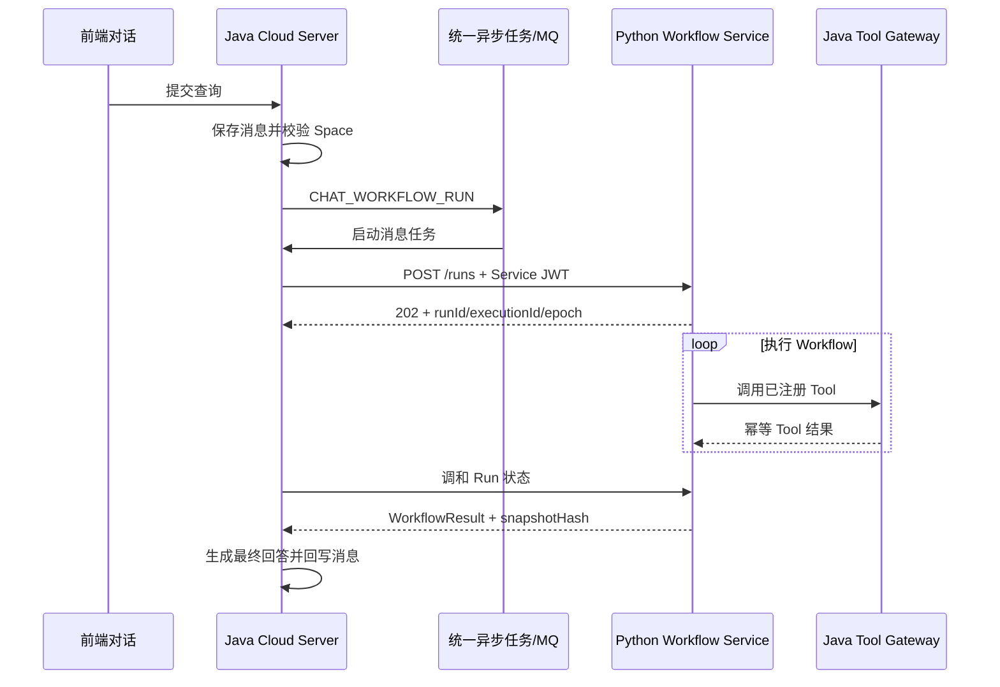

`WorkflowMessageLifecycleService` 用 `runId + executionId + executionEpoch` 确认远程结果是否属于当前执行轮次，旧轮次的延迟回调不能覆盖新结果。

`WorkflowMessageLifecycleService.reconcile` 的完整错误分类、Mapper 参数、轮次校验与最终生成代码已直接写入 [[#15.9 Workflow 调和与最终回答生成]]。

### 14.8 Tool Gateway 与工具注册

Workflow 不能任意调用 Java Service。工具必须显式注册到 `WorkflowToolRegistry`，并声明风险级与 Scope。

| 工具类型 | 示例 | 风险 |
| --- | --- | --- |
| 会话与知识读取 | `conversation.verify_context`、`knowledge.search`、`knowledge.load_chunks` | READ_ONLY |
| 用户记忆 | `memory.search`、`memory.save`、`memory.update` | READ_ONLY / WRITE |
| Space 文件 | `knowledge.file.list`、`knowledge.file.create_folder`、`knowledge.file.delete` | READ_ONLY / WRITE / HIGH |
| 外部服务 | `web.search`、`smtp.send_email`、`caldav.create_event` | READ_ONLY / HIGH |

当前 SMTP、CalDAV 和 Web Search 的外部 Provider 默认可使用确定性 Mock；未配置真实 Provider 时不应将 Mock 结果解释为真实外部副作用。

Agent 工具创建 Space 目录的注册实现如下：

```java
@Bean
WorkflowToolHandler knowledgeFileCreateFolder(
        SpaceFileService files, ObjectMapper objectMapper) {
    // 工具名、风险级和 Scope 在注册时固定
    return tool(
        "knowledge.file.create_folder",
        RiskLevel.WRITE,
        "tool.knowledge.write",
        (context, arguments) -> {
            // 从工具参数构建业务 DTO
            SpaceFolderCreateDTO dto = new SpaceFolderCreateDTO();
            dto.setName(textArg(arguments, "name", 255));
            dto.setParentId(arguments.get("parentId") == null
                ? null : longArg(arguments, "parentId"));

            // 使用 Tool Context 中的真实用户身份执行原有 Service 权限校验
            return nonNullMap(objectMapper.convertValue(
                files.createFolder(
                    longArg(arguments, "spaceId"), dto, context.userId()),
                new TypeReference<Map<String, Object>>() {}));
        });
}
```

### 14.9 工具幂等与风险控制

`WorkflowToolInvocationService` 把 `invocationId` 作为副作用的唯一幂等键。同一调用重试时回放已持久化结果，不会再次删除文件、发送邮件或创建日程。

`WorkflowToolInvocationService.invoke` 和 `replay` 的完整并发冲突、高风险门禁、异常契约和结果回放代码已直接写入 [[#15.10 Tool Gateway 幂等执行的完整方法]]。

高风险授权支持：

- `ALLOW_ONCE`：一次性授权，绑定首个成功消费的 `invocationId`，最长有效 15 分钟。
- `PERSISTENT`：持续授权，可设置过期时间并支持主动撤销。
- Web 账号和 API Key 授权分开绑定，不能相互借用。
- 授权成功和拒绝都会记录安全审计事件。

### 14.10 Agent 状态与故障恢复

Agent 消息和 Workflow Run 各有状态，前端先展示 Java 业务状态，再在详情中展示 Workflow 执行状态。

| 层级 | 典型状态 |
| --- | --- |
| assistant 消息 | `QUEUED`、`RUNNING`、`SUCCESS`、`FAILED`、`CANCELED` |
| Workflow Run | `PENDING`、`RUNNING`、`WAITING_TOOL`、`WAITING_HUMAN`、`SUCCEEDED`、`DEGRADED`、`FAILED`、`CANCELLED`、`TIMED_OUT` |
| Workflow Node | `pending`、`active`、`running`、`success`、`failed`、`timed_out`、`cancelled`、`inactive` |

恢复机制包括：

- Run 和节点结果先持久化，进程崩溃后不会丢失全部进度。
- Java 侧定时调和未受理或仍在运行的 Workflow 消息。
- MQ 模式下，不活跃的 Agent 消息会重新注册到统一异步任务中心。
- 用户重试保留原 `runId`，生成新 `executionId` 并增加 `executionEpoch`。
- 取消时同时取消统一任务和远程 Workflow，并通过版本栅栏拒绝迟到的 Worker 写入。
- Workflow 成功但最终回答生成暂时失败时，可只重试回答生成，不重复执行工具副作用。

### 14.11 Agent 与网盘、Space、RAG、Sandbox 的关系

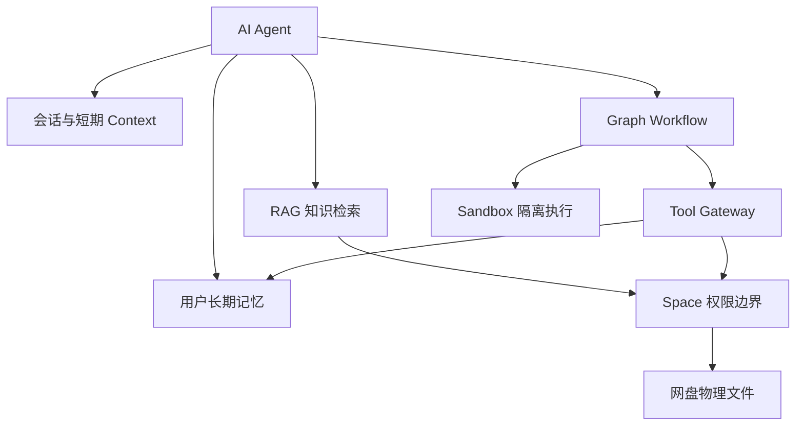

- **网盘**提供真实文件内容和内容寻址能力。
- **Space** 决定 Agent 能看到哪些协作文件，并继续承担文件写操作的权限边界。
- **RAG** 把 Space 文件变成 Agent 可检索的 chunk 和引用。
- **Workflow** 把自然语言目标转换为可追踪、可重试的执行图。
- **Tool Gateway** 将 Agent 能力限制在显式注册的业务操作中，并重用原有 Java Service 权限校验。
- **Sandbox** 承载需要代码、命令或文件处理的隔离执行，不把宿主机 Shell 直接暴露给模型。

### 14.12 AI Agent 主要代码位置

| 文件 | 职责 |
| --- | --- |
| `KnowledgeChatSessionController.java` | 会话、Agent 查询、重试、取消和反馈入口 |
| `KnowledgeChatQueryService.java` | 消息幂等提交、Space 授权、RAG/Workflow 路由和异步任务 |
| `WorkflowMessageLifecycleService.java` | Java 消息与 Workflow Run 绑定、调和、重试、取消和最终生成 |
| `WorkflowRunRequestFactory.java` | 把会话消息、Space 范围和 Context 转换为 Workflow Run 请求 |
| `WorkflowHttpClient.java` | 使用 Service JWT 创建、查询、重试和取消远程 Run |
| `InternalWorkflowToolController.java` | 仅供 Workflow 服务调用的 Java Tool Gateway |
| `WorkflowBuiltinToolConfiguration.java` | 注册知识、记忆、Space 文件与外部工具 |
| `WorkflowToolInvocationService.java` | Tool 风险级、调用幂等、结果回放和高风险门禁 |
| `AgentRiskAuthorizationService.java` | 一次性/持续高风险授权、消费、过期、撤销与审计 |
| `workflow-service/mini_agent_flow/intent/planner.py` | 意图识别、Task Graph、置信度和安全降级 |
| `workflow-service/mini_agent_flow/engine/graph_executor.py` | Graph Workflow 编译、激活、执行、Loop、Outcome、取消和持久化 |
| `workflow-service/mini_agent_flow/tools/ylcloud_gateway.py` | Workflow 侧对 Java Tool Gateway 的调用封装 |
| `workflow-service/mini_agent_flow/tools/sandbox_client.py` | 调用 Sandbox 执行隔离工具 |

### 14.13 阅读 Agent 代码时的关键不变量

- 模型输出是不可信输入，必须经过 Schema、Task Graph、Tool Registry、Scope 和风险等级校验。
- Workflow 服务不直接写业务库；写操作要通过 Java Tool Gateway 和原有 Service 权限边界。
- `runId` 表示逻辑任务，`executionId + executionEpoch` 表示具体执行轮次，重试不能被旧轮次结果覆盖。
- `invocationId` 是工具副作用的唯一幂等键，重试必须回放结果，不能再次执行。
- HIGH 工具除了 Scope 外还必须有有效的高风险总授权。
- Agent 只能读取当前用户所属 Space 的知识，引用、文件列表和 Tool 执行必须采用同一授权边界。
- Workflow 结果和最终自然语言回答分开：图执行冻结可审计结果，Java 侧再根据该结果生成用户可读回答。

## 15. 完整方法实现

### 15.1 阅读说明

前文说明功能与调用关系，本节展示真正执行业务规则的 Service 方法。

以下代码遵循三个原则：

1. 每个代码块都保留当前仓库中对应方法的完整方法体，不用伪代码、虚构辅助函数或只展示接口调用。
2. 为了阅读性增加中文注释，但不删除真实的权限校验、事务、异常、幂等和补偿分支。
3. 方法内部对已有辅助方法和 Mapper 的调用保持原样；其职责与源码位置在 [[#15.11 辅助实现的追踪表]] 中继续追踪。

### 15.2 个人网盘上传的 Service 实现

源码位置：`cloud-server/src/main/java/com/ylcloud/service/FileService.java`

```java
@Transactional
public FileVO upload(MultipartFile uploadFile,
                     Long parentId,
                     String idempotencyKey) {
    // 1. 从认证上下文获取当前用户，不信任客户端传入的用户身份
    Long userId = BaseContext.getCurrentId();

    // 2. 校验文件大小、空内容和文件名安全性
    validateUploadFile(uploadFile);
    String originalFilename = requireSafeFileName(
        uploadFile.getOriginalFilename());
    if (uploadFile.isEmpty()) {
        throw new BaseException("上传文件不能为空");
    }

    // 3. 将 0/null 父目录转换为当前用户根目录
    parentId = normalizeParentId(parentId, userId);

    // 4. 父节点必须存在、是目录，且用户具有 WRITE 权限
    UserFileDTO parent = requireFileById(parentId, FilePermission.WRITE);
    requireWritableDirectory(parent);

    // 5. 锁定父目录，使同名检查和插入在并发下仍可靠
    fileInfoMapper.lockUserFileById(parent.getId());
    Long ownerId = parent.getUserId();

    // 6. 计算完整文件摘要：MD5/SHA1 用于兼容，SHA256 作为内容身份
    String md5;
    String sha1;
    String hash;
    try {
        md5 = Md5Util.md5(uploadFile.getInputStream());
        sha1 = HashUtil.sha1(uploadFile.getInputStream());
        hash = HashUtil.sha256(uploadFile.getInputStream());
    } catch (IOException exception) {
        throw new RuntimeException("文件解析失败", exception);
    }

    // 7. 根据 Idempotency-Key 领取跨存储操作记录
    AtomicReference<String> resultRef = new AtomicReference<>();
    String effectiveKey = idempotencyKey == null || idempotencyKey.isBlank()
        ? UuidUtil.randomUuid() : idempotencyKey;
    requireValidIdempotencyKey(effectiveKey);
    String operationKey = CrossStoreOperationService.key(
        "PERSONAL_UPLOAD", userId, effectiveKey);
    CrossStoreOperation operation = crossStoreOperationService.claim(
        operationKey,
        "PERSONAL_UPLOAD",
        CrossStoreOperationService.payloadHash(
            ownerId, parentId, originalFilename,
            uploadFile.getSize(), hash),
        UuidUtil.randomUuid());

    // 8. 相同幂等请求已完成时，回放原逻辑文件结果
    if (CrossStoreOperationService.SUCCESS.equals(
            operation.getOperationStatus())) {
        return replayPersonalUpload(operation, ownerId, parentId);
    }

    // 事务提交后再把 user_file.id 记录为操作结果
    crossStoreOperationService.completeAfterCommit(
        operationKey, resultRef::get);

    // 9. 同一目录不允许出现同名普通文件
    requireNoNameConflict(
        originalFilename, 0, parentId, ownerId, null);

    // 10. 用 SHA256 查找可复用的物理文件
    File existingFile = fileInfoMapper.getFileByHash(hash);

    // 计算本次新增的实际占用容量；秒传可能不增加物理字节
    storageService.requireAvailable(
        ownerId,
        storageService.additionalBytes(
            ownerId,
            existingFile == null ? null : existingFile.getFileUuid(),
            uploadFile.getSize()));

    if (existingFile == null) {
        // 11A. 未命中内容：构建新的 file_info
        String fileUuid = operation.getResourceId();
        File file = File.builder()
            .name(originalFilename)
            .fileUuid(fileUuid)
            .dir(false)
            .type(getFileType(originalFilename))
            .size(uploadFile.getSize())
            .hash(hash)
            .md5(md5)
            .sha1(sha1)
            .status(1)
            .count(1)
            .createTime(LocalDateTime.now())
            .updateTime(LocalDateTime.now())
            .build();

        // 构建用户文件树中的逻辑节点
        UserFileDTO userFile = UserFileDTO.builder()
            .userId(ownerId)
            .parentId(parentId)
            .fileUuid(fileUuid)
            .fileName(originalFilename)
            .status(1)
            .Dir(0)
            .path(null)
            .createtime(file.getCreateTime())
            .updatetime(file.getUpdateTime())
            .build();

        try {
            // 先写 MinIO，失败时不继续写 MySQL 元数据
            crossStoreFileWriteService.putNewObject(
                uploadFile, file.getFileUuid());
        } catch (Exception exception) {
            throw new RuntimeException(exception);
        }

        // 写入物理文件与逻辑文件树节点
        fileInfoMapper.insertFileInfo(file);
        fileInfoMapper.insertFile_User(userFile);

        // 记录配额引用与生命周期
        recordUserQuotaReference(userFile);
        spaceFileLifecycleService.personalFileAdded(userFile);

        // 节点获得自增 ID 后再计算完整路径
        userFile.setPath(getPath(userFile.getId(), ownerId));
        fileInfoMapper.updatePath(
            userFile.getId(), userFile.getFileUuid(),
            userFile.getPath(), ownerId);

        // 保存幂等回放所需的 user_file.id
        resultRef.set(String.valueOf(userFile.getId()));
        crossStoreOperationService.recordResultCandidate(
            operationKey, resultRef.get());
        emitFileEvent("FILE_CREATED", userFile);
        return toFileVO(userFile);
    }

    // 11B. 命中相同内容：不再写 MinIO，只创建新逻辑引用
    UserFileDTO same = fileInfoMapper.getByFileUuidAndParent(
        existingFile.getFileUuid(), parentId, ownerId);
    if (same != null) {
        throw new ConflictException("已存在相同文件");
    }

    UserFileDTO userFile = UserFileDTO.builder()
        .userId(ownerId)
        .parentId(parentId)
        .fileUuid(existingFile.getFileUuid())
        .fileName(originalFilename)
        .status(1)
        .Dir(0)
        .path(null)
        .createtime(LocalDateTime.now())
        .updatetime(LocalDateTime.now())
        .build();

    // 秒传首先增加物理文件引用计数
    if (fileInfoMapper.updateFileCount(
            existingFile.getFileUuid(), 1) == 0) {
        throw new BaseException("文件引用计数更新失败");
    }

    // 新建 user_file，然后补齐路径、配额和事件
    fileInfoMapper.insertFile_User(userFile);
    recordUserQuotaReference(userFile);
    spaceFileLifecycleService.personalFileAdded(userFile);
    userFile.setPath(getPath(userFile.getId(), ownerId));
    fileInfoMapper.updatePath(
        userFile.getId(), userFile.getFileUuid(),
        userFile.getPath(), ownerId);
    resultRef.set(String.valueOf(userFile.getId()));
    crossStoreOperationService.recordResultCandidate(
        operationKey, resultRef.get());
    emitFileEvent("FILE_CREATED", userFile);
    return toFileVO(userFile);
}
```

这段代码的重点不是“把文件写进 MinIO”，而是同时解决以下问题：

- 逻辑目录权限与同名冲突。
- MinIO 对象与 MySQL 元数据的跨存储一致性。
- SHA256 内容去重与物理引用计数。
- HTTP 重试时的幂等回放。
- 配额、生命周期与文件事件的联动。

#### 为什么 Mapper 写入不放进 CrossStoreFileWriteService

`FileService.upload` 本身已由 `@Transactional` 开启 MySQL 本地事务。`fileInfoMapper.insertFileInfo` 和 `fileInfoMapper.insertFile_User` 使用同一 DataSource，会自动加入当前 Spring 事务；其中任意一条 SQL 失败，两条 SQL 都会回滚。

MinIO 不能加入 MySQL 本地事务，因此 `CrossStoreFileWriteService.putNewObject` 只封装外部存储写入，并通过 `CrossStoreCompensationService.removeNewObjectOnRollback` 注册事务回滚后的 MinIO 删除补偿。

```java
public void putNewObject(MultipartFile file,
                         String objectName) throws Exception {
    // MinIO 写入立即生效，不受 MySQL 事务管理
    minioclientUtil.putObject(file, objectName);

    // 注册事务同步回调：外层 MySQL 事务回滚时删除新 MinIO 对象
    compensationService.removeNewObjectOnRollback(objectName);
}
```

因此这里的一致性边界是：

```text
FileService.upload 的 MySQL 事务
├── MinIO putObject        → 事务外写入，回滚时执行补偿删除
├── INSERT file_info      → MySQL 本地事务
└── INSERT user_file      → MySQL 本地事务
```

把 Mapper 调用移入 `CrossStoreFileWriteService` 不会获得更强的事务性，反而会让“外部存储补偿”与“文件领域元数据”的职责混在一起。

### 15.3 文件树的查询、重命名与移动

源码位置：`cloud-server/src/main/java/com/ylcloud/service/FileService.java`

```java
public List<FileVO> listFiles(Long parentId, Long userId) {
    // 先用统一授权服务验证私有资源读权限
    authorizationService.require(
        AccessSubject.user(BaseContext.getCurrentId()),
        ResourceType.USER_PRIVATE,
        userId,
        ResourceAction.READ);

    // null/0 被规范化为用户根目录 ID
    parentId = normalizeParentId(parentId, userId);
    UserFileDTO parent = fileInfoMapper.getByFileId(parentId, userId);

    // 父节点必须存在、启用且为目录
    if (parent == null || parent.getStatus() == StatusConstant.DISABLE) {
        throw new NotFoundException("目录不存在或已失效");
    }
    if (parent.getDir() != 1) {
        throw new BaseException("目标位置不是目录");
    }

    // 只查询该 owner 在当前层级的有效子节点
    return listChildren(parentId, parent.getUserId()).stream()
        .map(this::toFileVO)
        .toList();
}

public FileVO renameFile(String fileUuid,
                         Long parentId,
                         String newName) {
    // fileUuid 必须在当前 parentId 下对应一个可修改逻辑节点
    UserFileDTO target = requireFileByUuid(
        fileUuid, parentId, FilePermission.MODIFY);
    newName = requireSafeFileName(newName);

    if (newName == null || newName.trim().isEmpty()) {
        throw new BaseException("文件名不能为空");
    }
    if (!userFileAvailable(target)) {
        throw new BaseException("文件当前不可重命名");
    }

    // 检查同目录、同节点类型的同名冲突
    List<UserFileDTO> siblings = fileInfoMapper.listFileByparentId(
        target.getParentId(), target.getUserId());
    for (UserFileDTO sibling : siblings) {
        if (sibling.getFileName().equals(newName)
                && sibling.getDir() == target.getDir()) {
            throw new ConflictException("存在同名文件，重命名失败");
        }
    }

    // 按逻辑节点 ID 更新名称，不修改物理 file_info
    LocalDateTime now = LocalDateTime.now();
    if (fileInfoMapper.updateNameById(
            target.getId(), newName, now) == 0) {
        throw new BaseException("重命名失败");
    }
    target.setFileName(newName);
    target.setUpdatetime(now);
    emitFileEvent("FILE_UPDATED", target);
    return toFileVO(target);
}

@Transactional
public Boolean movefiles(Long sourceplace, Long targetplace) {
    // 源节点要求 MODIFY，目标目录要求 WRITE
    UserFileDTO source = requireFileById(
        sourceplace, FilePermission.MODIFY);
    UserFileDTO target = requireFileById(
        targetplace, FilePermission.WRITE);

    if (source.getStatus() == 0 || target.getStatus() == 0) {
        throw new BaseException("文件状态不可移动");
    }
    if (target.getDir() == 0) {
        throw new BaseException("目标位置不是目录");
    }
    if (!source.getUserId().equals(target.getUserId())) {
        throw new BaseException("不能跨用户移动文件");
    }

    // 目录不能被移入自己或自己的后代目录
    if (source.getDir() == 1
            && isChildDir(source.getId(), target.getId(),
                          source.getUserId())) {
        throw new BaseException("不能移动目录到自身或子目录");
    }

    // 移动前检查目标目录同名冲突
    requireNoNameConflict(
        source.getFileName(), source.getDir(), target.getId(),
        source.getUserId(), source.getId());

    // 先计算并设置新 parentId
    source.setParentId(normalizeParentId(
        target.getId(), target.getUserId()));

    // 普通文件按节点 ID 更新 parentId，然后更新自身路径
    if (source.getDir() == 0) {
        int rows = fileInfoMapper.updateParent(
            source.getId(), target.getId(), LocalDateTime.now());
        if (rows == 0) {
            throw new BaseException("移动失败");
        }
        source.setPath(getPath(source.getId(), source.getUserId()));
        fileInfoMapper.updatePath(
            source.getId(), source.getFileUuid(),
            source.getPath(), source.getUserId());
    } else {
        // 目录节点使用 ID + UUID + owner 更新，避免命中错误逻辑节点
        fileInfoMapper.updateParentWithUuid(
            source.getId(), source.getFileUuid(),
            source.getParentId(), source.getUserId());

        // 目录移动后，广度遍历子树并重新计算每个节点的 path
        Queue<UserFileDTO> queue = new LinkedList<>();
        queue.offer(fileInfoMapper.getByFileUuid(
            source.getFileUuid(), source.getUserId()));
        while (!queue.isEmpty()) {
            UserFileDTO current = queue.poll();
            current.setPath(getPath(current.getId(), source.getUserId()));
            fileInfoMapper.updatePath(
                current.getId(), current.getFileUuid(),
                current.getPath(), source.getUserId());
            if (current.getDir() == 1) {
                queue.addAll(fileInfoMapper.listFileByparentId(
                    current.getId(), source.getUserId()));
            }
        }
    }

    source.setUpdatetime(LocalDateTime.now());
    emitFileEvent("FILE_UPDATED", source);
    return true;
}
```

### 15.4 回收站与物理文件清理

源码位置：`cloud-server/src/main/java/com/ylcloud/service/FileService.java`

```java
private void softDeleteTree(UserFileDTO node) {
    // 每一个被递归处理的节点都要校验 DELETE 权限
    requirePermission(node, FilePermission.DELETE);

    // 重复删除已在回收站的节点按幂等成功处理
    if (node.getStatus() == StatusConstant.RECYCLE) {
        return;
    }
    if (node.getStatus() != StatusConstant.ENABLE) {
        throw new BaseException("文件状态不可删除");
    }

    // 逻辑文件移入回收站后，关闭它对应的公开分享
    fileShareMapper.disableByUserFileId(
        node.getId(), node.getUserId());

    // 目录删除递归处理所有子节点
    List<UserFileDTO> children = listChildren(
        node.getId(), node.getUserId());
    children.forEach(this::softDeleteTree);

    // 只修改 user_file 逻辑状态，此时不删除 MinIO 对象
    if (fileInfoMapper.updateStatusById(
            node.getId(), StatusConstant.RECYCLE,
            LocalDateTime.now()) == 0) {
        throw new BaseException("文件移入回收站失败");
    }

    // 回收站文件不再计入当前活动逻辑引用配额
    if (quotaService != null && node.getDir() == 0) {
        quotaService.releaseReference("USER_FILE", node.getId());
    }
}

@Transactional
public Boolean deleteRecycleFilePermanently(Long fileId) {
    // 彻底删除仅允许作用于回收站节点
    UserFileDTO node = requireFileByIdActiveOrRecycle(
        fileId, FilePermission.DELETE);
    if (node.getStatus() != StatusConstant.RECYCLE) {
        throw new BaseException("只能彻底删除回收站中的文件");
    }
    hardDeleteTree(node);
    return StatusConstant.SUCCESS;
}

private void hardDeleteTree(UserFileDTO node) {
    requirePermission(node, FilePermission.DELETE);
    if (node.getDir() == 1) {
        // 目录必须先删除子节点，再删除自身
        List<UserFileDTO> children = listChildrenActiveOrRecycle(
            node.getId(), node.getUserId());
        children.forEach(this::hardDeleteTree);
        hardDeleteUserFile(node);
        return;
    }

    // 文件节点删除时同步减少 file_info 业务引用计数
    hardDeletePhysicalFileReference(node);
}

@Transactional
public void deleteOSS(UserFileDTO node) {
    File physical = fileInfoMapper.getFileByFileUuid(
        node.getFileUuid(), node.getUserId());
    if (physical == null) {
        throw new BaseException("文件元数据不存在");
    }

    // 只有所有业务引用已归零，才允许进入物理清理队列
    Integer referenceCount = fileInfoMapper.getFileCount(
        node.getFileUuid());
    if (referenceCount == null || referenceCount != 0) {
        throw new BaseException("物理文件仍有业务引用，不能直接清理");
    }
    physicalFileCleanupService.enqueue(node.getFileUuid());
}
```

### 15.5 分片上传、断点续传与合并

源码位置：`cloud-server/src/main/java/com/ylcloud/service/MultifileService.java`

```java
@Transactional
public InitifileVO initfile(MultifileDTO dto, Long userId) {
    // 1. 校验文件名、大小、摘要、分片大小和分片数量
    validateInitParam(dto);
    Long parentId = normalizeParentId(dto.getParentId(), userId);
    String uploadId = normalizeUploadId(dto.getUploadId());

    // fileKey 限定“用户 + 父目录 + 文件名”只有一个活动上传任务
    String fileKey = uploadFileKey(
        userId, parentId, dto.getFileName());

    // 2. uploadId 已存在时校验参数一致性并恢复原任务
    UploadTask existingTask = multifileMapper.getByUploadId(
        uploadId, userId);
    if (existingTask != null) {
        return resumeExistingTask(existingTask, dto, parentId);
    }

    // 3. 同名文件已有活动任务时，要求继续原任务
    UploadTask occupyingTask = multifileMapper.getActiveByFileKey(fileKey);
    if (occupyingTask != null) {
        if (!Objects.equals(occupyingTask.getUserId(), userId)) {
            throw new ConflictException("同名文件正在上传，请稍后重试");
        }
        return resumeExistingTask(occupyingTask, dto, parentId);
    }
    requireNoSameName(dto.getFileName(), parentId, userId);

    // 4. 使用 MD5 + SHA1 + size 查找可秒传的既有内容
    File existingFile = fileInfoMapper.getFileByMd5Sha1Size(
        dto.getFileMd5(), dto.getFileSha1(), dto.getFileSize());
    storageService.requireAvailable(
        userId,
        storageService.additionalBytes(
            userId,
            existingFile == null ? null : existingFile.getFileUuid(),
            dto.getFileSize()));

    if (existingFile != null) {
        // 命中内容时直接创建 user_file，不创建 upload_task
        FileVO file = reuseExistingFile(
            existingFile, dto.getFileName(), parentId, userId);
        InitifileVO result = new InitifileVO();
        result.setInstantUpload(true);
        result.setUploadedChunks(List.of());
        result.setFile(file);
        return result;
    }

    // 5. 后端确定最终分片大小和分片数
    Long chunkSize = dto.getChunkSize() == null
        ? DEFAULT_CHUNK_SIZE : dto.getChunkSize();
    Integer totalChunks = dto.getTotalChunks() == null
        ? Math.toIntExact(
            (dto.getFileSize() + chunkSize - 1) / chunkSize)
        : dto.getTotalChunks();

    // 6. 持久化 UPLOADING 任务，使进程重启后仍能续传
    LocalDateTime now = LocalDateTime.now();
    UploadTask task = new UploadTask();
    task.setUploadId(uploadId);
    task.setFileKey(fileKey);
    task.setUserId(userId);
    task.setParentId(parentId);
    task.setFileName(dto.getFileName());
    task.setFileSize(dto.getFileSize());
    task.setFileMd5(dto.getFileMd5());
    task.setFileSha1(dto.getFileSha1());
    task.setFileHash(dto.getFileHash());
    task.setChunkSize(chunkSize);
    task.setTotalChunks(totalChunks);
    task.setUploadedChunks(0);
    task.setStatus(UploadTaskConstant.UPLOADING);
    task.setFileUuid(UuidUtil.randomUuid());
    task.setLastActivityTime(now);
    task.setMergeStartedTime(null);
    task.setCreatetime(now);
    task.setUpdatetime(now);

    try {
        multifileMapper.insert(task);
    } catch (DuplicateKeyException exception) {
        // 并发初始化时只有唯一约束的胜者能创建活动任务
        UploadTask winner = multifileMapper.getActiveByFileKey(fileKey);
        if (winner != null && winner.getUploadId().equals(uploadId)) {
            return resumeExistingTask(winner, dto, parentId);
        }
        throw new ConflictException(
            "同名文件正在上传，请使用原 uploadId 继续断点续传");
    }
    return buildInitVO(task, false);
}

public Boolean uploadChunk(MultipartFile file,
                           String uploadId,
                           Integer chunkIndex,
                           String chunkMd5,
                           Long userId) {
    // 1. 任务必须属于当前用户且处于可上传状态
    if (file == null || file.isEmpty()) {
        throw new BaseException("分片不能为空");
    }
    UploadTask task = requireUploadingTask(uploadId, userId);
    if (chunkIndex == null || chunkIndex < 0
            || chunkIndex >= task.getTotalChunks()) {
        throw new BaseException("分片序号不合法");
    }

    // 2. 校验非末分片/末分片应有的字节数，并计算真实 MD5
    validateChunkSize(file, task, chunkIndex);
    String realChunkMd5 = calculateChunkMd5(file, chunkMd5);
    String objectName = "chunks/" + task.getFileUuid()
        + "/" + chunkIndex;

    // 3. 以 uploadId + chunkIndex 领取分片租约，防止并发重复上传
    ChunkUploadLeaseService.Lease lease =
        chunkUploadLeaseService.reserve(
            uploadId, chunkIndex, realChunkMd5,
            file.getSize(), objectName);
    if (lease.completed()) {
        multifileMapper.touch(uploadId);
        return true;
    }

    try {
        // 4. 分片以稳定对象名写入 MinIO
        String uploadedObjectName = minioclientUtil.uploadFilePart(
            task.getFileUuid(), task.getFileName(), file,
            chunkIndex, task.getTotalChunks());
        if (!objectName.equals(uploadedObjectName)) {
            throw new IllegalStateException("分片对象名与租约不一致");
        }

        // 5. 持久化分片完成状态
        chunkUploadLeaseService.complete(
            uploadId, chunkIndex, lease.token());
        return true;
    } catch (Exception exception) {
        // 失败时释放租约，允许后续重试接管
        chunkUploadLeaseService.release(
            uploadId, chunkIndex, lease.token());
        throw new BaseException("分片上传失败");
    }
}

@Transactional
public FileVO merge(String uploadId, Long userId) {
    UploadTask task = multifileMapper.getByUploadId(uploadId, userId);
    if (task == null) {
        throw new BaseException("上传任务不存在");
    }

    // 1. 已合并的任务直接回放结果，正在合并时拒绝并发请求
    if (UploadTaskConstant.MERGED.equals(task.getStatus())) {
        return mergedResult(task, userId);
    }
    if (UploadTaskConstant.MERGING.equals(task.getStatus())) {
        throw new ConflictException("文件正在合并，请稍后查询结果");
    }
    if (!UploadTaskConstant.UPLOADING.equals(task.getStatus())
            && !UploadTaskConstant.FAIL.equals(task.getStatus())) {
        throw new BaseException("上传任务状态异常");
    }

    // 2. 分片数量必须与任务声明完全一致
    List<Integer> uploaded = chunkUploadMapper.listUploadedIndexes(uploadId);
    if (uploaded.size() != task.getTotalChunks()) {
        throw new BaseException("分片未上传完整");
    }

    Long parentId = normalizeParentId(task.getParentId(), userId);
    requireNoSameName(task.getFileName(), parentId, userId);
    storageService.requireAvailable(
        userId,
        storageService.additionalBytes(
            userId, task.getFileUuid(), task.getFileSize()));

    // 3. CAS 把 UPLOADING/FAIL 切换为 MERGING，只允许一个请求获胜
    if (multifileMapper.claimMerge(uploadId, userId) == 0) {
        UploadTask latest = multifileMapper.getByUploadId(uploadId, userId);
        if (latest != null
                && UploadTaskConstant.MERGED.equals(latest.getStatus())) {
            return mergedResult(latest, userId);
        }
        throw new ConflictException("文件正在合并，请稍后查询结果");
    }

    String fileUuid = task.getFileUuid();
    FileMergeReqVO request = new FileMergeReqVO();
    request.setUploadId(uploadId);
    request.setFileUuid(fileUuid);
    request.setFileName(task.getFileName());
    request.setPartNames(chunkUploadMapper.listObjectNames(uploadId));

    try {
        // 4. 断线重试时，若最终对象已存在且尺寸正确，不重复 compose
        if (!minioclientUtil.objectMatchesSize(
                fileUuid, task.getFileSize())) {
            minioclientUtil.mergeFileParts(request);
        }

        // 5. 从 MinIO 实际读取合并结果，校验 MD5/SHA1/SHA256
        validateMergedObjectDigests(task, fileUuid);

        // 6. 创建 file_info 和 user_file，然后标记任务 MERGED
        FileVO file = saveMergedFile(
            task, fileUuid, parentId, userId);
        if (multifileMapper.markMerged(uploadId, fileUuid) == 0) {
            throw new IllegalStateException("上传任务合并状态提交失败");
        }

        // 7. 只在事务成功提交后清理临时分片
        cleanupPartsAfterCommit(task.getId(), fileUuid);
        return file;
    } catch (MergedObjectDigestException exception) {
        // 摘要不匹配时删除错误的最终对象，不保留伪成功内容
        try {
            minioclientUtil.removeObjectAllVersions(fileUuid);
        } catch (Exception cleanupError) {
            exception.addSuppressed(cleanupError);
        }
        throw new BaseException("合并文件摘要校验失败");
    } catch (Exception exception) {
        throw new BaseException("分片合并失败");
    }
}
```

### 15.6 Space 文件上传与 RAG 触发

源码位置：`cloud-server/src/main/java/com/ylcloud/service/SpaceFileService.java`

```java
@Transactional
public SpaceFileVO uploadFile(Long spaceId,
                              MultipartFile uploadFile,
                              Long parentId,
                              String name,
                              Long userId,
                              String idempotencyKey) {
    // 1. Space 写入使用成员角色/节点授权，不使用个人网盘所有权判断
    spaceFileAccessService.requireCreate(spaceId, userId);

    // 2. 校验文件，并使用安全文件名
    validateUploadFile(uploadFile);
    String fileName = name == null || name.isBlank()
        ? uploadFile.getOriginalFilename() : name;
    fileName = requireSafeFileName(fileName);

    // 3. 定位并锁定 Space 父目录
    Long realParentId = normalizeParentId(spaceId, parentId);
    SpaceFile parent = requireDirectory(spaceId, realParentId);
    spaceFileMapper.lockById(spaceId, realParentId);

    // 4. 计算整体摘要，禁止同一 Space 重复导入相同内容
    FileFingerprint fingerprint = calculateFingerprint(uploadFile);
    requireNoDuplicateContent(spaceId, fingerprint.hash());

    // 5. 在存储前把文件流交给 Sandbox 预检
    try {
        preflightService.inspect(
            fileName,
            fingerprint.hash(),
            uploadFile.getSize(),
            uploadFile.getInputStream(),
            userId);
    } catch (BaseException exception) {
        throw exception;
    } catch (Exception exception) {
        throw new BaseException(503, "无法读取上传文件进行 Sandbox 预检");
    }

    // 6. 检查 TEAM Space 的存储配额
    if (quotaService != null) {
        quotaService.requireTeamStorage(
            spaceId, fingerprint.hash(), uploadFile.getSize());
    }

    // 7. 领取 SPACE_UPLOAD 跨存储幂等操作
    AtomicReference<String> resultRef = new AtomicReference<>();
    String effectiveKey = idempotencyKey == null || idempotencyKey.isBlank()
        ? UuidUtil.randomUuid() : idempotencyKey;
    requireValidIdempotencyKey(effectiveKey);
    String operationKey = CrossStoreOperationService.key(
        "SPACE_UPLOAD", userId, effectiveKey);
    CrossStoreOperation operation = crossStoreOperationService.claim(
        operationKey,
        "SPACE_UPLOAD",
        CrossStoreOperationService.payloadHash(
            spaceId, realParentId, fileName,
            uploadFile.getSize(), fingerprint.hash()),
        UuidUtil.randomUuid());

    if (CrossStoreOperationService.SUCCESS.equals(
            operation.getOperationStatus())) {
        return replaySpaceUpload(operation, spaceId, realParentId);
    }
    crossStoreOperationService.completeAfterCommit(
        operationKey, resultRef::get);

    // 8. 同目录同名检查完成后，保存物理内容和 space_file
    requireNoSameName(spaceId, realParentId, fileName, 0);
    StoredPhysicalFile stored = storeMultipartFile(
        uploadFile, fileName, fingerprint,
        operation.getResourceId());
    SpaceFile spaceFile = createSpaceFile(
        spaceId, parent, stored.fileUuid(), fileName, userId);

    // 9. 按 Space 设置创建初始版本，并记录文件生命周期
    ensureInitialVersionIfEnabled(spaceFile, userId);
    lifecycleService.fileAdded(spaceFile, userId);

    // 10. 在当前事务中创建 RAG document/task，真正索引在提交后调度
    spaceRagService.handleFileImported(spaceFile, userId);

    resultRef.set(String.valueOf(spaceFile.getId()));
    crossStoreOperationService.recordResultCandidate(
        operationKey, resultRef.get());
    return toVO(
        spaceFileMapper.getById(spaceId, spaceFile.getId()), userId);
}
```

### 15.7 RAG 查询的完整方法

源码位置：`cloud-server/src/main/java/com/ylcloud/service/SpaceRagService.java`

```java
@Transactional
public SpaceRagQueryVO query(Long spaceId,
                            SpaceRagQueryDTO dto,
                            Long userId) {
    long startedAt = System.nanoTime();

    // 1. RAG 检索必须受 Space 成员权限限制
    spacePermissionService.requireMember(spaceId, userId);

    // 2. 站点级 AI 开关和 Space 级 RAG 开关必须同时启用
    if (!Boolean.TRUE.equals(siteSettingService.getBoolean(
            SiteSettingService.LLM_ENABLED, true))) {
        throw new BaseException("管理员已停用 AI 问答");
    }
    SpaceRagConfig config = requireConfig(spaceId);
    if (!StatusConstant.ENABLE.equals(config.getEnabled())) {
        throw new BaseException("当前空间未启用 RAG");
    }

    // 3. 根据 Space 配置和检索模式计算召回上限
    int limit = resolveQueryTopK(config, dto.getRetrievalMode());

    // 4. 结合问题与历史对话构建查询计划
    QueryPlan queryPlan = queryRewriteService.plan(
        dto.getQuestion(), dto.getHistory());
    long rewriteFinishedAt = System.nanoTime();

    // 5. 在当前 spaceId 的活动 chunk ref 中执行多路检索和排序
    List<FileRagChunk> chunks = searchChunks(
        spaceId, queryPlan, limit, config);
    long retrievalFinishedAt = System.nanoTime();

    // 6. 将原问题、召回 chunk、Space 配置和会话历史交给 LLM
    RagChatResult chatResult = ragChatService.answer(
        dto.getQuestion(), chunks, config, dto.getHistory());
    long generationFinishedAt = System.nanoTime();

    String answer = chatResult.getAnswer();
    boolean noAnswer = chatResult.isNoAnswer()
        || answer == null || answer.isBlank();

    // 7. 只有实际产生答案时才展示命中上下文和引用
    List<Long> hitChunkIds = new ArrayList<>();
    List<String> contexts = new ArrayList<>();
    StringJoiner idJoiner = new StringJoiner(",");
    if (!noAnswer) {
        for (FileRagChunk chunk : chunks) {
            hitChunkIds.add(chunk.getId());
            contexts.add(chunk.getContent());
            idJoiner.add(String.valueOf(chunk.getId()));
        }
    }

    // 8. 持久化查询记录，用于无答案分析、质量评估和审计
    saveQueryLog(
        spaceId,
        userId,
        dto.getQuestion(),
        answer,
        idJoiner.toString(),
        blankToCurrent(chatResult.getModelName(), config.getChatModel()),
        limit,
        safeTemperature(config.getTemperature()),
        chatResult.isSuccess(),
        chatResult.getErrorMessage());

    // 9. 返回答案、命中 chunk、引用和各阶段耗时
    SpaceRagQueryVO result = new SpaceRagQueryVO();
    result.setSpaceId(spaceId);
    result.setQuestion(dto.getQuestion());
    result.setAnswer(answer);
    result.setHitChunkIds(hitChunkIds);
    result.setContexts(contexts);
    result.setCitations(
        noAnswer ? new ArrayList<>() : buildCitations(spaceId, chunks));
    result.setRetrievedChunkIds(
        chunks.stream().map(FileRagChunk::getId).toList());
    result.setRewriteDurationMs(
        elapsedMillis(startedAt, rewriteFinishedAt));
    result.setRetrievalDurationMs(
        elapsedMillis(rewriteFinishedAt, retrievalFinishedAt));
    result.setGenerationDurationMs(
        elapsedMillis(retrievalFinishedAt, generationFinishedAt));
    result.setTotalDurationMs(
        elapsedMillis(startedAt, generationFinishedAt));
    return result;
}
```

`searchChunks` 内部还会调用多路检索器，将原问题、改写问题、Multi Query、HyDE、Step-back 及关键词路由的候选结果进行融合，并保留 Space 与活动文档状态过滤。

### 15.8 Agent 消息提交的完整方法

源码位置：`cloud-server/src/main/java/com/ylcloud/service/KnowledgeChatQueryService.java`

```java
@Transactional
public KnowledgeChatMessageVO submit(Long sessionId,
                                     Long userId,
                                     KnowledgeChatQueryCreateDTO dto,
                                     String requestKey) {
    // 1. 锁定用户拥有的会话，保证消息序号分配不冲突
    KnowledgeChatSession session = requireSessionForUpdate(
        sessionId, userId);

    // 2. 规范化知识范围，并逐一验证 Space 成员权限
    List<Long> spaceIds = normalizeSpaces(dto.getSpaceIds());
    spaceIds.forEach(spaceId ->
        spacePermissionService.requireMember(spaceId, userId));

    // 3. 同一会话内使用 requestKey 实现请求幂等
    String normalizedKey = normalizeRequestKey(requestKey);
    KnowledgeChatMessage existing = messageMapper.getByRequestKey(
        sessionId, normalizedKey);
    if (existing != null) {
        return toVO(existing);
    }

    // 4. 预留用户 Agent 并发任务配额
    if (quotaService != null) {
        quotaService.reserveAgentTask(userId);
    }

    LocalDateTime now = LocalDateTime.now();
    long firstSequence = session.getNextSequenceNo() == null
        ? 1 : session.getNextSequenceNo();

    // 一次预留 user + assistant 两个连续序号
    if (sessionMapper.reserveSequences(
            sessionId, userId, 2, now) == 0) {
        throw new BaseException("会话序号分配失败");
    }

    // 5. 先持久化用户消息
    KnowledgeChatMessage userMessage = new KnowledgeChatMessage();
    userMessage.setSessionId(sessionId);
    userMessage.setUserId(userId);
    userMessage.setSequenceNo(firstSequence);
    userMessage.setRole("user");
    userMessage.setContent(dto.getQuestion().trim());
    userMessage.setRetryCount(0);
    userMessage.setStatus(StatusConstant.ENABLE);
    userMessage.setCreatetime(now);
    userMessage.setUpdatetime(now);
    messageMapper.insert(userMessage);

    // 6. 再持久化 QUEUED 的 assistant 占位消息
    dto.setSpaceIds(spaceIds);
    KnowledgeChatMessage assistant = new KnowledgeChatMessage();
    assistant.setSessionId(sessionId);
    assistant.setUserId(userId);
    assistant.setSequenceNo(firstSequence + 1);
    assistant.setSourceMessageId(userMessage.getId());
    assistant.setRole("assistant");
    assistant.setContent("正在生成回答…");
    assistant.setTaskStatus("QUEUED");
    assistant.setRequestKey(normalizedKey);
    assistant.setRequestJson(writeRequest(dto));
    assistant.setRetryCount(0);
    assistant.setAsyncVersion(1L);
    assistant.setStatus(StatusConstant.ENABLE);
    assistant.setCreatetime(now);
    assistant.setUpdatetime(now);
    messageMapper.insert(assistant);
    sessionMapper.touch(session.getId(), userId, now);

    // 7. MQ 模式下注册统一异步任务；任务类型由 Workflow 开关决定
    if (mqChatEnabled()) {
        registerUnified(
            assistant,
            workflowEnabled() ? "CHAT_WORKFLOW_RUN" : "CHAT_QUERY");
    } else {
        // 非 MQ 模式也必须等事务提交后才启动异步执行
        dispatchAfterCommit(assistant.getId());
    }
    return toVO(assistant);
}
```

### 15.9 Workflow 调和与最终回答生成

源码位置：`cloud-server/src/main/java/com/ylcloud/workflow/client/WorkflowMessageLifecycleService.java`

```java
public void reconcile(Long messageId) {
    KnowledgeChatMessage message = messageMapper.getTaskById(messageId);
    if (message == null || message.getWorkflowRunId() == null) {
        return;
    }

    // Workflow 已完成、但最终回答尚未生成时，只执行最终生成
    if ("PENDING".equals(message.getGenerationStatus())) {
        generateFinal(message);
        return;
    }

    // 不是 Workflow 活动状态时无需继续轮询
    if (!isWorkflowActive(message.getWorkflowStatus())) {
        return;
    }

    try {
        UUID runId = UUID.fromString(message.getWorkflowRunId());

        // 1. 查询远程 Run 的当前状态
        WorkflowRunStatusResponse remote = client.getRun(runId);

        // 2. 使用 runId + executionId + epoch 拒绝过期轮次结果
        if (!matchesCurrent(
                message,
                remote.runId(),
                remote.executionId(),
                remote.executionEpoch())) {
            return;
        }

        WorkflowStatusPresentation presentation =
            WorkflowStatusPresentation.from(remote.status());

        if (!remote.status().isTerminal()) {
            // 3. 非终态只更新进度，不读取最终结果
            messageMapper.updateWorkflowProgress(
                messageId,
                remote.executionId().toString(),
                remote.executionEpoch(),
                remote.status().name(),
                presentation.javaStatus().name(),
                false);
            return;
        }

        // 4. 失败、取消或超时终态直接映射为消息失败
        if (remote.status() != WorkflowRunStatus.SUCCEEDED
                && remote.status() != WorkflowRunStatus.DEGRADED) {
            messageMapper.markWorkflowFailed(
                messageId,
                remote.executionId().toString(),
                remote.executionEpoch(),
                remote.status().name(),
                "Workflow 状态：" + remote.status().name());
            return;
        }

        // 5. 成功/降级成功后读取不可变 WorkflowResult
        WorkflowResult result = client.getResult(runId);
        if (!matchesCurrent(
                message,
                result.runId(),
                result.executionId(),
                result.executionEpoch())) {
            return;
        }
        if (result.status() != remote.status()) {
            throw new BaseException("Workflow 状态与结果不一致");
        }

        // 6. 把结果 JSON、resultHash 和 snapshotHash 持久化，切换为最终生成待处理
        int queued = messageMapper.queueWorkflowGeneration(
            messageId,
            runId.toString(),
            result.executionId().toString(),
            result.executionEpoch(),
            result.status().name(),
            result.status() == WorkflowRunStatus.DEGRADED,
            result.resultHash(),
            result.snapshotHash(),
            objectMapper.writeValueAsString(result));

        // 7. 只有 CAS 切换成功的 Worker 能生成最终答案
        if (queued > 0) {
            generateFinal(messageMapper.getTaskById(messageId));
        }
    } catch (WorkflowClientException exception) {
        // 可重试的短暂通信故障留给下一轮调和；确定性拒绝终止任务
        if (!exception.isRetryable()) {
            messageMapper.markWorkflowFailed(
                messageId,
                message.getWorkflowExecutionId(),
                message.getWorkflowExecutionEpoch(),
                WorkflowRunStatus.FAILED.name(),
                "Workflow service rejected request");
        }
    } catch (Exception exception) {
        messageMapper.markWorkflowFailed(
            messageId,
            message.getWorkflowExecutionId(),
            message.getWorkflowExecutionEpoch(),
            WorkflowRunStatus.FAILED.name(),
            "Workflow internal processing failure");
    }
}
```

### 15.10 Tool Gateway 幂等执行的完整方法

源码位置：`cloud-server/src/main/java/com/ylcloud/workflow/tool/WorkflowToolInvocationService.java`

```java
@Transactional
public ToolInvokeResponse invoke(ToolInvokeRequest request) {
    // 1. 工具必须在 Java 端显式注册
    WorkflowToolHandler handler = registry.require(request.toolName());

    // Workflow 声明的风险等级不能低于服务端真实定义
    if (handler.riskLevel() != request.riskLevel()) {
        throw new BaseException(409, "Tool 风险等级不匹配");
    }

    // 2. 对 JSON 参数规范化后计算 hash，用于防止换参重放
    String argumentsHash = canonicalizer.hash(request.arguments());

    // 3. invocationId 已存在时，不再执行 handler
    WorkflowToolInvocationRecord existing = mapper.get(
        request.invocationId().toString());
    if (existing != null) {
        return replay(existing, request, argumentsHash);
    }

    // 4. 构造受 Service JWT 和契约绑定的调用上下文
    ToolInvocationContext context = new ToolInvocationContext(
        request.runId(),
        request.executionId(),
        request.nodeId(),
        request.invocationId(),
        request.userId(),
        request.apiKeyId(),
        request.sessionId());

    // 5. HIGH 工具要求 Web 用户或 API Key 已颁发有效高风险授权
    if (handler.riskLevel() == RiskLevel.HIGH) {
        riskAuthorizationService.authorizeHighRisk(
            request.userId(),
            request.apiKeyId(),
            request.invocationId().toString());
    }

    // 6. 在执行副作用之前先插入幂等记录
    WorkflowToolInvocationRecord record = record(
        request, argumentsHash);
    try {
        mapper.insert(record);
    } catch (DuplicateKeyException exception) {
        // 并发调用只允许唯一键胜者，输家回放胜者结果
        WorkflowToolInvocationRecord raced = mapper.get(
            request.invocationId().toString());
        if (raced == null) {
            throw new BaseException(409, "Tool 调用幂等冲突");
        }
        return replay(raced, request, argumentsHash);
    }

    ToolInvokeResponse response;
    try {
        // 7. handler 内部调用原有 Java Service，因此仍会执行 Space/文件权限校验
        Map<String, Object> result = handler.invoke(
            context, request.arguments());
        response = new ToolInvokeResponse(
            "1.0",
            request.invocationId(),
            ToolInvokeStatus.SUCCEEDED,
            result == null ? Map.of() : result,
            null);
    } catch (BaseException exception) {
        // 业务拒绝转换为稳定契约错误，不把内部堆栈暴露给 Workflow
        response = failed(
            request,
            exception.getStatusCode() == 403
                ? ContractErrorCode.FORBIDDEN
                : ContractErrorCode.INVALID_REQUEST,
            safeMessage(exception),
            false);
    } catch (Exception exception) {
        response = failed(
            request,
            ContractErrorCode.INTERNAL_ERROR,
            "Tool 执行失败",
            false);
    }

    try {
        // 8. 完整响应先持久化，后续重试只回放该 JSON
        int rows = mapper.complete(
            request.invocationId().toString(),
            objectMapper.writeValueAsString(response),
            response.error() == null
                ? null : response.error().code().name());
        if (rows != 1) {
            throw new BaseException(500, "Tool 结果持久化失败");
        }
    } catch (Exception exception) {
        throw new BaseException(500, "Tool 结果持久化失败");
    }
    return response;
}

private ToolInvokeResponse replay(
        WorkflowToolInvocationRecord existing,
        ToolInvokeRequest request,
        String argumentsHash) {
    // invocationId 必须仍绑定原 Run、执行轮次、节点、用户、会话、工具和参数
    if (!existing.getRunId().equals(request.runId().toString())
            || !existing.getExecutionId().equals(
                request.executionId().toString())
            || !existing.getNodeId().equals(request.nodeId())
            || existing.getUserId() != request.userId()
            || !Objects.equals(
                existing.getApiKeyId(), request.apiKeyId())
            || existing.getSessionId() != request.sessionId()
            || !existing.getToolName().equals(request.toolName())
            || !existing.getArgumentsHash().equals(argumentsHash)) {
        throw new BaseException(409, "invocationId 已绑定其他调用");
    }

    // 如果上次调用已开始但结果未知，禁止再次执行副作用
    if (!"COMPLETED".equals(existing.getInvocationStatus())
            || existing.getResponseJson() == null) {
        return failed(
            request,
            ContractErrorCode.CONFLICT,
            "Tool 调用结果未知，禁止重复副作用",
            false);
    }

    try {
        return objectMapper.readValue(
            existing.getResponseJson(), ToolInvokeResponse.class);
    } catch (Exception exception) {
        throw new BaseException(500, "Tool 幂等结果损坏");
    }
}
```

### 15.11 辅助实现的追踪表

| 主流程中的调用 | 真正职责 | 主要位置 |
| --- | --- | --- |
| `requireFileById/requireFileByUuid` | 逻辑节点定位、归属和文件权限校验 | `FileService.java` |
| `requireNoNameConflict/requireNoSameName` | 同目录节点名称唯一性 | `FileService.java` / `SpaceFileService.java` |
| `CrossStoreOperationService.claim` | 跨 MinIO/MySQL 操作的幂等领取与结果回放 | `CrossStoreOperationService.java` |
| `CrossStoreFileWriteService.putNewObject` | 写 MinIO 对象，并在事务失败时注册补偿 | `CrossStoreFileWriteService.java` |
| `PhysicalFileCleanupService.enqueue` | 最后引用归零后异步清理物理对象 | `PhysicalFileCleanupService.java` |
| `ChunkUploadLeaseService.reserve/complete` | 分片级幂等、并发租约与完成状态 | `ChunkUploadLeaseService.java` |
| `MinioclientUtil.mergeFileParts` | 按分片序号合并 MinIO 临时对象 | `MinioclientUtil.java` |
| `SpaceFilePreflightService.inspect` | Space 文件存储前的 Sandbox 安全预检 | `SpaceFilePreflightService.java` |
| `SpaceRagService.handleFileImported` | 为 Space 文件创建 RAG document 和索引任务 | `SpaceRagService.java` |
| `RagTaskExecutorService.runFileTask` | 事务提交后异步执行文档索引 | `RagTaskExecutorService.java` |
| `QueryRewriteService.plan` | 原问题改写、Multi Query、HyDE 和 Step-back 计划 | `QueryRewriteService.java` |
| `WorkflowRunRequestFactory.create` | 从会话消息构建可持久化 Workflow Run 请求 | `WorkflowRunRequestFactory.java` |
| `WorkflowToolRegistry.require` | 只允许调用显式注册的工具 | `WorkflowToolRegistry.java` |
| `AgentRiskAuthorizationService.authorizeHighRisk` | 高风险 Tool 的一次性/持续授权和审计 | `AgentRiskAuthorizationService.java` |

### 15.12 Workflow 意图计划的真实实现

源码位置：`workflow-service/mini_agent_flow/intent/planner.py`

下面是 `IntentPlanner.resolve` 的完整实现。中文注释说明每个分支为什么存在。

```python
def resolve(
    self,
    run_id: UUID,
    question: str,
    short_term_context: list[ShortTermMessage],
) -> ResolvedIntentPlan:
    # 记录在各轮计划中被判定为低置信且无关的子任务
    dropped: set[str] = set()

    # 最多进行 settings.max_attempts 轮语义重试，默认为 4
    for attempt in range(1, self.settings.max_attempts + 1):
        try:
            # 要求模型返回符合 intent-plan/1.0 Schema 的结构化计划
            response = self.model.plan(
                run_id,
                IntentPlanRequest(
                    contract_version="1.0",
                    schema_version="intent-plan/1.0",
                    prompt_version="intent-plan-prompt/1.0",
                    question=question,
                    short_term_context=short_term_context,
                    attempt=attempt,
                    confidence_threshold=0.7,
                ),
            )
        except Exception as exc:
            # 只有被明确标记为 retryable 的模型错误才允许语义重试
            if not getattr(exc, "retryable", False):
                raise
            if attempt < self.settings.max_attempts:
                continue

            # 模型持续不可用时，回退为只保留 Context 的 UNKNOWN 主任务
            return ResolvedIntentPlan(
                self._fallback_plan(question),
                attempt,
                True,
                ("RETRY_EXHAUSTED:INVALID_PLAN_RESPONSE",),
                tuple(sorted(dropped)),
            )

        # 先删除无关低置信子任务，并修正其他任务的 dependencies
        plan, newly_dropped = self._drop_irrelevant(response.plan)
        dropped.update(newly_dropped)

        # 验证主任务、任务 ID、依赖边和有向无环结构
        self.validator.validate(plan)

        # ROUTING/SECURITY 不确定，或主任务低置信，属于关键不确定
        critical = self._critical_uncertainty(plan)

        # 普通低置信子任务属于可选不确定，可以跳过后继续执行主任务
        optional = self._optional_uncertainty(plan, critical)

        if not critical:
            # 没有关键不确定时，将可选低置信任务标记为 SKIPPED_UNCERTAIN
            resolved = self._skip_tasks(plan, optional)
            self.validator.validate(resolved)
            return ResolvedIntentPlan(
                resolved,
                attempt,
                bool(optional),
                tuple(
                    f"SKIPPED_UNCERTAIN:{task_id}"
                    for task_id in sorted(optional)
                ),
                tuple(sorted(dropped)),
            )

        # 尚有重试次数时，把关键不确定交给下一轮模型规划
        if attempt < self.settings.max_attempts:
            continue

        # 重试耗尽后，跳过仍然存在关键不确定的子任务
        skipped = {
            task.task_id
            for task in plan.tasks
            if task.role == "SUBTASK" and task.task_id in critical
        }

        # 依赖已跳过任务的下游任务也不能继续执行
        skipped = self._cascade_dependents(plan, skipped)

        # 主任务安全性无法确认时，所有前置子任务都失去合法执行目的
        if any(
            task.role == "PRIMARY" and task.uncertainty == "SECURITY"
            for task in plan.tasks
        ):
            skipped.update(task.task_id for task in plan.tasks)

        skipped.update(optional)
        resolved = self._skip_tasks(plan, skipped)

        # 降级结果允许主任务也被标记跳过，但图本身仍要通过结构校验
        self.validator.validate(resolved, allow_skipped_primary=True)

        reasons = tuple(
            f"RETRY_EXHAUSTED:{task_id}"
            for task_id in sorted(critical)
        ) + tuple(
            f"SKIPPED_UNCERTAIN:{task_id}"
            for task_id in sorted(optional)
        )
        return ResolvedIntentPlan(
            resolved,
            attempt,
            True,
            reasons,
            tuple(sorted(dropped)),
        )

    # for 循环的每条合法路径都应返回，这里只是静态安全保底
    raise AssertionError("intent planning loop must return")
```

这段实现体现了 Agent 规划与一般对话生成的根本区别：模型不是返回一段可直接执行的自由文本，而是返回必须经过结构校验、置信度门槛和安全降级的 Task Graph。

### 15.13 文件预览与分享的完整方法

源码位置：`cloud-server/src/main/java/com/ylcloud/service/FileService.java`

```java
public FilePreviewVO previewFile(String fileUuid, Long parentId) {
    // 定位逻辑文件，校验 READ 权限、节点类型与文件状态
    UserFileDTO userFileDTO = requirePreviewableFile(fileUuid, parentId);
    File file = fileInfoMapper.getFileByFileUuid(
        fileUuid, userFileDTO.getUserId());
    if (file == null) {
        throw new BaseException("文件元数据不存在");
    }

    // 从逻辑文件名和存储类型推导浏览器预览类型
    String contentType = resolveContentType(
        userFileDTO.getFileName(), file.getType());
    String previewType = resolvePreviewType(
        contentType, userFileDTO.getFileName());

    FilePreviewVO result = new FilePreviewVO();
    result.setFileUuid(fileUuid);
    result.setName(userFileDTO.getFileName());
    result.setPreviewType(previewType);
    result.setContentType(contentType);
    result.setSize(file.getSize());

    if ("text".equals(previewType)) {
        // 文本预览在服务端限制大小后直接读取 UTF-8 内容
        result.setTextContent(readTextPreview(file));
        return result;
    }
    if ("image".equals(previewType)
            || "pdf".equals(previewType)
            || "video".equals(previewType)
            || "audio".equals(previewType)) {
        // 预览 URL 仍经过同一 Java 权限边界，不直接暴露 MinIO URL
        result.setPreviewUrl(
            "/api/file/preview/" + fileUuid
                + "/stream?parentId=" + parentId);
        return result;
    }
    throw new BaseException("当前文件类型不支持预览");
}

public void previewFileStream(String fileUuid,
                              Long parentId,
                              HttpServletResponse response) {
    UserFileDTO userFileDTO = requirePreviewableFile(fileUuid, parentId);
    File file = fileInfoMapper.getFileByFileUuid(
        fileUuid, userFileDTO.getUserId());
    if (file == null) {
        throw new BaseException("文件元数据不存在");
    }

    String contentType = resolveContentType(
        userFileDTO.getFileName(), file.getType());
    String previewType = resolvePreviewType(
        contentType, userFileDTO.getFileName());
    if ("text".equals(previewType)) {
        response.setCharacterEncoding(StandardCharsets.UTF_8.name());
    }
    if (!"image".equals(previewType)
            && !"pdf".equals(previewType)
            && !"video".equals(previewType)
            && !"audio".equals(previewType)
            && !"text".equals(previewType)) {
        throw new BaseException("当前文件类型不支持预览");
    }

    try {
        // 从 MinIO 读取对象并写入 HTTP Response
        minioclientUtil.previewObject(
            fileUuid, userFileDTO.getFileName(), contentType, response);
    } catch (Exception exception) {
        log.error("文件{}预览失败: {}", fileUuid, exception.getMessage());
        throw new RuntimeException("文件预览失败", exception);
    }
}

private UserFileDTO requirePreviewableFile(
        String fileUuid, Long parentId) {
    UserFileDTO userFileDTO = requireFileByUuid(
        fileUuid, parentId, FilePermission.READ);
    if (userFileDTO.getDir() == 1) {
        throw new BaseException("目录不支持预览");
    }
    if (!userFileAvailable(userFileDTO)) {
        throw new BaseException("文件不可用");
    }
    return userFileDTO;
}

private String readTextPreview(File file) {
    if (file.getSize() != null
            && file.getSize() > MAX_TEXT_PREVIEW_SIZE) {
        throw new BaseException("文本文件过大，不支持直接预览");
    }
    try (InputStream inputStream =
             minioclientUtil.getObjectStream(file.getFileUuid())) {
        return IOUtils.toString(inputStream, StandardCharsets.UTF_8);
    } catch (Exception exception) {
        log.error("文本文件{}读取失败: {}",
            file.getFileUuid(), exception.getMessage());
        throw new RuntimeException("文本预览失败", exception);
    }
}

public String shareFile(String fileUuid, Long parentId) {
    // 分享属于对外暴露资源，要求 MODIFY 权限
    UserFileDTO userFileDTO = requireFileByUuid(
        fileUuid, parentId, FilePermission.MODIFY);
    if (!userFileAvailable(userFileDTO)) {
        throw new BaseException("文件不可用，无法分享");
    }

    // 一个逻辑文件只保留一个活动分享，重复请求直接回放
    FileShare existing = fileShareMapper.getActiveByUserFileId(
        userFileDTO.getId(), userFileDTO.getUserId());
    if (existing != null) {
        return "/api/share/" + existing.getShareCode();
    }

    LocalDateTime now = LocalDateTime.now();
    FileShare share = new FileShare();
    share.setShareCode(generateUniqueShareCode());
    share.setUserFileId(userFileDTO.getId());
    share.setFileUuid(userFileDTO.getFileUuid());
    share.setOwnerId(userFileDTO.getUserId());
    share.setStatus(StatusConstant.ENABLE);
    share.setCreateTime(now);
    share.setUpdateTime(now);
    if (fileShareMapper.insert(share) == 0) {
        throw new BaseException("创建分享链接失败");
    }
    return "/api/share/" + share.getShareCode();
}

private String generateUniqueShareCode() {
    // 最多尝试 10 次，每次都用数据库检查唯一性
    for (int index = 0; index < 10; index++) {
        String shareCode = ShareCodeUtil.generate();
        if (!fileShareMapper.existsByShareCode(shareCode)) {
            return shareCode;
        }
    }
    throw new BaseException("生成分享码失败，请重试");
}
```

### 15.14 个人文件导入 Space 与 RAG 任务创建

源码位置：

- `cloud-server/src/main/java/com/ylcloud/service/SpaceFileService.java`
- `cloud-server/src/main/java/com/ylcloud/service/SpaceRagService.java`

```java
@Transactional
public SpaceFileVO importUserFile(Long spaceId,
                                  SpaceFileImportDTO dto,
                                  Long userId) {
    // 1. 校验 Space 创建权限、父目录和父目录并发锁
    spaceFileAccessService.requireCreate(spaceId, userId);
    Long parentId = normalizeParentId(spaceId, dto.getParentId());
    SpaceFile parent = requireDirectory(spaceId, parentId);
    spaceFileMapper.lockById(spaceId, parentId);

    // 2. 只能导入当前用户拥有的普通个人文件
    UserFileDTO userFile = fileInfoMapper.getByFileId(
        dto.getUserFileId(), userId);
    if (userFile == null || userFile.getDir() == 1) {
        throw new BaseException("只能导入当前用户可读取的文件");
    }

    String fileName = dto.getName() == null || dto.getName().isBlank()
        ? userFile.getFileName() : dto.getName();
    fileName = requireSafeFileName(fileName);
    requireNoSameName(spaceId, parentId, fileName, 0);

    // 3. 读取物理文件，校验 Space 内容防重
    File physical = fileInfoMapper.getFileByFileUuid(
        userFile.getFileUuid(), userId);
    if (physical == null) {
        throw new BaseException("物理文件不存在");
    }
    requireNoDuplicateContent(spaceId, physical.getHash());

    // 4. 在激活 Space 引用前执行 Sandbox 预检
    try {
        preflightService.inspect(
            fileName,
            physical.getHash(),
            physical.getSize(),
            minioclientUtil.getObjectStream(physical.getFileUuid()),
            userId);
    } catch (BaseException exception) {
        throw exception;
    } catch (Exception exception) {
        throw new BaseException(503, "无法读取文件进行 Sandbox 预检");
    }

    if (quotaService != null) {
        quotaService.requireTeamStorage(
            spaceId, quotaKey(physical), physical.getSize());
    }

    // 5. 创建新的 Space 逻辑节点，物理内容仍复用原 fileUuid
    LocalDateTime now = LocalDateTime.now();
    SpaceFile spaceFile = new SpaceFile();
    spaceFile.setSpaceId(spaceId);
    spaceFile.setFileUuid(userFile.getFileUuid());
    spaceFile.setFileName(fileName);
    spaceFile.setDir(0);
    spaceFile.setParentId(parentId);
    spaceFile.setPath(buildPath(parent, fileName, false));
    requireDepth(parent.getDepth() + 1);
    spaceFile.setDepth(parent.getDepth() + 1);
    spaceFile.setNodeVersion(1L);
    spaceFile.setContentHash(physical.getHash());
    spaceFile.setLifecycleState("ACTIVE");
    reserveContent(spaceId, physical.getHash());
    spaceFile.setStatus(StatusConstant.ENABLE);
    spaceFile.setCreatedBy(userId);
    spaceFile.setCreatetime(now);
    spaceFile.setUpdatetime(now);
    spaceFileMapper.insert(spaceFile);
    activateContentGuard(spaceFile);

    // 6. 记录 TEAM 配额引用，并增加物理文件业务引用计数
    if (quotaService != null) {
        quotaService.recordTeamFile(
            spaceFile.getId(), spaceId, spaceFile.getFileUuid());
    }
    if (fileInfoMapper.updateFileCount(
            userFile.getFileUuid(), 1) == 0) {
        throw new BaseException("文件引用计数更新失败");
    }

    // 7. 创建初始版本、记录生命周期并触发 RAG
    ensureInitialVersionIfEnabled(spaceFile, userId);
    lifecycleService.fileAdded(spaceFile, userId);
    spaceRagService.handleFileImported(spaceFile, userId);
    return toVO(
        spaceFileMapper.getById(spaceId, spaceFile.getId()), userId);
}

@Transactional
public void handleFileImported(SpaceFile spaceFile, Long userId) {
    // 目录只负责组织文件树，不创建 RAG 文档
    if (spaceFile == null || spaceFile.getDir() == 1) {
        return;
    }

    // 先把已超时占用的索引任务转为可恢复状态
    expireStaleIndexTasks(spaceFile.getSpaceId());

    // 创建或取得与 space_file 绑定的 RAG document
    SpaceRagDocument document = createDocument(spaceFile, userId);

    // 已有正在运行的同文件任务时不重复提交
    SpaceRagTask runningTask = spaceRagTaskMapper.findRunningFileTask(
        spaceFile.getSpaceId(), spaceFile.getId());
    if (runningTask != null) {
        return;
    }

    // 持久化 INDEX_FILE 任务
    SpaceRagTask task = createTask(
        spaceFile.getSpaceId(),
        spaceFile.getId(),
        document.getId(),
        SpaceConstant.RAG_TASK_INDEX_FILE,
        userId);

    // MQ 未启用时，在当前数据库事务提交后本地调度
    if (!mqRagEnabled()) {
        dispatchAfterCommit(() ->
            ragTaskExecutorService.runFileTask(
                task.getId(), document.getId(), userId));
    }
}
```

### 15.15 Graph Workflow 执行器的完整方法

源码位置：`workflow-service/mini_agent_flow/engine/graph_executor.py`

下面直接写入 `GraphWorkflowExecutor.run` 的完整实现。仅增加中文注释，没有删除 Loop、取消、Outcome Router、CAS、Trace 或终态提交分支。

```python
    def run(
        self,
        workflow: Workflow | GraphWorkflow,
        *,
        run_id: str | None = None,
        epoch: int = 1,
        restart_existing: bool = False,
    ) -> WorkflowRunResult:
        # 1. 兼容旧版 Workflow：先编译成统一的 v2 图结构
        is_v1 = isinstance(workflow, Workflow)
        if isinstance(workflow, Workflow):
            workflow = V1ToV2Compiler().compile(workflow)
        # 2. 在执行前完成定义预算、静态数据流和工具策略校验
        self._budget = BudgetGuard(self.runtime_config)
        try:
            self._budget.validate_definition(
                node_count=len(workflow.nodes), edge_count=len(workflow.edges)
            )
        except BudgetExceededError as exc:
            raise WorkflowExecutionError(str(exc)) from exc
        plan = ExecutionPlanCompiler(analyzer=self.analyzer).compile(workflow)
        StaticDataflowValidator().analyze(plan)
        self._validate_runtime_tool_policies(workflow)
        compiled = plan.compiled_graph
        context = self._create_context(workflow)
        try:
            self._budget.ensure_context(context.to_dict())
        except BudgetExceededError as exc:
            raise WorkflowExecutionError(str(exc)) from exc
        # 3. 初始化运行上下文、追踪器、激活状态和持久化 RunController
        trace = TraceRecorder()
        node_by_id = dict(plan.nodes_by_id)
        activation_tracker = ActivationTracker()
        outcome_router = OutcomeRouter(plan.edge_index)
        controller = RunController(
            workflow=workflow,
            tool_registry=self.tool_registry,
            config=self.runtime_config,
            store=self.run_control_store,
            run_id=run_id,
            epoch=epoch,
            restart_existing=restart_existing,
        )
        controller.start()
        run_id = controller.run_id
        execution_id = controller.execution_id
        pending_outcomes: dict[str, OutcomeEvent] = {}
        handled_outcomes: list[OutcomeEvent] = []
        active_end_nodes: list[str] = []
        cancellation_mode = False
        cleanup_node_ids: set[str] = set()
        cleanup_errors: list[str] = []
        states: dict[str, NodeStatus] = {
            node_id: "pending" for node_id in compiled.condensed_graph.nodes
        }
        start_id = next(node.id for node in workflow.nodes if isinstance(node, GraphStartNode))
        states[compiled.representative_by_node[start_id]] = "active"
        executed: list[str] = []
        self._step_count = 0

        try:
            for representative in compiled.topological_order:
                node = node_by_id[representative]
                if cancellation_mode and representative not in cleanup_node_ids and not isinstance(
                    node, GraphEndNode
                ):
                    states[representative] = "inactive"
                    self._record_inactive(node, context, trace)
                    continue
                if states[representative] != "active":
                    states[representative] = "inactive"
                    self._record_inactive(node, context, trace)
                    continue

                # 每个节点执行前消费取消请求；需要清理时转入取消处理节点
                cancel_request = controller.consume_cancel_request(node.id)
                if cancel_request is not None:
                    states[representative] = "cancelled"
                    cancellation_mode = True
                    cleanup_target = self._route_cancel_outcome(
                        node=node,
                        reason=str(cancel_request.get("reason") or "USER_CANCELLED"),
                        run_id=run_id,
                        execution_id=execution_id,
                        invocation_id=str(uuid4()),
                        router=outcome_router,
                        compiled=compiled,
                        states=states,
                        tracker=activation_tracker,
                        pending_outcomes=pending_outcomes,
                        handled_outcomes=handled_outcomes,
                    )
                    if cleanup_target is None:
                        break
                    cleanup_node_ids.add(cleanup_target)
                    continue

                states[representative] = "running"
                self._consume_step()
                self._consume_handler_budget(node)
                executed.append(representative)
                incoming_outcome = pending_outcomes.pop(node.id, None)
                routed_outcome = False
                # Loop SCC 由专用执行分支处理，并通过 CAS 提交本轮结果
                if representative in compiled.loop_regions:
                    loop_before = context.to_dict()
                    loop_span = trace.start_span()
                    loop_handle = controller.begin_invocation(node, attempt=1)
                    try:
                        self._execute_loop(
                            node=self._require_loop(node),
                            region=compiled.loop_regions[representative],
                            compiled=compiled,
                            context=context,
                            trace=trace,
                            node_by_id=node_by_id,
                            executed=executed,
                            controller=controller,
                        )
                        if not controller.accept_invocation(loop_handle, status="success"):
                            raise WorkflowExecutionError(
                                f"loop result lost CAS race: {node.id}"
                            )
                        controller.persist_node_commit(
                            loop_handle,
                            node=node,
                            outputs={},
                            context=context.to_dict(),
                        )
                    except Exception as exc:
                        if isinstance(exc, NodeContractError):
                            controller.accept_invocation(
                                loop_handle, status="failed", error=exc
                            )
                            raise
                        if isinstance(exc, NodeCancelledError):
                            controller.accept_invocation(
                                loop_handle, status="cancelled", error=exc
                            )
                            setattr(exc, "invocation_id", loop_handle.invocation_id)
                            setattr(exc, "attempt", 1)
                            states[representative] = "cancelled"
                            cancellation_mode = True
                            cleanup_target = self._route_cancel_outcome(
                                node=node,
                                reason="USER_CANCELLED",
                                run_id=run_id,
                                execution_id=execution_id,
                                invocation_id=str(
                                    getattr(exc, "invocation_id", uuid4())
                                ),
                                router=outcome_router,
                                compiled=compiled,
                                states=states,
                                tracker=activation_tracker,
                                pending_outcomes=pending_outcomes,
                                handled_outcomes=handled_outcomes,
                            )
                            if cleanup_target is None:
                                break
                            cleanup_node_ids.add(cleanup_target)
                            continue
                        is_timeout = isinstance(exc, NodeTimeoutError)
                        states[representative] = "timed_out" if is_timeout else "failed"
                        if isinstance(
                            exc, (WorkflowExecutionError, NodeTimeoutError, NodeCancelledError)
                        ):
                            error: BaseException = exc
                        else:
                            error = WorkflowExecutionError(str(exc))
                        setattr(error, "invocation_id", loop_handle.invocation_id)
                        setattr(error, "attempt", 1)
                        trace.record_failure(
                            node_id=node.id,
                            node_type=node.type,
                            input_data={"items": node.items},
                            error=error,
                            context_before=loop_before,
                            context_after=context.to_dict(),
                            span=loop_span,
                            status="timed_out" if is_timeout else "failed",
                            metadata=getattr(error, "safe_metadata", None),
                        )
                        controller.accept_invocation(
                            loop_handle,
                            status="timed_out" if is_timeout else "failed",
                            error=error,
                        )
                        if incoming_outcome is not None and incoming_outcome.outcome == "cancelled":
                            cleanup_errors.append(str(error))
                            break
                        if incoming_outcome is not None:
                            raise WorkflowExecutionError(
                                f"outcome handler failed: {node.id}"
                            ) from error
                        routed_outcome = self._route_failure_outcome(
                            node=node,
                            error=error,
                            is_timeout=is_timeout,
                            run_id=run_id,
                            execution_id=execution_id,
                            router=outcome_router,
                            compiled=compiled,
                            states=states,
                            tracker=activation_tracker,
                            pending_outcomes=pending_outcomes,
                            handled_outcomes=handled_outcomes,
                        )
                        if not routed_outcome:
                            raise error
                else:
                    try:
                        states[representative] = self._execute_node(
                            node,
                            context,
                            trace,
                            outcome_event=incoming_outcome,
                            controller=controller,
                        )
                    except Exception as exc:
                        if isinstance(exc, NodeContractError):
                            raise
                        if isinstance(exc, NodeCancelledError):
                            states[representative] = "cancelled"
                            cancellation_mode = True
                            cleanup_target = self._route_cancel_outcome(
                                node=node,
                                reason="USER_CANCELLED",
                                run_id=run_id,
                                execution_id=execution_id,
                                invocation_id=str(
                                    getattr(exc, "invocation_id", uuid4())
                                ),
                                router=outcome_router,
                                compiled=compiled,
                                states=states,
                                tracker=activation_tracker,
                                pending_outcomes=pending_outcomes,
                                handled_outcomes=handled_outcomes,
                            )
                            if cleanup_target is None:
                                break
                            cleanup_node_ids.add(cleanup_target)
                            continue
                        is_timeout = isinstance(exc, NodeTimeoutError)
                        states[representative] = "timed_out" if is_timeout else "failed"
                        if incoming_outcome is not None and incoming_outcome.outcome == "cancelled":
                            cleanup_errors.append(str(exc))
                            break
                        if incoming_outcome is not None:
                            raise WorkflowExecutionError(
                                f"outcome handler failed: {node.id}"
                            ) from exc
                        routed_outcome = self._route_failure_outcome(
                            node=node,
                            error=exc,
                            is_timeout=is_timeout,
                            run_id=run_id,
                            execution_id=execution_id,
                            router=outcome_router,
                            compiled=compiled,
                            states=states,
                            tracker=activation_tracker,
                            pending_outcomes=pending_outcomes,
                            handled_outcomes=handled_outcomes,
                        )
                        if not routed_outcome:
                            raise
                if routed_outcome:
                    continue
                if representative in compiled.loop_regions:
                    states[representative] = "success"
                if isinstance(node, GraphEndNode):
                    active_end_nodes.append(node.id)
                self._activate_outer_successors(
                    source=representative,
                    compiled=compiled,
                    states=states,
                    context=context,
                    tracker=activation_tracker,
                    router=outcome_router,
                    source_status="skipped" if states[representative] == "skipped" else "success",
                )
        # 5. 统一冻结 trace，并将超时、业务执行错误和未知异常持久化
        except NodeTimeoutError as exc:
            wrapped = WorkflowExecutionError(
                str(exc), trace=self._render_trace(trace, is_v1=is_v1)
            )
            if hasattr(exc, "safe_metadata"):
                setattr(wrapped, "safe_metadata", getattr(exc, "safe_metadata"))
            controller.fail(wrapped, wrapped.trace, status="timed_out")
            raise wrapped from exc
        except WorkflowExecutionError as exc:
            exc.trace = self._render_trace(trace, is_v1=is_v1)
            controller.fail(exc, exc.trace)
            raise
        except Exception as exc:
            wrapped = WorkflowExecutionError(
                str(exc), trace=self._render_trace(trace, is_v1=is_v1)
            )
            controller.fail(wrapped, wrapped.trace)
            raise wrapped from exc

        # 6. 非取消流程必须到达至少一个被激活的 END 节点
        if not active_end_nodes and not cancellation_mode:
            error = WorkflowExecutionError(
                "workflow completed without reaching an active end node",
                trace=self._render_trace(trace, is_v1=is_v1),
            )
            controller.fail(error, error.trace)
            raise error
        # 7. 生成冻结结果；发生恢复路由时标记 completed_with_recovery
        final_output = None if cancellation_mode else self._build_final_output(workflow, context)
        result_status = (
            "cancelled"
            if cancellation_mode
            else "completed_with_recovery" if handled_outcomes else "completed"
        )
        result = WorkflowRunResult(
            workflow_name=workflow.name,
            context=context.to_dict(),
            final_output=final_output,
            executed_nodes=executed,
            trace=self._render_trace(trace, is_v1=is_v1),
            status=result_status,
            run_id=run_id,
            execution_id=execution_id,
            active_end_nodes=active_end_nodes,
            handled_outcomes=[event.to_safe_dict() for event in handled_outcomes],
            cleanup_errors=cleanup_errors,
        )
        # 8. 将结果摘要与 trace 一并提交到运行存储
        controller.complete(
            status=result.status,
            result_summary={
                "final_output": result.final_output,
                "active_end_nodes": result.active_end_nodes,
                "handled_outcomes": result.handled_outcomes,
            },
            trace=result.trace,
        )
        return result
```

## 16. 统一授权服务

### 16.1 授权不是单层判断

当前项目采用“身份认证 → 功能权限 → 资源权限 → 节点能力 → 高风险附加授权”的分层模型。只有前一层放行，请求才会进入下一层。

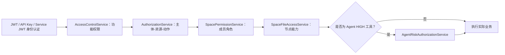

| 层级 | 解决的问题 | 主要实现 |
| --- | --- | --- |
| 身份认证 | 请求是谁发起的 | `JwtTokenInterceptor`、`OpenApiKeyInterceptor`、Service JWT |
| 功能权限 | 用户是否启用了上传、下载、知识库等产品能力 | `UserPermissionInterceptor`、`AccessControlService` |
| 资源权限 | 主体能否对某个用户私有资源或 Space 执行动作 | `AuthorizationService` |
| Space 角色 | 用户是不是成员、管理员或所有者 | `SpacePermissionService` |
| 文件节点能力 | 成员能否修改具体节点或整棵子树 | `SpaceFileAccessService` |
| Agent 高风险授权 | HIGH 工具是否得到额外明确授权 | `AgentRiskAuthorizationService` |

> [!important]
> `AuthorizationService` 不负责登录，也不替代功能权限开关。它统一的是“已认证主体对具体资源执行具体动作”的判定。

### 16.2 统一授权模型：AccessSubject

源码位置：`cloud-common/src/main/java/com/ylcloud/authorization/AccessSubject.java`

```java
package com.ylcloud.authorization;

import java.util.Objects;

/**
 * A normalized authenticated principal.
 *
 * <p>API keys and system tasks always retain the user whose current resource
 * permissions bound their execution. Their own scope/budget checks are applied
 * in addition to, never instead of, these resource checks.</p>
 */
public record AccessSubject(
        AccessSubjectType type,
        Long userId,
        String referenceId
) {
    public AccessSubject {
        Objects.requireNonNull(type, "subject type is required");
        if (userId == null || userId < 1) {
            throw new IllegalArgumentException("subject userId must be positive");
        }
        if (type != AccessSubjectType.USER && (referenceId == null || referenceId.isBlank())) {
            throw new IllegalArgumentException("non-user subjects require a reference id");
        }
    }

    public static AccessSubject user(Long userId) {
        return new AccessSubject(AccessSubjectType.USER, userId, null);
    }

    public static AccessSubject apiKey(Long userId, Long apiKeyId) {
        if (apiKeyId == null || apiKeyId < 1) {
            throw new IllegalArgumentException("apiKeyId must be positive");
        }
        return new AccessSubject(AccessSubjectType.API_KEY, userId, String.valueOf(apiKeyId));
    }

    public static AccessSubject systemTask(Long userId, String taskId) {
        return new AccessSubject(AccessSubjectType.SYSTEM_TASK, userId, taskId);
    }
}
```

源码位置：`cloud-common/src/main/java/com/ylcloud/authorization/AccessSubjectType.java`

```java
package com.ylcloud.authorization;

/** Authenticated principals understood by the unified resource authorization layer. */
public enum AccessSubjectType {
    USER,
    API_KEY,
    SYSTEM_TASK
}
```

源码位置：`cloud-common/src/main/java/com/ylcloud/authorization/AuthorizationBasis.java`

```java
package com.ylcloud.authorization;

/** Why access was granted; useful for audit hooks and security tests. */
public enum AuthorizationBasis {
    SELF,
    SPACE_MEMBER,
    ADMIN_RESOURCE_GRANT,
    DEPLOYMENT_OWNER
}
```

源码位置：`cloud-common/src/main/java/com/ylcloud/authorization/ResourceAction.java`

```java
package com.ylcloud.authorization;

/** Stable actions used by controllers, services, tools, API keys and tasks. */
public enum ResourceAction {
    READ,
    DOWNLOAD,
    WRITE,
    MANAGE,
    EXECUTE
}
```

源码位置：`cloud-common/src/main/java/com/ylcloud/authorization/ResourceType.java`

```java
package com.ylcloud.authorization;

/** Resource boundaries protected by unified authorization. */
public enum ResourceType {
    USER_PRIVATE,
    SPACE
}
```

### 16.3 资源级统一授权：AuthorizationService

源码位置：`cloud-server/src/main/java/com/ylcloud/service/AuthorizationService.java`

授权顺序固定为：参数与账号状态 → 直接资源关系 → Deployment Owner → 管理员显式资源授权 → 拒绝。返回 `AuthorizationBasis` 是为了记录“为什么被允许”。

```java
package com.ylcloud.service;

import com.ylcloud.Exception.ForbiddenException;
import com.ylcloud.authorization.AccessSubject;
import com.ylcloud.authorization.AuthorizationBasis;
import com.ylcloud.authorization.ResourceAction;
import com.ylcloud.authorization.ResourceType;
import com.ylcloud.constant.SpaceConstant;
import com.ylcloud.constant.StatusConstant;
import com.ylcloud.entity.SpaceMember;
import com.ylcloud.entity.User;
import com.ylcloud.mapper.AccessControlMapper;
import com.ylcloud.mapper.AdminResourceGrantMapper;
import com.ylcloud.mapper.LoginMapper;
import com.ylcloud.mapper.SpaceMemberMapper;
import lombok.RequiredArgsConstructor;
import lombok.extern.slf4j.Slf4j;
import org.springframework.stereotype.Service;

@Service
@RequiredArgsConstructor
@Slf4j
public class AuthorizationService {
    private final LoginMapper loginMapper;
    private final SpaceMemberMapper spaceMemberMapper;
    private final AdminResourceGrantMapper grantMapper;
    private final AccessControlMapper accessControlMapper;

    // 统一入口：校验主体、资源与动作，返回本次放行的授权依据
    public AuthorizationBasis require(AccessSubject subject,
                                      ResourceType resourceType,
                                      Long resourceId,
                                      ResourceAction action) {
        if(subject == null || resourceType == null || resourceId == null || resourceId < 1 || action == null) {
            throw new ForbiddenException("资源授权参数无效");
        }
        User user = loginMapper.getById(subject.userId());
        if(user == null || !StatusConstant.ENABLE.equals(user.getStatus())) {
            throw new ForbiddenException("授权主体无效或已停用");
        }

        AuthorizationBasis direct = directAccess(subject,resourceType,resourceId,action);
        if(direct != null) {
            return direct;
        }
        if(Boolean.TRUE.equals(user.getDeploymentOwner())) {
            auditOwnerOverride(subject,resourceType,resourceId,action);
            return AuthorizationBasis.DEPLOYMENT_OWNER;
        }
        if("ADMIN".equalsIgnoreCase(user.getRole())
                && grantMapper.countActive(user.getId(),resourceType.name(),resourceId,action.name()) > 0) {
            return AuthorizationBasis.ADMIN_RESOURCE_GRANT;
        }
        throw new ForbiddenException("没有资源访问权限");
    }

    // 先判断资源的直接访问关系：个人资源归属或 Space 成员角色
    private AuthorizationBasis directAccess(AccessSubject subject,
                                            ResourceType resourceType,
                                            Long resourceId,
                                            ResourceAction action) {
        if(ResourceType.USER_PRIVATE.equals(resourceType)) {
            return resourceId.equals(subject.userId()) ? AuthorizationBasis.SELF : null;
        }
        SpaceMember member = spaceMemberMapper.getActive(resourceId,subject.userId());
        if(member == null) {
            return null;
        }
        if(ResourceAction.READ.equals(action) || ResourceAction.DOWNLOAD.equals(action)
                || ResourceAction.EXECUTE.equals(action)) {
            return AuthorizationBasis.SPACE_MEMBER;
        }
        if(SpaceConstant.ROLE_OWNER.equals(member.getRole())
                || SpaceConstant.ROLE_ADMIN.equals(member.getRole())) {
            return AuthorizationBasis.SPACE_MEMBER;
        }
        return null;
    }

    // 部署所有者越权访问必须记录审计；审计故障不能阻断所有者救援操作
    private void auditOwnerOverride(AccessSubject subject,
                                    ResourceType resourceType,
                                    Long resourceId,
                                    ResourceAction action) {
        try {
            accessControlMapper.insertAudit(
                    subject.userId(),
                    resourceType.name(),
                    resourceId,
                    "DEPLOYMENT_OWNER_" + action.name() + "_" + subject.type().name(),
                    null,
                    null
            );
        } catch(RuntimeException ex) {
            // Owner access cannot be blocked by audit storage failure, but the
            // failure remains visible for operations and the later audit task.
            log.error("deployment owner authorization audit failed: resourceType={}, resourceId={}, action={}",
                    resourceType,resourceId,action,ex);
        }
    }
}
```

### 16.4 功能开关授权：AccessControlService

源码位置：`cloud-server/src/main/java/com/ylcloud/service/AccessControlService.java`

该类管理用户组、用户覆盖权限及审计。下面保留完整类实现，`require` 不是接口示意。

```java
package com.ylcloud.service;

import com.fasterxml.jackson.core.JsonProcessingException;
import com.fasterxml.jackson.databind.ObjectMapper;
import com.ylcloud.DTO.AdminPermissionGroupDTO;
import com.ylcloud.DTO.AdminUserAccessUpdateDTO;
import com.ylcloud.Exception.BaseException;
import com.ylcloud.Exception.ForbiddenException;
import com.ylcloud.VO.PermissionDefinitionVO;
import com.ylcloud.VO.PermissionGroupVO;
import com.ylcloud.constant.UserPermissionKeys;
import com.ylcloud.context.BaseContext;
import com.ylcloud.entity.PermissionGrant;
import com.ylcloud.entity.PermissionGroup;
import com.ylcloud.mapper.AccessControlMapper;
import lombok.RequiredArgsConstructor;
import org.springframework.dao.DuplicateKeyException;
import org.springframework.stereotype.Service;
import org.springframework.beans.factory.annotation.Autowired;
import org.springframework.transaction.annotation.Transactional;

import java.util.LinkedHashMap;
import java.util.List;
import java.util.Map;

@Service
@RequiredArgsConstructor
public class AccessControlService {
    private final AccessControlMapper mapper;
    private final ObjectMapper objectMapper;
    private SecurityAuditService securityAuditService;

    @Autowired(required = false)
    public void setSecurityAuditService(SecurityAuditService securityAuditService) {
        this.securityAuditService = securityAuditService;
    }

    public List<PermissionDefinitionVO> definitions() {
        return UserPermissionKeys.DEFINITIONS;
    }

    public List<PermissionGroupVO> listGroups() {
        Map<Long, Map<String, Boolean>> grants = new LinkedHashMap<>();
        for(PermissionGrant grant : mapper.listAllGroupGrants()) {
            grants.computeIfAbsent(grant.getSubjectId(), ignored -> UserPermissionKeys.defaults(false))
                    .put(grant.getPermissionKey(), grant.getAllowed() != null && grant.getAllowed() == 1);
        }
        return mapper.listGroups().stream().map(group -> toVO(group,grants.get(group.getId()))).toList();
    }

    @Transactional
    public PermissionGroupVO createGroup(AdminPermissionGroupDTO dto) {
        validateGroup(dto);
        PermissionGroup group = new PermissionGroup();
        group.setName(dto.getName().trim());
        group.setDescription(normalize(dto.getDescription()));
        group.setCreatedBy(BaseContext.getCurrentId());
        try {
            mapper.insertGroup(group);
        } catch(DuplicateKeyException ex) {
            throw new BaseException("用户组名称已存在");
        }
        replaceGroupGrants(group.getId(),dto.getPermissions());
        audit("GROUP",group.getId(),"CREATE",null,dto);
        return findGroup(group.getId());
    }

    @Transactional
    public PermissionGroupVO updateGroup(Long groupId, AdminPermissionGroupDTO dto) {
        validateGroup(dto);
        PermissionGroup before = requireGroup(groupId);
        try {
            mapper.updateGroup(groupId,dto.getName().trim(),normalize(dto.getDescription()));
        } catch(DuplicateKeyException ex) {
            throw new BaseException("用户组名称已存在");
        }
        replaceGroupGrants(groupId,dto.getPermissions());
        audit("GROUP",groupId,"UPDATE",before,dto);
        return findGroup(groupId);
    }

    @Transactional
    public void deleteGroup(Long groupId) {
        PermissionGroup group = requireGroup(groupId);
        if(group.getSystemGroup() != null && group.getSystemGroup() == 1) {
            throw new BaseException("系统默认用户组不能删除");
        }
        if(mapper.countGroupMembers(groupId) > 0) {
            throw new BaseException("请先移出该用户组中的所有用户");
        }
        mapper.deleteGroup(groupId);
        audit("GROUP",groupId,"DELETE",group,null);
    }

    @Transactional
    public void updateUserAccess(Long userId, AdminUserAccessUpdateDTO dto) {
        if(userId == null || dto == null) {
            throw new BaseException("用户权限参数不能为空");
        }
        Map<String, Object> before = userAccessSnapshot(userId);
        if(dto.isClearGroup()) {
            mapper.clearUserGroup(userId);
        } else if(dto.getGroupId() != null) {
            if(mapper.getGroup(dto.getGroupId()) == null) {
                throw new BaseException("用户组不存在");
            }
            mapper.assignUserGroup(userId,dto.getGroupId());
        }
        if(dto.getOverrides() != null) {
            validatePermissions(dto.getOverrides());
            mapper.deleteUserOverrides(userId);
            dto.getOverrides().forEach((key,allowed) -> mapper.insertUserOverride(userId,key,Boolean.TRUE.equals(allowed)));
        }
        audit("USER",userId,"ACCESS_UPDATE",before,userAccessSnapshot(userId));
    }

    public Map<String, Boolean> userOverrides(Long userId) {
        Map<String, Boolean> result = new LinkedHashMap<>();
        for(PermissionGrant grant : mapper.listUserOverrides(userId)) {
            result.put(grant.getPermissionKey(),grant.getAllowed() != null && grant.getAllowed() == 1);
        }
        return result;
    }

    // 计算用户最终功能权限；关闭 CLOUD_DRIVE 时覆盖全部子权限
    public Map<String, Boolean> effectivePermissions(Long userId) {
        Map<String, Boolean> effective = new LinkedHashMap<>();
        for(PermissionDefinitionVO definition : UserPermissionKeys.DEFINITIONS) {
            effective.put(definition.getKey(),resolve(userId,definition.getKey()));
        }
        if(!Boolean.TRUE.equals(effective.get(UserPermissionKeys.CLOUD_DRIVE))) {
            effective.replaceAll((key,value) -> UserPermissionKeys.CLOUD_DRIVE.equals(key) ? value : false);
        }
        return effective;
    }

    // HTTP 入口调用的统一功能权限断言
    public void require(Long userId, String permissionKey) {
        if(!UserPermissionKeys.ALL.contains(permissionKey)) {
            throw new IllegalArgumentException("Unknown permission: " + permissionKey);
        }
        if(!resolve(userId,UserPermissionKeys.CLOUD_DRIVE)
                || (!UserPermissionKeys.CLOUD_DRIVE.equals(permissionKey) && !resolve(userId,permissionKey))) {
            throw new ForbiddenException("权限不足: " + permissionKey);
        }
    }

    // 数据库按“部署所有者 > 用户覆盖 > 用户组授权 > 默认拒绝”解析
    private boolean resolve(Long userId, String permissionKey) {
        Integer allowed = mapper.resolvePermission(userId,permissionKey);
        return allowed != null && allowed == 1;
    }

    private void replaceGroupGrants(Long groupId, Map<String, Boolean> permissions) {
        validatePermissions(permissions);
        mapper.deleteGroupGrants(groupId);
        Map<String, Boolean> normalized = UserPermissionKeys.defaults(false);
        if(permissions != null) normalized.putAll(permissions);
        normalized.forEach((key,allowed) -> mapper.insertGroupGrant(groupId,key,Boolean.TRUE.equals(allowed)));
    }

    private PermissionGroupVO findGroup(Long groupId) {
        return listGroups().stream().filter(group -> groupId.equals(group.getId())).findFirst()
                .orElseThrow(() -> new BaseException("用户组不存在"));
    }

    private PermissionGroup requireGroup(Long groupId) {
        PermissionGroup group = groupId == null ? null : mapper.lockGroup(groupId);
        if(group == null) throw new BaseException("用户组不存在");
        return group;
    }

    private PermissionGroupVO toVO(PermissionGroup group, Map<String, Boolean> permissions) {
        PermissionGroupVO vo = new PermissionGroupVO();
        vo.setId(group.getId());
        vo.setName(group.getName());
        vo.setDescription(group.getDescription());
        vo.setSystemGroup(group.getSystemGroup() != null && group.getSystemGroup() == 1);
        vo.setUserCount(group.getUserCount() == null ? 0 : group.getUserCount());
        vo.setPermissions(permissions == null ? UserPermissionKeys.defaults(false) : permissions);
        vo.setCreateTime(group.getCreateTime());
        vo.setUpdateTime(group.getUpdateTime());
        return vo;
    }

    private void validateGroup(AdminPermissionGroupDTO dto) {
        if(dto == null || dto.getName() == null || dto.getName().isBlank()) throw new BaseException("用户组名称不能为空");
        validatePermissions(dto.getPermissions());
    }

    private void validatePermissions(Map<String, Boolean> permissions) {
        if(permissions == null) return;
        String invalid = permissions.keySet().stream().filter(key -> !UserPermissionKeys.ALL.contains(key)).findFirst().orElse(null);
        if(invalid != null) throw new BaseException("不支持的权限: " + invalid);
    }

    private Map<String, Object> userAccessSnapshot(Long userId) {
        Map<String, Object> snapshot = new LinkedHashMap<>();
        snapshot.put("groupId",mapper.getUserGroupId(userId));
        snapshot.put("overrides",userOverrides(userId));
        return snapshot;
    }

    private String normalize(String value) { return value == null || value.isBlank() ? null : value.trim(); }
    private void audit(String targetType, Long targetId, String action, Object before, Object after) {
        mapper.insertAudit(BaseContext.getCurrentId(),targetType,targetId,action,json(before),json(after));
        if(securityAuditService != null) {
            securityAuditService.recordCritical(new SecurityAuditService.AuditEventBuilder()
                    .eventType("PERMISSION_CHANGE").action(action).subject(BaseContext.getCurrentId(), null)
                    .target(targetType, String.valueOf(targetId), null).result("SUCCESS")
                    .detail(Map.of("before", before == null ? Map.of() : before,
                            "after", after == null ? Map.of() : after)));
        }
    }
    private String json(Object value) {
        if(value == null) return null;
        try { return objectMapper.writeValueAsString(value); }
        catch(JsonProcessingException ex) { return String.valueOf(value); }
    }
}
```

### 16.5 HTTP 入口统一拦截：UserPermissionInterceptor

源码位置：`cloud-server/src/main/java/com/ylcloud/interceptor/UserPermissionInterceptor.java`

该拦截器把 URI 与 HTTP 方法转换为权限键，再调用 `AccessControlService.require`。路径权限只是第一道门，业务 Service 仍必须执行资源授权。

```java
package com.ylcloud.interceptor;

import com.ylcloud.Exception.ForbiddenException;
import com.ylcloud.constant.UserPermissionKeys;
import com.ylcloud.context.BaseContext;
import com.ylcloud.service.AccessControlService;
import jakarta.servlet.http.HttpServletRequest;
import jakarta.servlet.http.HttpServletResponse;
import lombok.RequiredArgsConstructor;
import org.springframework.stereotype.Component;
import org.springframework.web.servlet.HandlerInterceptor;

import java.util.LinkedHashSet;
import java.util.Set;

@Component
@RequiredArgsConstructor
public class UserPermissionInterceptor implements HandlerInterceptor {
    private final AccessControlService accessControlService;

    @Override
    // Controller 执行前，根据请求路径收集所需功能权限并逐项校验
    public boolean preHandle(HttpServletRequest request, HttpServletResponse response, Object handler) throws Exception {
        Long userId = BaseContext.getCurrentId();
        if(userId == null) return true;
        try {
            for(String permission : requiredPermissions(request)) accessControlService.require(userId,permission);
            return true;
        } catch(ForbiddenException ex) {
            response.setStatus(HttpServletResponse.SC_FORBIDDEN);
            response.setContentType("application/json;charset=UTF-8");
            response.getWriter().write("{\"code\":403,\"message\":\"" + ex.getMessage() + "\",\"data\":null}");
            return false;
        }
    }

    // 把 HTTP 路径和方法映射为稳定的权限键
    Set<String> requiredPermissions(HttpServletRequest request) {
        String uri = request.getRequestURI();
        String method = request.getMethod();
        Set<String> required = new LinkedHashSet<>();
        if(uri.startsWith("/api/admin/") || uri.equals("/api/user/current") || uri.startsWith("/api/site/")) return required;
        if(uri.startsWith("/api/file/") || uri.startsWith("/api/space/") || uri.startsWith("/api/knowledge/")
                || uri.startsWith("/api/async") || uri.startsWith("/api/storage/")) {
            required.add(UserPermissionKeys.CLOUD_DRIVE);
        }
        if(uri.contains("/download")) required.add(UserPermissionKeys.FILE_DOWNLOAD);
        if(isUploadOrCreate(uri,method)) required.add(UserPermissionKeys.FILE_UPLOAD);
        if(uri.startsWith("/api/knowledge/") || uri.matches("^/api/space/[^/]+/(rag|knowledge)(/.*)?$")) {
            required.add(UserPermissionKeys.KNOWLEDGE_USE);
        }
        if("POST".equals(method) && (uri.matches("^/api/space/[^/]+/files/(upload|import)$")
                || uri.matches("^/api/space/[^/]+/rag/links$"))) {
            required.add(UserPermissionKeys.KNOWLEDGE_USE);
            required.add(UserPermissionKeys.KNOWLEDGE_FILE_ADD);
        }
        return required;
    }

    private boolean isUploadOrCreate(String uri, String method) {
        if(!"POST".equals(method)) return false;
        return uri.equals("/api/file/upload") || uri.startsWith("/api/file/multipart/")
                || uri.matches("^/api/file/[01]$")
                || uri.matches("^/api/space/[^/]+/files/(folder|import|upload)$")
                || uri.matches("^/api/space/[^/]+/files/[^/]+/versions$");
    }
}
```

### 16.6 Space 角色适配：SpacePermissionService

源码位置：`cloud-server/src/main/java/com/ylcloud/service/SpacePermissionService.java`

Space 角色服务优先读取真实成员关系；不存在直接成员时，再进入统一资源授权，以支持 Deployment Owner 和显式管理员资源授权。

```java
package com.ylcloud.service;

import com.ylcloud.Exception.ForbiddenException;
import com.ylcloud.authorization.AccessSubject;
import com.ylcloud.authorization.ResourceAction;
import com.ylcloud.authorization.ResourceType;
import com.ylcloud.constant.SpaceConstant;
import com.ylcloud.entity.SpaceMember;
import com.ylcloud.mapper.SpaceMemberMapper;
import org.springframework.stereotype.Service;

/**
 * 空间权限校验服务。
 */
@Service
public class SpacePermissionService {
    private final SpaceMemberMapper spaceMemberMapper;
    private final AuthorizationService authorizationService;

    /**
     * 初始化 SpacePermissionService 对象。
     *
     * @param spaceMemberMapper 方法入参
     */
    public SpacePermissionService(SpaceMemberMapper spaceMemberMapper,
                                  AuthorizationService authorizationService) {
        this.spaceMemberMapper = spaceMemberMapper;
        this.authorizationService = authorizationService;
    }

    /**
     * 校验 requireMember 相关逻辑。
     *
     * @param spaceId 空间 ID
     * @param userId 用户 ID
     * @return 处理结果
     */
    public SpaceMember requireMember(Long spaceId, Long userId) {
        SpaceMember member = spaceMemberMapper.getActive(spaceId,userId);
        if(member == null) {
            authorizationService.require(
                    AccessSubject.user(userId),
                    ResourceType.SPACE,
                    spaceId,
                    ResourceAction.READ
            );
            return syntheticMember(spaceId,userId,SpaceConstant.ROLE_MEMBER);
        }
        return member;
    }

    /**
     * 校验 requireAdmin 相关逻辑。
     *
     * @param spaceId 空间 ID
     * @param userId 用户 ID
     * @return 处理结果
     */
    public SpaceMember requireAdmin(Long spaceId, Long userId) {
        SpaceMember member = spaceMemberMapper.getActive(spaceId,userId);
        if(member != null && (SpaceConstant.ROLE_OWNER.equals(member.getRole())
                || SpaceConstant.ROLE_ADMIN.equals(member.getRole()))) {
            return member;
        }
        authorizationService.require(
                AccessSubject.user(userId),
                ResourceType.SPACE,
                spaceId,
                ResourceAction.MANAGE
        );
        return syntheticMember(spaceId,userId,SpaceConstant.ROLE_ADMIN);
    }

    /**
     * 校验 requireOwner 相关逻辑。
     *
     * @param spaceId 空间 ID
     * @param userId 用户 ID
     * @return 处理结果
     */
    public SpaceMember requireOwner(Long spaceId, Long userId) {
        SpaceMember member = requireMember(spaceId,userId);
        if(!SpaceConstant.ROLE_OWNER.equals(member.getRole())) {
            throw new ForbiddenException("只有空间所有者可以执行该操作");
        }
        return member;
    }

    /**
     * 执行 isOwnerRole 函数的业务处理。
     *
     * @param role 角色
     * @return 处理结果
     */
    public boolean isOwnerRole(String role) {
        return SpaceConstant.ROLE_OWNER.equals(role);
    }

    /**
     * 执行 isAdminRole 函数的业务处理。
     *
     * @param role 角色
     * @return 处理结果
     */
    public boolean isAdminRole(String role) {
        return SpaceConstant.ROLE_OWNER.equals(role) || SpaceConstant.ROLE_ADMIN.equals(role);
    }

    private SpaceMember syntheticMember(Long spaceId, Long userId, String role) {
        SpaceMember member = new SpaceMember();
        member.setSpaceId(spaceId);
        member.setUserId(userId);
        member.setRole(role);
        member.setStatus(1);
        return member;
    }
}
```

### 16.7 Space 文件节点能力：SpaceFileAccessService

源码位置：`cloud-server/src/main/java/com/ylcloud/service/SpaceFileAccessService.java`

同为 Space MEMBER，并不表示能修改全部文件。此层继续检查 VIEWER、节点创建者和目录中是否包含其他成员节点。

```java
package com.ylcloud.service;

import com.ylcloud.Exception.ForbiddenException;
import com.ylcloud.Exception.NotFoundException;
import com.ylcloud.VO.SpaceFileCapabilityVO;
import com.ylcloud.authorization.SpaceFileAction;
import com.ylcloud.constant.SpaceConstant;
import com.ylcloud.entity.SpaceFile;
import com.ylcloud.entity.SpaceMember;
import com.ylcloud.mapper.SpaceFileMapper;
import org.springframework.stereotype.Service;

/** Central capability boundary for Space file operations. */
@Service
public class SpaceFileAccessService {
    private final SpacePermissionService permissionService;
    private final SpaceFileMapper fileMapper;

    public SpaceFileAccessService(SpacePermissionService permissionService, SpaceFileMapper fileMapper) {
        this.permissionService = permissionService;
        this.fileMapper = fileMapper;
    }

    public SpaceMember requireRead(Long spaceId, Long userId) {
        return permissionService.requireMember(spaceId, userId);
    }

    public SpaceMember requireCreate(Long spaceId, Long userId) {
        SpaceMember member = requireRead(spaceId, userId);
        if (SpaceConstant.ROLE_VIEWER.equals(member.getRole())) {
            throw new ForbiddenException("只读成员不能创建或导入文件");
        }
        return member;
    }

    public SpaceFile requireNodeAction(Long spaceId, Long fileId, Long userId, SpaceFileAction action) {
        SpaceMember member = requireRead(spaceId, userId);
        SpaceFile node = fileMapper.getById(spaceId, fileId);
        if (node == null || !"ACTIVE".equals(node.getLifecycleState())) {
            throw new NotFoundException("空间文件不存在");
        }
        if(action == SpaceFileAction.READ) return node;
        if (isManager(member)) {
            return node;
        }
        if (SpaceConstant.ROLE_VIEWER.equals(member.getRole())) {
            throw new ForbiddenException("只读成员不能修改文件");
        }
        if (!userId.equals(node.getCreatedBy())) {
            throw new ForbiddenException("成员只能修改自己提交的节点");
        }
        if (node.getDir() == 1 && (action == SpaceFileAction.RENAME
                || action == SpaceFileAction.MOVE || action == SpaceFileAction.DELETE)
                && fileMapper.countForeignOwnedInSubtree(spaceId, fileId, userId) > 0) {
            throw new ForbiddenException("目录包含其他成员创建的节点，不能操作整棵子树");
        }
        return node;
    }

    public SpaceFileCapabilityVO capabilities(SpaceFile node, Long userId) {
        SpaceMember member = requireRead(node.getSpaceId(), userId);
        boolean manager = isManager(member);
        boolean viewer = SpaceConstant.ROLE_VIEWER.equals(member.getRole());
        boolean own = userId.equals(node.getCreatedBy());
        boolean ownsSubtree = own && (node.getDir() != 1
                || fileMapper.countForeignOwnedInSubtree(node.getSpaceId(), node.getId(), userId) == 0);
        boolean mutable = manager || (!viewer && own);
        boolean subtreeMutable = manager || (!viewer && ownsSubtree);
        boolean root = Long.valueOf(0L).equals(node.getParentId());
        return SpaceFileCapabilityVO.builder()
                .canRead(true)
                .canCreate(!viewer && node.getDir() == 1)
                .canRename(!root && (node.getDir() == 1 ? subtreeMutable : mutable))
                .canMove(!root && (node.getDir() == 1 ? subtreeMutable : mutable))
                .canRemove(!root && (node.getDir() == 1 ? subtreeMutable : mutable))
                .canUploadVersion(node.getDir() == 0 && mutable)
                .canManageVersions(node.getDir() == 0 && mutable)
                .build();
    }

    private boolean isManager(SpaceMember member) {
        return SpaceConstant.ROLE_OWNER.equals(member.getRole())
                || SpaceConstant.ROLE_ADMIN.equals(member.getRole());
    }
}
```

### 16.8 个人网盘如何接入统一授权

`FileService` 把当前认证用户包装为 `AccessSubject`，再按 `USER_PRIVATE + 资源所有者 ID + 动作` 调用统一授权。下面保留两个完整辅助方法：

```java
private void requirePermission(UserFileDTO userFileDTO, FilePermission permission) {
    // 先确认逻辑文件仍然有效，避免对不存在资源进行授权判断
    if(userFileDTO == null || userFileDTO.getStatus() == StatusConstant.DISABLE) {
        throw new NotFoundException("文件不存在或已失效");
    }

    // 主体来自认证上下文；资源 ID 使用逻辑文件真正的所有者 ID
    authorizationService.require(
            AccessSubject.user(BaseContext.getCurrentId()),
            ResourceType.USER_PRIVATE,
            userFileDTO.getUserId(),
            resourceAction(permission)
    );
}

private ResourceAction resourceAction(FilePermission permission) {
    // 将文件领域动作归一化为统一资源动作
    return switch (permission) {
        case READ -> ResourceAction.READ;
        case DOWNLOAD -> ResourceAction.DOWNLOAD;
        case WRITE, MODIFY, DELETE -> ResourceAction.WRITE;
    };
}
```

因此，个人文件只有 `resourceId.equals(subject.userId())` 才会以 `SELF` 直接放行；Deployment Owner 或持有精确资源授权的管理员通过后续分支放行。普通管理员身份本身不会自动获得所有用户文件。

### 16.9 授权优先级与安全不变量

1. `AccessSubject.userId` 必须来自已验证的 JWT、API Key 绑定用户或系统任务绑定用户，不能信任请求体。
2. API Key 和系统任务不会绕过用户资源权限；它们只是不同主体类型，仍绑定一个真实用户。
3. 用户功能权限与资源权限必须同时满足。例如具有 `FILE_DOWNLOAD` 但不是资源所有者或 Space 成员，仍不能下载。
4. 普通 ADMIN 不拥有天然的全资源权限，必须存在匹配 `resourceType + resourceId + action` 的有效授权。
5. Deployment Owner 可以执行救援式越权，但必须写入审计日志。
6. Space MEMBER 的 READ/DOWNLOAD/EXECUTE 可以直接放行；WRITE/MANAGE 还要满足 OWNER/ADMIN 或节点能力规则。
7. Agent HIGH 工具必须在上述授权通过后，再由 `AgentRiskAuthorizationService` 完成附加授权，不能用高风险授权替代资源授权。

### 16.10 权限键定义与拦截器注册

`UserPermissionKeys` 定义稳定的产品能力键，`WebConfig` 决定维护模式、JWT、用户功能权限和 Open API Key 拦截器的执行边界。下面是两个类的完整实现。

源码位置：`cloud-server/src/main/java/com/ylcloud/constant/UserPermissionKeys.java`

```java
package com.ylcloud.constant;

import com.ylcloud.VO.PermissionDefinitionVO;

import java.util.LinkedHashMap;
import java.util.List;
import java.util.Map;
import java.util.Set;

public final class UserPermissionKeys {
    public static final String CLOUD_DRIVE = "CLOUD_DRIVE";
    public static final String FILE_UPLOAD = "FILE_UPLOAD";
    public static final String FILE_DOWNLOAD = "FILE_DOWNLOAD";
    public static final String KNOWLEDGE_USE = "KNOWLEDGE_USE";
    public static final String KNOWLEDGE_FILE_ADD = "KNOWLEDGE_FILE_ADD";

    public static final List<PermissionDefinitionVO> DEFINITIONS = List.of(
            new PermissionDefinitionVO(CLOUD_DRIVE, "云盘总权限", "关闭后覆盖全部单项权限，但保留单项配置"),
            new PermissionDefinitionVO(FILE_UPLOAD, "上传与添加文件", "上传、分片上传、创建文件以及上传新版本"),
            new PermissionDefinitionVO(FILE_DOWNLOAD, "下载文件", "下载个人文件、空间文件及历史版本"),
            new PermissionDefinitionVO(KNOWLEDGE_USE, "使用知识库", "浏览、检索、问答和运行知识库处理任务"),
            new PermissionDefinitionVO(KNOWLEDGE_FILE_ADD, "向知识库添加文件", "上传或导入空间文件以及添加网页知识源")
    );
    public static final Set<String> ALL = Set.of(CLOUD_DRIVE, FILE_UPLOAD, FILE_DOWNLOAD, KNOWLEDGE_USE, KNOWLEDGE_FILE_ADD);

    private UserPermissionKeys() { }

    public static Map<String, Boolean> defaults(boolean allowed) {
        Map<String, Boolean> values = new LinkedHashMap<>();
        DEFINITIONS.forEach(definition -> values.put(definition.getKey(), allowed));
        return values;
    }
}
```

源码位置：`cloud-server/src/main/java/com/ylcloud/config/WebConfig.java`

```java
package com.ylcloud.config;

import com.ylcloud.interceptor.JwtTokenInterceptor;
import com.ylcloud.interceptor.MaintenanceInterceptor;
import com.ylcloud.interceptor.OpenApiKeyInterceptor;
import com.ylcloud.interceptor.UserPermissionInterceptor;
import org.springframework.beans.factory.annotation.Autowired;
import org.springframework.context.annotation.Configuration;
import org.springframework.web.servlet.config.annotation.InterceptorRegistry;
import org.springframework.web.servlet.config.annotation.WebMvcConfigurer;

@Configuration //声明这是一个配置类
//WebMvcConfigurer：Spring MVC配置接口，可以自定义MVC相关配置
public class WebConfig implements WebMvcConfigurer {
    @Autowired //自动注入
    private JwtTokenInterceptor jwtTokenInterceptor;
    @Autowired
    private UserPermissionInterceptor userPermissionInterceptor;
    @Autowired
    private OpenApiKeyInterceptor openApiKeyInterceptor;
    @Autowired
    private MaintenanceInterceptor maintenanceInterceptor;

    @Override
    public void addInterceptors(InterceptorRegistry registry) {
        // 维护模式拦截器：需在所有授权之前执行，覆盖所有 /api/** 路径
        // 维护模式下仅放行 GET（只读）、健康检查和维护管理端点；
        // /api/v1/** 和 /api/open/** 不再豁免——Open API 写入在维护期同样应被阻止。
        // /internal/** 路径由 Internal API 自行通过 MaintenanceModeService 检查。
        registry.addInterceptor(maintenanceInterceptor)
                .addPathPatterns("/api/**")
                .excludePathPatterns("/api/sign", "/api/login", "/api/site/public-settings",
                        "/api/share/**", "/api/admin/maintenance/disable");

        registry.addInterceptor(jwtTokenInterceptor)
                .addPathPatterns("/**")
                .excludePathPatterns("/api/sign")
                .excludePathPatterns("/api/login")
                .excludePathPatterns("/api/site/public-settings")
                .excludePathPatterns("/api/share/**")
                .excludePathPatterns("/api/v1/**", "/api/open/**")
                // Internal API 使用独立 audience/scope/binding Service JWT，由各内部 Controller 强制验签。
                .excludePathPatterns("/internal/**");
        registry.addInterceptor(userPermissionInterceptor)
                .addPathPatterns("/api/**")
                .excludePathPatterns("/api/sign", "/api/login", "/api/site/public-settings", "/api/share/**",
                        "/api/v1/**", "/api/open/**");
        registry.addInterceptor(openApiKeyInterceptor)
                .addPathPatterns("/api/v1/**", "/api/open/**");
    }
}
```
