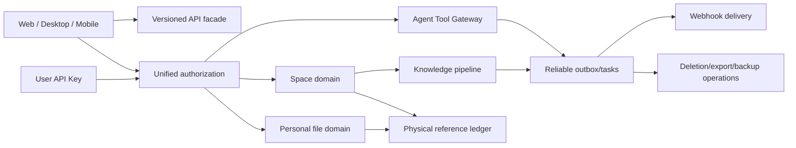

# 统一知识平台领域与安全架构

## 背景与目标

REQ-20260725-001 已完成产品决策。目标是在现有 Spring Boot/MyBatis、React、MySQL、MinIO、Qdrant、Workflow 与 Docker Compose 基础上，形成可私有部署并可运营为共享 SaaS 的单实例知识工作平台，同时避免引入完整租户模型。

## 候选方案比较

| 方案 | 需求满足 | 安全/正确性 | 维护成本 | 交付成本 | 结论 |
|---|---|---|---|---|---|
| 完整多租户重构 | 超出需求 | 强隔离，但与已确认模型冲突 | 高 | 极高 | 不采纳 |
| 按现有模块零散追加判断 | 部分满足 | 容易产生权限旁路和状态分裂 | 高 | 中 | 不采纳 |
| 单实例统一授权核心、领域状态机与 Outbox | 完整满足 | 主体、资源、Scope、风险统一校验 | 中 | 高但可分阶段 | 采纳 |

比较优先级依次为需求满足、安全与数据正确性、可维护性、交付复杂度、性能与成本。

## 架构决策

1. 保持单实例数据模型，不增加 `tenant_id`；强隔离通过独立部署实现。
2. 引入不可变 `deployment_owner` 身份，与可变 `ADMIN/USER` 角色分离。所有入口统一构造 `AccessSubject`，由授权服务计算主体、资源、动作、Scope、站点策略的交集。
3. 保留 `user_file` 与 `space_file` 两套逻辑模型，以 `file_info`/对象摘要作为物理内容身份；引用账本负责唯一存储计量和最终清理。
4. PERSONAL/TEAM Space 使用显式状态机；Space 成员关系是知识检索边界，移出 Space 同步写知识清理 Outbox。
5. API Key、Webhook、账号删除、数据导出、备份和升级均采用持久状态机与幂等任务；不可把进程内异步线程当作可靠队列。
6. 高风险授权替换现有逐 Tool/参数 Grant：Web 使用账号级一次性或持久授权，API Key 使用 Key 级开关；只有 Agent Tool Gateway 消费该授权。
7. 公共 API 由版本化门面暴露；无版本路径代理最新版。旧主版本在兼容期后进入只读模式。
8. 完整备份由 Compose 运维脚本编排 MySQL、MinIO、Qdrant 和配置快照；只有隔离恢复验证成功的备份可进入 `READY` 并参与轮换。
9. 纳入 REQ-20260725-002 的存量重型异步域采用 ADR-20260725-002 的 RabbitMQ + MySQL 统一任务架构。统一任务中心复用本 ADR 的 `AccessSubject` 和资源授权；MQ Consumer 只执行领域函数，不重新定义 Space、文件、知识或 Agent 状态。
10. Space 文件在线查看复用现有预览元数据与受权流式接口，由前端提供统一预览器；预览请求每次重新校验 Space 成员权限和文件有效性，不生成可脱离授权上下文长期使用的公开 URL。
11. Space 文件贡献者归因使用独立业务字段：`created_by/createtime` 表示不可变提交人和提交时间；新增 `last_modified_by/user_modified_at` 表示最后一次用户可见内容或元数据变更。通用 `updatetime` 继续服务技术状态排序与并发控制，但不得用于推断修改人。
12. 保留 `user_file` 与 `space_file` 双逻辑模型，只在前端抽取共享 File Explorer 交互层。共享层通过 Personal/Space 数据适配器和 capability 上下文调用各自 API，不统一节点所有权、权限守卫或知识生命周期。
13. Space File Explorer 以 `spaceId + parentId` 为目录上下文，复用现有 `space_file.parent_id` 和目录接口；文件进入 Space 后继续默认知识化，文件夹不创建 RAG 文档。
14. 当前授权仍以 Space 角色为文件可见性边界。未来文件级 ACL 必须在后端形成统一的 `canRead(spaceId, fileId, subject)` 判定，并由列表、检索、问答和引用共同调用；本阶段不新增 ACL 表、继承算法或配置 UI。

## 系统边界与模块职责

- Identity：注册、部署所有者、角色、注销状态、JWT/API Key 主体。
- Authorization：普通管理员授权、资源 ACL、Key Scope、Tool 风险、站点策略。
- File/Space：双文件模型、Space 生命周期、物理引用与配额。
- File Explorer：共享目录导航、面包屑、列表状态和操作编排；Personal/Space 适配器分别负责 API、节点标识、权限能力与知识状态展示。
- Knowledge：索引、知识资产状态、移除清理与查询权限。
- Agent/Workflow：Tool Registry、账号/Key 高风险授权、调用审计。
- Open Platform：`/api/v1`、无版本路由、Webhook、用量。
- Lifecycle：注销、导出、异步删除。
- Operations：审计保留、备份、恢复、维护模式、升级和回滚。

## 核心数据与状态设计

- `users`：增加部署所有者标志及 `ACTIVE/CANCELLED/PURGING/PURGED` 生命周期字段；迁移时锁定最小 `user_id` 并恢复启用。
- `admin_resource_grant`：记录用户或 TEAM OWNER 对普通 ADMIN 的显式数据访问授权。
- `space`/`space_member`：强化 PERSONAL 不变量、TEAM 唯一 OWNER、所有权转移和 `ACTIVE/DISSOLVING/DISSOLVED`。
- `physical_file_usage`：按内容身份保存唯一计费归属；TEAM 使用独立配额账户。
- `space_file`：保留不可变 `created_by`，新增可空 `last_modified_by` 与 `user_modified_at`；新数据创建时两组归因均写入当前用户。历史无法可靠回填的最后修改人保持为空。
- `space_file.parent_id/path/is_dir`：继续作为 Space 目录树事实，不迁移到 `user_file`；根目录采用现有 Space 约定，所有写操作校验父节点属于同一有效 Space 且为目录。
- `file_version`：继续以 `created_by/createtime` 记录该版本的上传或恢复执行人；列表 API 返回安全用户摘要，不把账号敏感字段复制进版本记录。
- `agent_risk_authorization`：账号级 Web 授权与 API Key 风险能力，不保存逐 Tool 类似参数授权。
- `user_api_key`、`api_key_scope`、`api_key_space_scope`：只保存前缀和哈希，Scope 显式化。
- `webhook_subscription`、`webhook_delivery`：签名、事件 ID、重试、幂等和目标策略。
- `account_deletion_job`、`data_export_job`：异步生命周期和可重入步骤。
- `usage_ledger`：自然月窗口与资源计量主体。
- `security_audit_event`：不可变事件、主体、目标、动作、结果、Trace。
- `backup_run`、`restore_verification`、`upgrade_run`：运维状态与证据。

## 关键流程

1. 首次注册在数据库锁内完成用户、PERSONAL Space 和部署所有者身份创建，确保唯一性。
2. 请求认证后构造主体；资源服务必须调用统一授权，不再通过 `role=ADMIN` 全局放行。
3. Space 文件创建成功后提交知识索引任务；移出时先使其不可检索，再异步删除该 Space 派生物。
4. Agent 执行 HIGH_RISK Tool 前检查账号或 Key 授权；旧 Grant 升级时全部失效。
5. 注销立即封禁并记录时间；ADMIN 可恢复；到期扫描只提交幂等删除任务。
6. 备份写入临时目录，完成校验和隔离恢复后原子发布；新备份失败不影响上一份 `READY`。
7. 直接上传、个人文件导入、Web 链接导入和文件夹创建时，原子写入提交人及初始修改人；上传/恢复版本、重命名、移动和版本设置成功时，在同一事务更新最后修改人和用户修改时间，提交人不变。
8. RAG 索引、知识状态、错误信息、资源版本对账和异步清理只能更新各自技术字段，不得写入 `last_modified_by/user_modified_at`。
9. 前端从文件列表或版本历史打开预览器；文本直接安全渲染，图片/PDF/音视频使用受权流式 URL；不支持或过大的文件展示可理解的失败状态和下载操作。
10. Space 页面进入目录后，以当前 `parentId` 加载子节点；创建目录、上传和导入请求携带当前 `parentId`。面包屑由受权节点链或受权树数据生成，不能信任客户端自行拼接的祖先 ID。
11. File Explorer 只根据后端返回的 capability 决定交互可用性，按钮隐藏不构成授权；Space Controller/Service 对每次读写继续执行成员与角色校验。

## 异常、幂等与恢复

- 所有所有权转移、首用户迁移、一次性授权消费和配额扣减使用事务锁或唯一约束。
- Outbox 事件使用业务幂等键；Webhook 至少一次投递，以 `eventId` 去重。
- Qdrant/MinIO 跨存储失败保留可重试任务，数据库状态不得伪装完成。
- 删除、导出、备份和升级每一步可重入，迟到结果不得恢复已注销或已移除资源。
- 维护模式拒绝写请求和新 Agent/Workflow 任务，允许健康检查、恢复和必要的只读查询。

## 安全与隐私

- 部署所有者越权访问必须单独审计；普通 ADMIN 无默认私人数据访问权。
- API Key 明文只展示一次，使用高熵随机值、固定前缀检索和强哈希验证。
- Webhook 解析最终 IP 并在每次重定向重新执行 SSRF 检查；内网放行是显式站点策略。
- Secret 加密密钥只从备份目录外的文件型 Secret 读取。
- 软件不强制 HTTPS，但 UI 和部署文档必须显示明文传输风险。
- 预览内容必须设置正确的 `Content-Type`、`Content-Disposition` 和防嗅探策略；文本不得作为可执行 HTML 注入页面，嵌入式 PDF/媒体不得获得主应用同源脚本能力。
- 文件贡献者信息只对具备该 Space 读取权限的主体返回。默认仅返回稳定用户 ID 和显示名称；离组、停用或注销用户使用安全历史占位，不扩展为账号资料查询接口。

## 性能、容量与可观测性

- 配额计量以账本增量为主、周期对账为辅，避免每请求全表扫描。
- 异步任务记录队列延迟、处理时长、重试和最终失败；Webhook、索引、删除、导出和备份分别告警。
- Trace 至少关联 `subjectId/apiKeyId/userId/spaceId/fileId/runId/eventId/jobId` 中适用字段。
- Space 文件列表批量解析提交人/修改人，禁止逐行查询用户造成 N+1；预览首开时长、流式失败率和权限拒绝应纳入现有接口指标。
- Space 目录默认只加载当前层级，避免文件量增长后每次进入 Space 都构建全量树；搜索结果必须返回可授权定位的目录信息，不能绕过文件可见性边界。

## 迁移、发布与回滚

1. 先发布兼容新字段的数据库迁移，再切换统一授权与状态机。
2. 删除 Bootstrap 首管理员路径；生产首次账号只允许通过普通注册创建。
3. 旧 `workflow_confirmation_grant` 全部撤销并在替换完成后删除旧 Controller、Service、DTO、Mapper 和表。
4. `/api/v1` 成为权威公共契约，无版本 Controller 只作为最新版门面；旧主版本只读兼容属于明确外部兼容层。
5. 每阶段发布前执行完整备份；数据迁移失败回滚镜像并恢复最近 `READY` 备份。
6. 新迁移从现有 `space_file.created_by/createtime` 回填提交人语义；`last_modified_by/user_modified_at` 仅在存在确定业务证据时回填，否则保持 `NULL` 并由下一次合格用户变更建立归因，禁止从 `updatetime` 猜测。
7. 回滚应用时允许暂时停止返回或展示新增字段，但已写入的归因列不删除、不反向覆盖；预览 UI 可独立关闭，后端现有受权预览契约继续保持兼容。
8. Space File Explorer 首阶段不需要数据表迁移；发布采用前端能力切换并保留现有后端接口。回滚仅恢复旧平铺 UI，不修改 `space_file` 目录关系或已提交知识任务。

## 后果与风险接受

- 平台获得统一安全边界和可追踪状态，但数据库表、前后端及运维脚本改动广泛。
- 接受部署所有者无限读取私人数据且不可转移。
- 接受持久高风险授权覆盖未来 HIGH_RISK Tool。
- 接受默认7天审计、默认1份成功备份及旧 API 长期只读维护风险。
- 不强制 HTTPS 会使误配置实例面临凭据泄露风险。
- 共享 File Explorer 可能把 Personal 所有权语义误带入 Space；通过适配器边界、capability 契约、后端强制授权和跨空间回归测试控制。
- 文件级 ACL 仅预留意味着当前有效 Space 成员仍可看到该 Space 的全部有效文件；该限制必须在产品说明中明确，不能宣称已经支持文件级权限。

## 官方资料

核验日期：2026-07-25。除 ADR-20260725-002 已决策的 RabbitMQ 外，本 ADR 不再引入其他核心基础设施；实施时以仓库锁定版本对应文档为准：

- [Docker Compose production](https://docs.docker.com/compose/how-tos/production/)
- [MySQL Shell dump utilities](https://dev.mysql.com/doc/mysql-shell/8.0/en/mysql-shell-utilities-dump-instance-schema.html)
- [MySQL mysqldump consistent transaction](https://dev.mysql.com/doc/refman/8.0/en/mysqldump.html)
- [Qdrant snapshots](https://qdrant.tech/documentation/operations/snapshots/)
- [MinIO backup and restore](https://min.io/docs/minio/linux/operations/backup-restore.html)

## 实施任务

- [[10-规划与实施/任务/TASK-20260725-001-部署所有者与首用户迁移]]
- [[10-规划与实施/任务/TASK-20260725-002-统一授权与管理员资源授权]]
- [[10-规划与实施/任务/TASK-20260725-003-Space生命周期与所有权]]
- [[10-规划与实施/任务/TASK-20260725-004-Space文件知识生命周期]]
- [[10-规划与实施/任务/TASK-20260725-005-知识资产质量状态]]
- [[10-规划与实施/任务/TASK-20260725-006-Agent高风险总授权]]
- [[10-规划与实施/任务/TASK-20260725-007-用户API-Key与Scope]]
- [[10-规划与实施/任务/TASK-20260725-008-版本化开放API]]
- [[10-规划与实施/任务/TASK-20260725-009-Webhook事件投递]]
- [[10-规划与实施/任务/TASK-20260725-010-账号注销删除与数据导出]]
- [[10-规划与实施/任务/TASK-20260725-011-用户组与TEAM配额]]
- [[10-规划与实施/任务/TASK-20260725-012-统一安全审计与保留]]
- [[10-规划与实施/任务/TASK-20260725-013-完整备份与恢复验证]]
- [[10-规划与实施/任务/TASK-20260725-014-Compose升级维护与回滚]]
- [[10-规划与实施/任务/TASK-20260725-015-前端管理与全链路验收]]
- [[10-规划与实施/任务/TASK-20260816-001-Space文件提交人与修改人可见性]]
- [[10-规划与实施/任务/TASK-20260816-002-Space文件在线预览]]
- [[10-规划与实施/任务/TASK-20260816-003-Space文件树与共享浏览体验]]
- 关联异步实施：TASK-20260725-016 至 TASK-20260725-021；统一依赖顺序见 `.plans/implement-unified-knowledge-platform.todo.md`。
