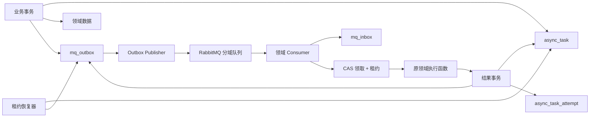
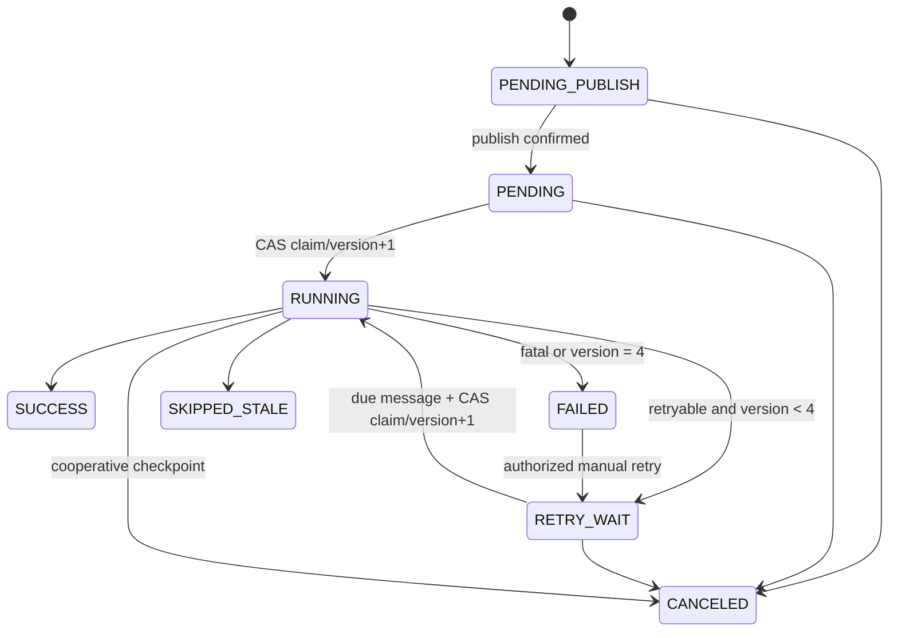

# RabbitMQ 统一异步任务架构

## 1. 决策摘要

项目采用 RabbitMQ 4.3.4 单节点作为异步任务传输层，以 MySQL 统一任务表作为事实源，使用事务 Outbox 解决业务提交与消息发布的一致性，使用 Inbox、领取 CAS、租约续期、尝试版本和资源版本解决至少一次投递下的重复执行与旧 Worker 写入。

RabbitMQ 负责“唤醒和削峰”，不保存任务唯一真相；消息丢失、重复、延迟或 Broker 暂停都由数据库状态、Outbox 补发和租约恢复闭环。

本 ADR 是 ADR-20260725-001 的异步执行子架构：主体、资源、Space/文件/知识状态和安全审计沿用平台领域模型。TASK-20260725-002 的统一授权是任务重试、取消和详情权限的前置；Consumer 不得建立独立 ADMIN 豁免或绕过领域服务。

## 2. 现状与问题

当前主要模式为：

- `RagAsyncConfig` 提供共享 `ThreadPoolTaskExecutor`。
- `RagTaskExecutorService`、`KnowledgePipelineExecutorService` 等使用 `@Async`。
- Chat、Memory、Pipeline、Cleanup、RAG 等领域各自维护定时恢复逻辑。
- `/api/async` 只聚合 RAG 和 Knowledge Pipeline 两类领域表。
- RAG 通过活动范围唯一键和 `markRunningIfPending` 降低并发重复，但没有通用租约。
- 进程退出可能留下 `RUNNING`；执行异常若被领域服务吞掉，未来监听器难以正确 NACK。
- Qdrant Point ID 依赖数据库 `chunkId` 和默认字符集，不能表达逻辑 Space 文件隔离。

## 3. 决策驱动因素

优先级从高到低：

1. 事务一致性和可恢复性。
2. 幂等、顺序和旧执行者隔离。
3. 对现有 Spring Boot/MySQL/Compose 技术栈的适配成本。
4. 分阶段迁移和快速应用回滚。
5. 任务可观测、可人工处置。
6. 首期单机部署复杂度。

## 4. 备选方案

| 方案 | 一致性 | 运维成本 | 任务语义 | 结论 |
|---|---:|---:|---:|---|
| 保留 `@Async` + 数据库扫描 | 中 | 低 | 需各领域重复实现 | 不选，无法形成统一消费和削峰 |
| RabbitMQ 直接发布 | 低 | 中 | 发布快但存在事务提交/消息发布双写窗口 | 不选 |
| RabbitMQ + 事务 Outbox + 统一任务中心 | 高 | 中 | 路由、重试、租约、取消均适配 | 选择 |
| Kafka + Outbox | 高 | 高 | 强事件流和回放，长任务控制需另建语义 | 当前规模过重 |
| RocketMQ + 事务消息 | 高 | 中高 | 能力完整，但项目生态和运维经验不占优 | 不选 |

## 5. 总体架构



边界规则：

- 业务事务只写 MySQL，不等待 RabbitMQ。
- Publisher 只发布已提交 Outbox。
- Consumer 只接收轻量任务信封，再按 `taskId` 读取权威数据。
- 领域执行函数不自行吞掉异常；返回结构化结果或向监听器抛出可分类异常。
- 定时器只协调、恢复、清理，不直接做重型业务。

## 6. RabbitMQ 拓扑

### 6.1 固定命名

- Direct exchange：`ylcloud.task.exchange`
- Retry exchange：`ylcloud.task.retry.exchange`
- Dead-letter exchange：`ylcloud.task.dlx`

| 域 | 主队列 | 主路由键 | Retry 队列 | DLQ | 默认并发 |
|---|---|---|---|---|---:|
| cleanup | `ylcloud.task.cleanup.q` | `task.cleanup` | `ylcloud.task.cleanup.retry.q` | `ylcloud.task.cleanup.dlq` | 1 |
| maintenance | `ylcloud.task.maintenance.q` | `task.maintenance` | `ylcloud.task.maintenance.retry.q` | `ylcloud.task.maintenance.dlq` | 1 |
| memory | `ylcloud.task.memory.q` | `task.memory` | `ylcloud.task.memory.retry.q` | `ylcloud.task.memory.dlq` | 2 |
| chat/workflow | `ylcloud.task.chat.q` | `task.chat` | `ylcloud.task.chat.retry.q` | `ylcloud.task.chat.dlq` | 3 |
| knowledge | `ylcloud.task.knowledge.q` | `task.knowledge` | `ylcloud.task.knowledge.retry.q` | `ylcloud.task.knowledge.dlq` | 2 |
| rag | `ylcloud.task.rag.q` | `task.rag` | `ylcloud.task.rag.retry.q` | `ylcloud.task.rag.dlq` | 2 |

所有队列 durable，消息 persistent。主队列设置 DLX；Retry 队列 TTL 默认 60 秒，过期后按域路由回主队列。并发、prefetch、TTL 均通过配置覆盖。长任务默认 prefetch=1；Chat 可在压测后提高。

业务重试次数由数据库控制，不能仅依赖 RabbitMQ `x-death`。终态失败进入数据库 `FAILED`；DLQ 同时保留无法解析、无法路由或超过传输处置范围的原始消息，供管理员查看，不能作为人工重试的消息源。

### 6.2 发布和消费

- Publisher 开启 Confirm，设置 `mandatory=true` 并处理 Return。
- Confirm ACK 后才将 Outbox 标为 `SENT`；NACK、Return、超时均保留待重发。
- Consumer 使用手动 ACK。
- 只有任务结果事务提交成功后 ACK。
- 消息格式错误或不支持的 `schemaVersion` 进入 DLQ。
- 可恢复基础设施异常关闭/NACK 当前投递；业务失败写入任务结果后 ACK。
- 首期使用 classic durable queue；未来三节点部署时再评估 quorum queue，不能在单节点上宣称 Broker 高可用。

## 7. 消息信封

```json
{
  "schemaVersion": 1,
  "messageId": "01J...",
  "eventType": "TASK_DISPATCH",
  "taskId": 12345,
  "taskDomain": "rag",
  "taskType": "SPACE_FILE_INDEX",
  "expectedAttemptVersion": 1,
  "resourceKey": "space-file:21:8001",
  "resourceVersion": 7,
  "createdAt": "2026-07-25T10:00:00Z",
  "traceId": "..."
}
```

消息不得包含文件二进制、文档正文、用户密钥、访问令牌或可变业务快照。执行参数以 `taskId` 查询 `async_task.payload_json` 或领域表。`messageId` 每次派发唯一；人工重试必须创建新 `messageId`。

## 8. 数据模型

Flyway 只新增版本迁移，禁止修改已执行迁移。建议使用以下逻辑字段；实现 Agent 可遵循项目命名规范调整物理类型，但不得改变约束语义。

### 8.1 `async_task`

| 字段 | 约束/用途 |
|---|---|
| `id` | bigint PK |
| `task_key` | varchar(191) UNIQUE，业务创建幂等键 |
| `task_domain` / `task_type` | 分域和执行函数路由 |
| `payload_json` | JSON，仅保存轻量 ID/选项 |
| `created_by` / `space_id` | 权限和查询；系统任务允许创建者为空 |
| `resource_key` | 逻辑资源稳定键 |
| `resource_version` | bigint，资源单调版本 |
| `status` | 统一状态 |
| `attempt_version` | 已领取次数，初始 0 |
| `max_attempts` | 默认 4 |
| `next_retry_at` | `RETRY_WAIT` 到期时间 |
| `lease_token` / `lease_owner` | 当前 Worker 所有权 |
| `lease_until` / `last_heartbeat_at` | 租约和续期 |
| `cancel_requested_at/by/reason` | 协作取消 |
| `last_error_type/code/message` | 脱敏截断后的摘要 |
| `started_at` / `finished_at` | 生命周期 |
| `row_version` | 乐观锁版本 |
| `created_at` / `updated_at` / `expire_at` | 审计和保留 |

必须建立：

- `UNIQUE(task_key)`。
- 查询索引：`(status, next_retry_at)`、`(status, lease_until)`、`(created_by, created_at)`、`(space_id, created_at)`、`(resource_key, resource_version)`。
- 同一业务动作的 `task_key` 应由稳定业务字段生成，不得使用随机 UUID 破坏创建幂等。

### 8.2 `async_task_attempt`

| 字段 | 约束/用途 |
|---|---|
| `id` | bigint PK |
| `task_id` / `attempt_version` | UNIQUE，追加写入 |
| `trigger_type` | `INITIAL`、`AUTO_RETRY`、`MANUAL_RETRY`、`LEASE_RECOVERY` |
| `worker_id` / `lease_token` | 执行所有者 |
| `status` | `RUNNING`、`SUCCESS`、`FAILED`、`RETRY_WAIT`、`CANCELED`、`SKIPPED_STALE` |
| `started_at` / `last_heartbeat_at` / `finished_at` | 时间线 |
| `failure_type/code/message` | 分类、稳定错误码、脱敏原因 |
| `retryable` / `next_retry_at` | 重试判断 |
| `operator_id` / `operator_remark` | 人工重试/取消审计 |
| `duration_ms` | 完成时计算 |

尝试表不可覆盖旧尝试；不保存完整堆栈，堆栈仅进入带 `taskId/messageId/traceId` 的服务日志。

### 8.3 `mq_outbox`

字段至少包括：`message_id` UNIQUE、`task_id`、`expected_attempt_version`、exchange、routing key、payload、headers、`status(PENDING/PUBLISHING/SENT)`、`publish_attempts`、`next_publish_at`、Publisher 领取租约、Confirm 时间、最后错误和审计时间。

Publisher 使用数据库领取租约避免多实例重复扫描；即使重复发布也由消费幂等消化。Outbox 与任务创建、自动重试或人工重试状态变更处于同一事务。

### 8.4 `mq_inbox`

字段至少包括：`message_id` UNIQUE、`task_id`、`expected_attempt_version`、consumer、`status(RECEIVED/PROCESSED/IGNORED/DEAD)`、接收/处理时间和结果摘要。

Inbox 唯一键是第一层重复保护；任务 CAS 是第二层。Inbox 插入和最终结果更新与任务结果事务协调，不能只凭 Inbox 存在就假定业务成功。

### 8.5 领域表

现有领域任务/业务表增加可空 `async_task_id` 及索引。迁移期间：

- 新模式创建的新任务必须关联统一任务。
- 旧任务不回填、不改变含义。
- UI/API 合并读取旧任务和新任务。
- `mq-v6` 观察完成前保留旧字段和旧执行入口，之后只移除代码路径，不立即破坏性删列。

## 9. 状态机



规则：

- 自动 Worker 只能领取 `PENDING` 或已到期 `RETRY_WAIT`。
- 每次成功领取原子执行 `attempt_version = attempt_version + 1`，并创建对应尝试记录。
- `FAILED` 是自动流程终态；恢复器不得再次领取。
- 人工重试复用原任务，清除错误摘要，写审计和新 Outbox；不重放旧 DLQ。
- 最终写入必须匹配 `id + RUNNING + attempt_version + lease_token`，更新 0 行代表 Worker 已过期，禁止继续提交业务结果。

## 10. 租约、心跳和崩溃恢复

- 租约默认 120 秒，心跳每 30 秒。
- 心跳通过所有权条件更新 `lease_until` 和当前 attempt 的 `last_heartbeat_at`。
- Worker 领取后立即启动心跳，在外部长调用和批次间设置取消/所有权检查点。
- 恢复器扫描 `RUNNING AND lease_until < now()`，以行锁/CAS 关闭当前尝试：
  - `attempt_version < max_attempts`：任务转 `RETRY_WAIT`，`next_retry_at=now()+60s`，同事务创建新 Outbox。
  - 否则：任务转 `FAILED`。
- 原消息在有效租约期间发生重复时可记 `IGNORED` 并 ACK；若原 Worker 已崩溃，数据库恢复器负责创建新派发消息。
- RabbitMQ consumer timeout 必须大于最长单次任务或由心跳/任务拆分控制，不能把无限长批处理放在一个 delivery 中。

## 11. 幂等与资源顺序

幂等分四层：

1. 创建：稳定 `task_key` 防止重复创建。
2. 投递：`mq_inbox.message_id` 防止同消息重复消费。
3. 执行：任务状态、`expectedAttemptVersion` 和领取 CAS 防止重复领取。
4. 副作用：`resource_key + resource_version` 与领域幂等键防止迟到任务覆盖新状态。

资源版本由创建任务的业务事务单调增加。Consumer 发现消息版本低于当前资源版本时，记录 `SKIPPED_STALE` 后 ACK。删除产生更高版本，因此旧索引/画像任务不能复活已删除资源。

外部副作用要求：

- Qdrant upsert/delete 使用稳定 Point ID，可安全重复。
- MinIO 删除将“不存在”视为成功。
- 数据库派生写使用唯一键或版本条件 upsert。
- 无天然幂等能力的外部调用必须保存 provider request key/result，并在重试前查询。

## 12. Qdrant Point ID 规范

规范输入：

```text
point-id-v1|{spaceId}|{spaceFileId}|{fileHash}|{chunkIndex}
```

实现要求：

- 字段顺序固定，分隔符固定，明确使用 UTF-8。
- 通过名称型 UUID 的确定性算法生成 Qdrant UUID；禁止依赖平台默认字符集。
- 同一逻辑文件同一内容同一分块重试得到相同 ID。
- `spaceFileId` 不同，即使物理文件和 hash 相同，也得到不同 ID。
- 重命名/移动逻辑文件不改变 ID；内容变化导致 `fileHash` 变化并产生新 ID。
- 删除/重建先按 `spaceId + spaceFileId` 和资源版本清理旧点，防止旧 hash 残留。

## 13. 失败分类、重试和 DLQ

### 13.1 可自动重试

RabbitMQ/网络超时、Qdrant/MinIO 暂时不可用、模型服务限流或 5xx、解析器临时退出、数据库瞬态锁冲突等。默认 1 分钟后重试，总尝试不超过 4。

### 13.2 不自动重试

文档已删除、权限丢失、参数非法、不支持文件、业务校验失败、资源版本过期。前四类进入 `FAILED`，版本过期进入 `SKIPPED_STALE`。

异常映射器必须产出稳定 `failure_type`、`error_code`、用户可读且脱敏的 `message`、`retryable`。未知异常默认按可重试处理到上限，但必须告警。

DLQ 用于传输/协议异常和保留原消息证据。运维处理 DLQ 时先修复原因，再通过任务 API 创建新派发；不得直接把旧消息搬回主队列。

## 14. 取消与权限

等待状态取消以 CAS 直接转 `CANCELED`。运行状态写持久化 `cancel_requested_at/by/reason`，Worker 在安全检查点停止，并以所有权条件写 `CANCELED`；禁止 `Thread.stop` 或强杀容器中的单个任务。

取消应推进对应 `resource_version` 或写入同等效果的取消栅栏，避免迟到外部结果落库。若副作用不可中断，应在返回后先检查所有权/取消再发布结果。

人工重试和取消权限：

- 创建者。
- 相关 Space 的 owner/admin。
- 系统管理员。
- 非 Space 用户任务：任务所有者和系统管理员。
- 系统任务：仅系统管理员。

每次人工操作记录操作者、时间、原状态、原因/备注和请求追踪 ID。

## 15. API 与前端

统一 API 至少提供：

- 分页任务列表及状态/域/类型/创建者/Space/时间筛选。
- 任务详情与 attempts 时间线。
- `POST /api/async/{taskId}/retry`。
- `POST /api/async/{taskId}/cancel`。
- 权限字段 `canRetry`、`canCancel` 和不可操作原因。

兼容层合并旧 RAG、旧 Pipeline 和新任务，使用稳定复合游标/排序，不能继续“每来源最多 100 条后内存拼接”。详情展示：

- 状态、域、类型、资源、创建者、创建/开始/结束时间。
- 每次 attempt 的版本、触发方式、Worker、租约、心跳、耗时。
- `FAILED`/`RETRY_WAIT` 原因、错误码、是否可重试、下次重试时间。
- 人工重试/取消操作者与备注。
- 旧任务提示无尝试历史。

前端明确支持 `CANCELED`、`RETRY_WAIT`、`SKIPPED_STALE`。活跃任务可短轮询，终态停止详情轮询。

## 16. 保留、监控和安全

### 16.1 保留

终态 `async_task`、attempt 和 `SENT` Outbox 默认保留 3 天，通过配置修改，定时小批量删除。不得普通清理：

- 活跃任务。
- `PENDING/PUBLISHING` Outbox。
- 未处置 DLQ。
- 审计或法规要求锁定的数据。

旧领域任务继续按原规则归档，不因新任务保留器被误删。

### 16.2 监控默认值

- 任一 DLQ 消息数 > 0：立即告警。
- 最老未发布 Outbox > 60 秒：告警。
- 活跃队列 consumer 数为 0：告警。
- 主队列最老 ready 消息 > 5 分钟：告警。
- 租约过期次数、`FAILED` 比率和重试率按 5 分钟窗口建立基线并告警。
- 指标至少按 domain/type/status 分类，日志带 taskId、attemptVersion、messageId、traceId。

### 16.3 安全

- RabbitMQ 仅加入 Compose 内部网络，AMQP 不绑定公网。
- Management UI 仅绑定 `127.0.0.1`。
- 禁止 guest 远程登录；应用和管理账号分离、最小 vhost 权限。
- 凭证通过项目 secret 机制注入，禁止提交到 Git 或打印到日志。
- 首期同宿主机内部网络不启用 AMQP TLS；任何跨主机或外部暴露前必须启用 TLS 和网络 ACL。

## 17. 六版本迁移

| 版本 | 内容 | Feature Flag |
|---|---|---|
| `mq-v1` | RabbitMQ、四张统一表、Outbox/Inbox、状态机、API/UI 基座、`deploy.sh` | `async.mq.enabled` |
| `mq-v2` | 物理清理与 maintenance | `async.mq.cleanup`、`async.mq.maintenance` |
| `mq-v3` | 用户记忆提取/画像/向量索引 | `async.mq.memory` |
| `mq-v4` | 知识 Chat 与 Workflow 生命周期 | `async.mq.chat` |
| `mq-v5` | Knowledge Pipeline | `async.mq.knowledge` |
| `mq-v6` | RAG、Point ID、批量扇出、最终切换 | `async.mq.rag` |

每版执行：实现 → 自动化测试 → Compose 验证 → 文档回写 → Git commit → push。镜像固定使用版本标签，不使用 `latest`/`dev`。旧路径在对应 Flag 关闭时仍可回切，直到 `mq-v6` 观察窗口完成才移除。

跨计划依赖按 `.plans/implement-unified-knowledge-platform.todo.md` 执行：mq-v1 在统一授权之后；mq-v2 在 Space 文件知识生命周期定义之后；mq-v4 复用 Agent 高风险授权；mq-v5 复用知识资产质量状态；mq-v6 复用 Space 逻辑文件与知识生命周期。

## 18. 部署与数据库回滚决策

降应用版本是“切换/覆盖运行中的应用镜像”，不是回滚 Flyway。已成功执行的迁移保持不变；旧应用必须兼容新增表/列。采用 expand-contract：

1. 先增表、增可空列、增索引，不删除/改义。
2. 应用双读/双路径并由 Flag 切换。
3. 观察窗口后，在独立后续版本做破坏性收缩。

自动回滚只恢复旧 app/frontend 镜像和旧 Flag，随后健康检查与冒烟；不执行数据库 restore。只有数据已被错误写坏且人工判定后，才按备份恢复流程处理。

单脚本详细契约在 [[10-规划与实施/任务/TASK-20260725-016-mq-v1消息队列基础设施与统一任务中心]]。

仓库只允许一个 `scripts/deploy.sh`。TASK-20260725-016 创建版本发布、健康检查、任务冒烟和镜像自动回滚能力；TASK-20260725-014 在同一入口上追加完整备份门禁、维护模式和平台升级规则，不得另建平行部署脚本。

## 19. 风险、回滚与来源

### 19.1 已接受风险

- 单节点 RabbitMQ 故障期间不能消费；MySQL Outbox 保证恢复后补发，但不提供 Broker HA。
- 协作取消不能立即停止不可中断的外部调用。
- 不回填旧任务，因此旧详情能力有限。
- 3 天保留可能不足以做长期审计，生产可调高。

### 19.2 回滚

- 单域异常：关闭该域 MQ Flag，恢复旧入口；保留新任务/Outbox 供诊断。
- 全局异常：部署上一镜像版本，RabbitMQ 和新增表保留。
- RabbitMQ 异常：停止 Publisher/Consumer，业务继续写 `PENDING_PUBLISH`；修复后补发。
- 错误消息：隔离 DLQ，禁止盲目重放。

### 19.3 官方依据（检索日期 2026-07-25）

- [RabbitMQ Release Information](https://www.rabbitmq.com/release-information)
- [Spring Boot AMQP](https://docs.spring.io/spring-boot/reference/messaging/amqp.html)
- [RabbitMQ Reliability Guide](https://www.rabbitmq.com/docs/reliability)
- [RabbitMQ Consumer Acknowledgements and Publisher Confirms](https://www.rabbitmq.com/docs/confirms)
- [RabbitMQ Consumer Prefetch](https://www.rabbitmq.com/docs/consumer-prefetch)
- [RabbitMQ Dead Letter Exchanges](https://www.rabbitmq.com/docs/dlx)
- [RabbitMQ TTL](https://www.rabbitmq.com/docs/ttl)
- [Docker Compose up](https://docs.docker.com/reference/cli/docker/compose/up/)
- [Docker Compose pull](https://docs.docker.com/reference/cli/docker/compose/pull/)

## 20. 下游实施

- [[10-规划与实施/任务/TASK-20260725-016-mq-v1消息队列基础设施与统一任务中心]]
- [[10-规划与实施/任务/TASK-20260725-017-mq-v2清理与维护任务迁移]]
- [[10-规划与实施/任务/TASK-20260725-018-mq-v3用户记忆任务迁移]]
- [[10-规划与实施/任务/TASK-20260725-019-mq-v4知识Chat与Workflow任务迁移]]
- [[10-规划与实施/任务/TASK-20260725-020-mq-v5知识流水线任务迁移]]
- [[10-规划与实施/任务/TASK-20260725-021-mq-v6-RAG迁移与最终切换]]
