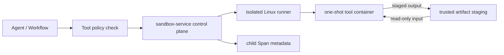

# 独立 Sandbox 服务与一次性容器架构

## 决策

采用独立 `sandbox-service` 控制面和独立 Linux Runner 节点。Workflow 只提交已注册 Tool Invocation；Runner 按不可变 Tool Catalog 创建一次性 Docker 容器。Java Tool Gateway 继续负责业务工具，Sandbox 只承载本地计算和第三方程序。

下游任务：[[10-规划与实施/任务/TASK-20260813-001-Sandbox控制面与安全运行时]]、[[10-规划与实施/任务/TASK-20260813-002-Workflow-Sandbox执行模式接入]]、[[10-规划与实施/任务/TASK-20260813-003-Sandbox生产调度与文件链路]]。

## 候选方案

| 方案 | 安全边界 | 复杂度 | 结论 |
|---|---:|---:|---|
| Workflow 子进程 | 弱，共享宿主环境 | 低 | 仅保留可信轻量工具 |
| 应用节点 Docker Socket | 容器隔离但扩大应用权限 | 中 | 拒绝 |
| 独立节点 Docker/Rootless Runner | 容器与节点双重隔离 | 中 | 首版采用 |
| gVisor/microVM | 更强内核边界 | 高 | 保留 Runtime 接口后续替换 |

## 系统边界

## 协议、Trace 与保留

请求包含 Tool 名称/版本、参数、幂等键、父 trace/span、主体与资源引用。状态为 `QUEUED/PREPARING/RUNNING/COLLECTING/SUCCEEDED/FAILED/CANCELLED/TIMED_OUT/RESOURCE_EXCEEDED/SECURITY_REJECTED`。同步 MVP 可在 HTTP 请求内执行，但协议不得依赖同步实现。

Invocation 不建立独立安全审计域。服务返回子 Span 元数据：主体、工具及版本、镜像 digest、输入输出摘要、权限摘要、网络策略、资源上限/用量、起止时间、退出码、终止原因和提交状态。正文、宿主路径、密钥与堆栈禁止进入 Span；记录随父 Trace 删除。

## 安全、恢复与回滚

- Runner 使用独立节点和专用身份；应用服务不挂载 Docker Socket。
- 容器 `network=none`、非 root、只读根、`cap-drop=ALL`、`no-new-privileges`、默认 seccomp、PID/CPU/内存限制。
- 输入只读、输出单独可写；拒绝绝对路径、`..`、符号链接和越界输出。
- 不注入 JWT、数据库、MinIO、RabbitMQ 或 Docker 凭据。
- 镜像必须用 digest；生产需扫描、SBOM、签名和预拉取。
- 使用 idempotency key 去重；Sandbox 不可用时明确失败，不回退宿主执行。
- Feature Flag 灰度；回滚时停用 `sandbox` 模式，旧执行模式不受影响。

## 官方资料核验

核验日期：2026-08-13。Docker Seccomp、Rootless、Resource Constraints 与 Engine Security 官方文档：`https://docs.docker.com/engine/security/seccomp/`、`https://docs.docker.com/engine/security/rootless/`、`https://docs.docker.com/engine/containers/resource_constraints/`、`https://docs.docker.com/engine/security/`。

