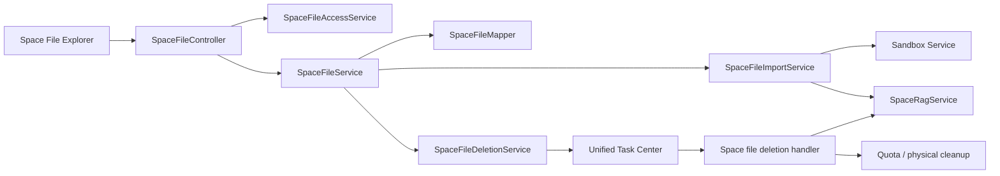

# Space 文件树权限、导入与删除技术架构

## 1. 背景与目标

Space 当前后端已经拥有 `space_file.parent_id`、根目录、按父目录查询、创建目录、目录内上传/导入和递归删除能力，但 `SpacesPage` 只加载根目录并平铺展示；后端没有完整的重命名、移动、祖先链、全 Space 搜索、正式 `VIEWER` 角色、节点 capability、导入隔离任务和大目录异步删除契约。

本决策在保留 `user_file` 与 `space_file` 双逻辑模型的前提下，形成可以直接实现的 Space File Explorer、角色与节点关系授权、Sandbox 导入、同内容防重和不可撤销异步删除架构。普通文件只有在 Sandbox 预检成功并激活 Space 节点后才默认进入知识化。

## 2. 用户、场景与业务价值

- OWNER/ADMIN 管理任意 Space 节点与知识生命周期。
- MEMBER 创建和管理自己的节点；只有整棵有效子树均由本人创建时，才可操作非空目录。
- VIEWER 浏览、搜索、预览、下载和使用知识，不改变节点。
- 用户可把 Personal 文件或目录导入 Space，并选择“整批失败”或“跳过失败项”。
- 用户确认删除后，节点立即从文件与知识视图隔离，系统可靠异步清理且不允许撤销。

## 3. 范围与非目标

### 包含

1. 正式四角色模型和服务端 capability。
2. 目录最大深度 100、祖先链、重命名、移动、全 Space 搜索。
3. 同一 Space 同一物理内容只有一个有效或隔离中节点。
4. 所有 Space 导入来源统一经过 Sandbox 预检。
5. Personal 文件/目录快照式批量导入和用户选择失败策略。
6. 删除影响预览、子树隔离、统一异步任务清理和失败恢复。
7. Personal/Space 共享展示组件但使用独立 adapter 与权限上下文。

### 非目标

- 合并 `user_file` 与 `space_file`。
- 文件级 ACL 表、权限继承和逐文件授权 UI。
- 同一内容在同一 Space 多位置展示。
- 自动合并历史重复文件。
- 删除撤销、回收站或异步删除取消。
- 让用户提交任意 Sandbox 命令、镜像或 entrypoint。

## 4. 验收标准

1. Space 支持逐层目录浏览、面包屑、100 层限制、当前目录写入和整个 Space 搜索。
2. MEMBER 不能通过拥有父目录控制其他成员节点；子树含他人节点时，重命名、移动、删除均返回 403。
3. 所有导入内容先进入 Sandbox；失败内容不产生 ACTIVE 文件、RAG 文档或向量。
4. 同内容重复请求返回 409 和已有节点定位，不移动已有节点、不重复向量化。
5. 删除确认后立即隔离、不可撤销；重试不会重复释放引用或删除错误向量。
6. Personal 未导入文件不自动知识化；Space 目录不知识化；通过预检的 Space 普通文件默认知识化。
7. 历史重复数据只生成报告，不自动修改。

## 5. 现状诊断与证据

### 已证实事实

- `SpaceFileController.list` 已支持 `parentId`；`SpaceFileService.listFiles` 调用 `normalizeParentId` 和 `SpaceFileMapper.listByParentId`。
- `createFolder/importUserFile/uploadFile/importWebLink` 已接收或具备 `parentId`，并在创建普通文件后调用 `handleFileImported`。
- `SpaceFileService.removeTree` 当前在一个事务和 Java 递归调用栈中同步遍历整棵树。
- `SpaceFileMapper.updateName` 没有完整 Controller/Service 业务入口；没有移动、祖先链和文件搜索契约。
- `SpaceConstant` 只有 OWNER/ADMIN/MEMBER；前端却提交 VIEWER，后端 `normalizeRole` 会拒绝。
- `SpacesPage` 查询键只有 `[space-files, activeSpaceId]`，上传、建目录和导入没有传当前目录。
- 现有 Sandbox 只执行平台预置 Tool，不接受任意命令；统一异步任务中心已有幂等键、租约、重试、资源版本和 Handler 注册机制。

### 根因

数据模型已经支持目录，但产品页面、授权能力、目录操作契约和可靠长任务没有围绕“文件树”形成同一闭环；前端平铺只是表象，直接只改 UI 会暴露缺失接口、角色漂移、递归删除和重复知识索引问题。

### 未知项

无。产品行为已于 2026-08-17 确认。

## 6. 约束与假设

- MySQL 是节点、授权、导入和删除状态真相源。
- MinIO、Sandbox、Qdrant 和 RabbitMQ 均不参与 MySQL 本地事务，使用持久状态、Outbox、幂等和资源版本收敛。
- 根目录深度为 0，用户第一层目录深度为 1，最大深度为 100。
- `parent_id` 是树关系事实，`path` 是派生展示字段，不参与授权。
- 文件内容身份为 `file_uuid` 与 SHA-256；文件名和路径不是内容身份。

## 7. 候选方案比较

| 方案 | 满足度 | 安全/正确性 | 维护 | 成本 | 结论 |
|---|---:|---:|---:|---:|---|
| 只改 Space 前端，复用现有全量接口 | 低 | 低 | 低 | 低 | 不采纳；缺失移动、授权、Sandbox 和可靠删除 |
| 合并 Personal/Space 后端模型 | 中 | 低 | 中 | 极高 | 不采纳；破坏协作和知识边界 |
| 双模型 + 共享展示层 + Space 专属领域服务 | 高 | 高 | 高 | 中高 | 采纳 |

## 8. 架构决策

1. 新增 `SpaceFileAccessService`，集中计算角色、节点关系、子树所有权和 capability；Controller、Workflow Tool、开放 API 和 RAG 引用入口禁止复制角色字符串判断。
2. 新增正式 `VIEWER`；OWNER/ADMIN 管理全部节点，MEMBER 管理本人普通文件及“目标和全部有效后代均由本人创建”的子树，VIEWER 只读。
3. 浏览使用按层 `/list`，全量 `/tree` 不作为主 UI 数据源；搜索使用服务端 Space 范围接口。
4. 所有导入建立持久导入批次和条目，Sandbox 只消费不可变输入清单；成功激活节点后提交知识化。
5. 同一 Space 对相同内容建立并发防重事实；重复返回现有节点定位，不自动移动。
6. 删除建立预览与确认协议，确认事务隔离整棵子树并创建不可取消的统一异步任务；Worker 幂等清理。
7. 前端共享 `FileExplorer` 展示层，Personal/Space adapter 各自转换类型、调用 API 和提供 capability。

## 9. 模块职责与关键流程

### 导入

1. Controller 校验 Space 写入 capability 和目标目录。
2. Service 展开 Personal 目录并固化相对路径、节点 ID、UUID、SHA-256、大小快照。
3. 在启动 Sandbox 前做 Space 内容防重、总数量、总大小和最大深度检查。
4. 创建批次与条目，状态 `PENDING → SCANNING`。
5. Sandbox 对全部文件执行预置 `file.preflight` Tool。
6. `ATOMIC` 模式任一失败则批次失败并销毁 Sandbox；`SKIP_FAILED` 模式继续。
7. 对成功条目在事务内创建目录和 `space_file`，记录引用；提交后触发 RAG。
8. 批次终态保存成功、失败、跳过数量和逐项错误。

### 删除

1. `preview-delete` 返回受权子树统计与一次性确认令牌。
2. 用户输入目录名确认并提交令牌。
3. 事务内重新锁定和计算子树，校验令牌快照、权限和节点版本。
4. 全部节点变为 `REMOVAL_PENDING`，文件立即不可读、不可写、不可检索。
5. 创建不可取消统一异步任务。
6. Worker 按稳定节点顺序清理 RAG、引用计量、文件计数和最终物理对象，记录检查点。
7. 全部成功转 `REMOVED`；失败保持隔离并由管理员重试。

## 10. 接口、数据与状态设计

### REST API

| Method | Path | 权限 | 响应/规则 |
|---|---|---|---|
| GET | `/api/space/{spaceId}/files/list?parentId=` | READ | 当前层，返回节点 capability |
| GET | `/api/space/{spaceId}/files/{folderId}/ancestors` | READ | 根到当前目录，不含越权节点 |
| GET | `/api/space/{spaceId}/files/search?q=&limit=&cursor=` | READ | 整个 Space 搜索，返回定位路径 |
| PUT | `/api/space/{spaceId}/files/{fileId}/rename` | RENAME | `{name, expectedVersion}` |
| PUT | `/api/space/{spaceId}/files/{fileId}/move` | MOVE | `{targetParentId, expectedVersion}` |
| POST | `/api/space/{spaceId}/files/import-batches` | CREATE | Personal 文件/目录快照与失败策略 |
| GET | `/api/space/{spaceId}/files/import-batches/{batchId}` | READ | 批次与条目结果 |
| POST | `/api/space/{spaceId}/files/{fileId}/deletion-preview` | DELETE | 影响统计与确认令牌 |
| DELETE | `/api/space/{spaceId}/files/{fileId}` | DELETE | `{confirmationToken, confirmationName}`；返回 202/任务 |
| GET | `/api/space/{spaceId}/files/duplicates-report` | MANAGE | 历史重复报告，只读 |

现有单文件 `/import`、`/upload` 和 Web 导入入口内部改为创建单条导入批次并经过 Sandbox；外部路径保持兼容，但成功响应允许改为 `202 + taskId/batchId`，无版本 Web 客户端同步升级。版本化公共 API 如已暴露相同能力，必须发布新主版本或保持旧响应契约。

### DTO/VO

- `SpaceFileCapabilityVO`: `canRead/canCreate/canRename/canMove/canRemove/canUploadVersion/canManageVersions`。
- `SpaceFileLocationVO`: 节点和祖先摘要。
- `SpaceFileRenameDTO`, `SpaceFileMoveDTO`：均带 `expectedVersion`。
- `SpaceFileImportBatchCreateDTO`: `sourceNodeIds,targetParentId,failurePolicy`。
- `SpaceFileImportBatchVO`, `SpaceFileImportItemVO`。
- `SpaceFileDeletionPreviewVO`, `SpaceFileDeleteDTO`。
- 前端 `ExplorerNode`, `ExplorerCapability`, `FileExplorerAdapter`；禁止 `any`。

### 数据迁移

新 Flyway 迁移使用下一个未占用版本号，实施前以 `rg --files cloud-server/src/main/resources/db/migration` 再确认：

1. `space_member.role` 接受 `VIEWER`；若无数据库枚举约束只迁移数据/索引，不伪造无效 DDL。
2. `space_file` 增加 `node_version bigint not null default 1`、`depth int not null default 0`、`content_hash varchar(128) null`、`lifecycle_state varchar(32) not null default 'ACTIVE'`、`deletion_batch_id bigint null`。
3. 回填 depth/content hash；异常深度只报告，不截断。
4. 新建 `space_file_import_batch`、`space_file_import_item`、`space_file_delete_batch`。
5. 防重采用独立 `space_file_content_guard(space_id, content_hash, space_file_id, guard_state)`，以 `(space_id,content_hash)` 唯一键覆盖 ACTIVE/SCANNING/REMOVAL_PENDING；最终 REMOVED 后释放。不要依赖 MySQL 对软删除行的部分唯一索引。
6. 历史重复在 guard 回填前生成报告；每组只选择稳定最小 ID 建 guard，其余保持历史可读并标记 `legacy_duplicate=1`，不自动合并或删除。

### 状态

导入批次：`PENDING → SCANNING → COMMITTING → SUCCEEDED/PARTIAL_SUCCESS/FAILED`。

条目：`PENDING → SCANNING → PASSED/FAILED → IMPORTED/SKIPPED`。

节点：`ACTIVE → REMOVAL_PENDING → REMOVED`；失败仍保持 `REMOVAL_PENDING`，错误属于删除批次/异步任务，不回退 ACTIVE。

## 11. 异常、幂等、降级与恢复

- 名称冲突、重复内容、移动环、超过 100 层、陈旧 `expectedVersion` 返回 409。
- 非成员或节点/子树授权不足返回 403；不存在或已删除节点返回 404；REMOVAL_PENDING 返回 409/410 并保持不泄露内容。
- 导入批次使用用户幂等键；相同键不同 payload 返回 409。
- Sandbox 超时按条目失败，不在宿主机降级执行。
- 删除确认令牌绑定 `userId/spaceId/fileId/nodeVersion/subtreeDigest/expiry`，一次使用；确认时必须重新检查。
- 删除 Worker 对每个节点使用幂等清理检查点；迟到任务核对 batchId 和 nodeVersion。

## 12. 安全、隐私与合规

- Sandbox 使用平台预置 `file.preflight` Tool、固定镜像、只读输入、无宿主网络/凭据/数据库访问、CPU/内存/PID/时间/输出限制，完成后销毁。
- 文件名、路径和 Sandbox 错误输出需净化，不能返回内部对象键、Secret 或堆栈。
- 搜索、祖先链、重复定位、删除统计都先授权后返回，不以“前端隐藏”作为边界。
- MEMBER 子树检查必须包含所有有效和隔离中后代，不能忽略他人 REMOVAL_PENDING 节点。

## 13. 性能、容量、可靠性与可观测性

- 当前层列表按 `(space_id,parent_id,lifecycle_state,is_dir,updatetime)` 索引；搜索按可控 LIKE/全文能力实施，必须分页和限制 query 长度。
- 深度存储用于 O(1) 创建校验；移动目录仍计算子树最大相对深度并批量更新。
- 子树授权/移动/隔离避免 Java 递归，使用递归 CTE 或迭代分页；最大深度已限制 100。
- 指标：导入排队/扫描/失败、Sandbox 时长和销毁、重复拒绝、搜索延迟、删除隔离到完成时长、失败清理节点数。
- Trace 关联 `spaceId/fileId/importBatchId/deleteBatchId/asyncTaskId/sandboxInvocationId`。

## 14. 兼容、发布与回滚

1. 先发布 expand 数据迁移和兼容读取，再发布服务端新状态/API，最后切换前端。
2. 旧 Space 平铺 UI 被新 File Explorer 直接替换，不保留双运行组件。
3. 回滚应用不降级 Flyway；新列和批次表保留。已隔离删除不恢复，继续由兼容 Worker 清理。
4. Sandbox 不可用时导入明确 503/失败，不绕过预检。
5. 历史重复报告先于 guard 强制执行发布，避免迁移误删。

## 15. 原子任务与依赖

1. TASK-20260817-001：四角色、节点授权与 capability。
2. TASK-20260817-002：目录深度、祖先链、重命名、移动、搜索与内容 guard。
3. TASK-20260817-003：Sandbox 预检与 Personal 目录批量导入。
4. TASK-20260817-004：删除预览、子树隔离与不可撤销异步清理。
5. TASK-20260816-003：共享 File Explorer 和 Space 前端接入；依赖前四项。

## 16. 测试范围与通过标准

- 必须：授权矩阵、子树所有权、边界/异常、并发防重、幂等、Sandbox 逃逸负例、删除迟到任务、前端组件和回归测试。
- 集成：真实 MySQL 递归/锁、MinIO 引用、Sandbox API、RabbitMQ/统一任务、Qdrant 清理。
- E2E：Personal 目录选择 → Sandbox → Space 目录 → RAG → 搜索/引用；多人混合子树拒绝；删除后立即不可见且最终收敛。
- 性能：100 层、宽目录、大批量导入和大子树删除。
- 通过标准以各 TASK 下游 TEST 文档为准，任何 P0 权限、重复向量、删除幂等或 Sandbox 隔离失败均阻止发布。

## 17. 实现者测试文档要求

每个任务必须生成独立执行记录，包含测试目标、内容、前置条件、数据、步骤、预期、实际、证据和结论；实现完成但门禁未通过只能标记 `pending-verification`。

## 18. 风险与观察项

- 用户接受删除确认后不可撤销。
- 用户接受历史重复只报告、不自动修复。
- `SKIP_FAILED` 会产生部分目录结果，UI 必须明确显示失败清单。
- 全文件 Sandbox 会增加导入延迟和资源成本；不得以绕过 Sandbox 降低延迟。

## 19. 官方资料与核验

本方案不新增第三方技术选型；沿用仓库已锁定的 Spring Boot、MySQL、RabbitMQ、Docker/Sandbox、MinIO 与 Qdrant。实现时应按锁定版本核验 MySQL 递归 CTE/锁语义、Docker 隔离参数及 RabbitMQ 投递语义。核验日期：2026-08-17。

## 实施任务

- [[10-规划与实施/任务/TASK-20260817-001-Space四角色与节点授权]]
- [[10-规划与实施/任务/TASK-20260817-002-Space目录操作搜索与内容防重]]
- [[10-规划与实施/任务/TASK-20260817-003-Sandbox预检与Personal目录导入]]
- [[10-规划与实施/任务/TASK-20260817-004-Space子树隔离与异步删除]]
- [[10-规划与实施/任务/TASK-20260816-003-Space文件树与共享浏览体验]]

## 20. 2026-08-17 实施结果、遗留问题与解决方案

### 已落地

- `V52` 完成树字段、内容 guard、导入批次/条目和删除批次表；历史重复只标记和报告。
- 四角色与 `SpaceFileAccessService` 已落地。MEMBER 操作目录前锁定 Space 有效节点，再验证整棵子树创建者，避免并发插入他人节点穿透授权。
- Space 已支持逐层浏览、祖先链、重命名、移动、100 层限制、全 Space 名称搜索、重复报告和 capability。
- Personal 目录导入会冻结 UUID/hash/size/相对路径快照，创建 `SPACE_FILE_IMPORT` 统一异步任务；全部文件在 Sandbox 通过后才激活，支持 `ATOMIC` 与 `SKIP_FAILED`，重试跳过已导入检查点。
- 删除确认令牌有效期 5 分钟；确认后整树原子隔离，`SPACE_FILE_DELETE` 不可取消，节点按深度逐项事务清理；文件/RAG 普通读取立即排除隔离节点。
- Personal 与 Space 共用面包屑和搜索外壳；Space 页面已按目录浏览并提供当前目录上传、导入、移动、重命名、删除和版本入口。

### 当前问题与确定方案

| 问题 | 当前保护 | 解决方案/发布门禁 |
|---|---|---|
| 原开发库 `ylcloud` 的 V52 首次执行因 `(batch_id,relative_path varchar(1024))` 超过 MySQL 3072 字节索引上限而失败；MySQL DDL 自动提交导致该库保留部分 V52 对象及 25 条 guard 数据 | 未删除、回滚或继续启动旧库；另建 `ylcloud_space_test` 验证修正迁移 | 先备份旧库，再经人工批准执行定向 Flyway repair/对象对账；禁止直接 drop 具有数据的 guard 表。修正后的唯一键使用 `(batch_id,relative_path_hash)` |
| Docker Desktop 与基础 Sandbox 真实执行已通过，但恶意样本、压缩炸弹、超时、重启、RAG/MinIO/Qdrant/RabbitMQ 全链路尚未全部执行 | Sandbox 客户端 fail-closed；基础无网络、只读根、非 root、cap-drop 与幂等验证通过 | 继续执行 TEST-103/104 全部故障注入与数据面测试；未通过不得发布 |
| 将 Docker Socket 挂入 Sandbox 服务容器会赋予其宿主 Docker 的 root 等价控制能力 | Win10 开发环境经用户明确授权后启用并完成真实预检；执行容器仍为无网络、非 root、只读根且任务后销毁 | 该授权仅限本机开发验证；生产必须使用独立 rootless Docker/隔离节点，不得把应用节点主 Socket 暴露给对外服务 |
| 兼容 `/upload`、`/import`、Web 导入虽全部同步调用同一个 Sandbox 边界，但只有 Personal 目录选择器进入持久批次 | 不存在绕过 Sandbox 的激活路径，Sandbox 不可用即 503 | 下一兼容 API 变更把上传/Web 内容先写入隔离 staging，再创建单条批次并返回 202；增加失败 staging 清理任务后才能删除同步兼容路径 |
| 名称搜索当前以 `limit` 限流，尚未返回 cursor | 最大 200 条且仅 ACTIVE | 增加 `(space_id,id)` 游标契约与前端“加载更多”，在大 Space 性能门禁前完成 |
| 子树写操作为保证 MEMBER 并发授权正确性，会锁定 Space 内全部有效节点 | 正确性优先，创建会锁父节点并与之互斥 | 真实 MySQL 压测后改为递归 CTE 子树锁 + Space tree revision/写栅栏，避免大 Space 全局串行化 |
| 删除批次成功表示节点清理与 RAG 删除任务已可靠入队，不等于 Qdrant 已物理收敛 | 隔离后检索 SQL 已过滤，知识删除任务可重试 | 删除批次增加下游任务计数/最终对账状态，只有 Qdrant、引用和物理清理均完成才标记 `CONVERGED` |
| Sandbox 请求当前用 Base64 JSON 传递整个文件，大文件有内存放大 | 超限或服务异常时 fail-closed | 改为受签名的一次性只读对象流/分块输入，维持 hash/size 校验；完成 2GB 压测后再开放大文件导入 |
| capability 列表对目录执行逐节点子树查询 | 结果正确 | Mapper 增加批量 foreign-owner 聚合，消除大目录 N+1；纳入前端大目录性能门禁 |

### 已执行证据

- `mvn -pl cloud-server -am test -DskipITs`：316 tests，0 failure/error/skipped。
- `npm run build`：TypeScript 与 Vite production build 通过，1832 modules transformed。
- Docker Desktop 4.82.0 / Engine 29.6.1 已由 `DESKTOP-VMOCLJT\\Win10` 启动；应用与 Sandbox 镜像构建通过。
- 全新隔离库 `ylcloud_space_test` 从空库成功应用 53 条迁移并到达 V52；应用 `/actuator/health` 为 `UP`。V52 的 `uk_space_import_item_path` 已验证为 `(batch_id,relative_path_hash)`，`relative_path` 保持 `varchar(1024)`。
- Sandbox 容器内 pytest：11 passed；Win10 宿主真实 Docker 验证 `PASS`，调用状态 `SUCCEEDED`，幂等回放/subject 历史隔离通过，容器无网络、只读根、非 root、`cap-drop ALL`、PID/CPU/内存限制配置通过。
- 高权限开发模式真实 `file.preflight` 回归：安全文本 `safe=true`；`MZ` 文件头 `safe=false/EXECUTABLE_CONTENT`；两次均成功退出且无任务容器残留。控制面常驻，但只在文件激活前预检或 Agent Tool 显式采用 `execution_mode: sandbox` 时创建一次性执行容器。
- 原 `ylcloud` 数据库未执行任何破坏性修复，原应用容器保持停止；修复前不得将其作为本版本验证库启动。
- `git diff --check`：无空白错误（仅工作区 CRLF 提示）。
