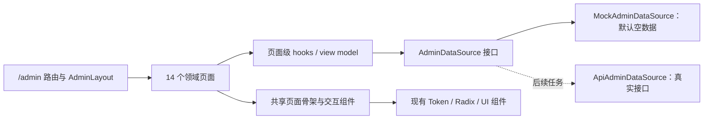
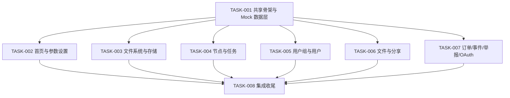

# 管理后台前端原型与 Mock 数据架构

## 1. 决策上下文

当前 `/admin` 已有 `AdminLayout`、14 个路由和约 38 个管理页样式选择器，也已有 `Button`、`Dialog`、`PageState`、`StatusBadge`、`Tabs`、`ManagementPage` 等共享组件。但页面成熟度不一致：5 个路由仍是通用占位页，多个列表只有静态表头，面板首页和设置标签存在占位内容，且没有管理页专项测试。旧 `features/settings/AdminSettingsPage.tsx` 和若干真实 Admin API 仍存在，但本阶段已明确只做统一前端原型。

## 2. 合理候选方案对比

| 评价项 | 方案 A：每页独立静态实现 | 方案 B：共享骨架与类型化 Mock 数据源 | 方案 C：元数据驱动通用管理渲染器 |
|---|---|---|---|
| 需求满足度 | 可覆盖 14 页，但交互易不一致 | 完整覆盖且支持空/数据/错误/操作状态 | 可覆盖，但复杂页面仍需逃生口 |
| 安全与误导风险 | 每页自行提示，容易遗漏 | 统一注入演示标识与操作措辞 | 可统一，但动态配置错误影响面大 |
| 正确性 | 页面状态分散 | 状态机和命令结果集中约束 | Schema 正确时较高，调试成本高 |
| 可维护性 | 低，重复表格和筛选逻辑 | 高，页面保留领域差异、公共结构复用 | 中高，但容易过度抽象 |
| 交付复杂度 | 初期低、后期高 | 中等且可分批交付 | 首期高 |
| 后续 API 接入 | 需要逐页重写数据调用 | 替换 DataSource 实现即可 | 需同时维护 Schema 与适配层 |
| 性能与扩展 | 可控 | 可控，可按页懒加载 | 配置解析与通用层更重 |
| 成本与团队适配 | 短期便宜、长期昂贵 | 与当前 React 组件模式一致 | 需要额外框架心智 |
| 供应商锁定 | 无新增 | 无新增 | 无新增，但形成内部框架锁定 |

## 3. 用户选定方案与取舍

采用方案 B：共享管理页骨架、类型化 `AdminDataSource` 和纯前端 Mock 实现。该方案满足“先把所有页面做完整、后端稍后统一接入”的已确认路线，同时避免 14 页各自发明筛选、空状态、分页、弹窗和演示提示。

不采用方案 A 的原因是重复实现会让后续 API 接入和视觉修正放大为 14 份工作；不采用方案 C 的原因是订单、事件、节点、OAuth 和设置表单差异明显，当前没有稳定后端契约，过早做通用 Schema 会把不确定业务固化成框架。

下游任务：[[10-规划与实施/任务/TASK-20260913-001-管理后台共享骨架与Mock数据层]]、[[10-规划与实施/任务/TASK-20260913-002-管理首页与参数设置页面]]、[[10-规划与实施/任务/TASK-20260913-003-文件系统与存储策略页面]]、[[10-规划与实施/任务/TASK-20260913-004-节点与后台任务页面]]、[[10-规划与实施/任务/TASK-20260913-005-用户组与用户页面]]、[[10-规划与实施/任务/TASK-20260913-006-文件与分享页面]]、[[10-规划与实施/任务/TASK-20260913-007-订单事件举报与OAuth页面]]、[[10-规划与实施/任务/TASK-20260913-008-管理后台响应式可访问性与集成收尾]]。

## 4. 系统边界与模块职责



- `AdminLayout`：路由出口、侧栏、顶栏、主题、移动导航、管理员上下文，不持有领域数据。
- 领域页面：定义字段、标签、筛选器、列、详情和操作语义，不直接访问 `fetch` 或 `api.ts`。
- 共享组件：统一 Page Header、演示模式提示、筛选栏、数据表、空状态、分页、详情面板、表单布局和危险操作确认。
- 页面级 hooks/view model：管理查询条件、选择、分页、弹窗和内存记录，不跨页面保存模拟数据。
- `AdminDataSource`：按领域暴露查询与命令接口；结果包含 `mode: "mock" | "api"`，供 UI 强制展示来源。
- `MockAdminDataSource`：确定性、无网络、默认空集合；允许测试注入 fixture 和故障结果。
- 现有 `api.ts` 与旧 API 页面：保留，不在本阶段删除；后续实现 `ApiAdminDataSource` 时作为迁移输入。

## 5. 建议目录与组件边界

```text
cloud-frontend/src/features/admin/
  core/
    AdminDataSource.ts
    AdminDataSourceContext.tsx
    mockAdminDataSource.ts
    adminModels.ts
    adminQueryState.ts
  components/
    AdminPageScaffold.tsx
    AdminPrototypeNotice.tsx
    AdminFilterBar.tsx
    AdminDataTable.tsx
    AdminEmptyState.tsx
    AdminPagination.tsx
    AdminDetailPanel.tsx
    AdminFormDialog.tsx
    AdminConfirmDialog.tsx
  layout/AdminLayout.tsx
  pages/*.tsx
```

优先扩展现有 `ManagementPage.tsx`、`Dialog.tsx`、`PageState.tsx`、`StatusBadge.tsx`、`Tabs.tsx` 和 `data-table` 样式；只有在管理页语义无法表达时才新增组件。不得引入新的组件库。

## 6. 关键前端流程

### 6.1 页面查询

1. 路由加载领域页面。
2. 页面从 `AdminDataSourceContext` 取得 Mock 数据源。
3. 查询以筛选、排序、页码和页大小组成不可变 Query。
4. 默认返回 `items: []`、`total: 0` 和 `mode: "mock"`。
5. 页面同时渲染筛选、表头、分页摘要和语义化空状态，不用通用占位页替代结构。

### 6.2 临时命令

1. 用户打开表单或危险操作确认框。
2. 客户端完成必填项、格式、范围和交叉字段校验。
3. Mock 命令返回确定性结果，页面只更新当前内存集合。
4. Toast 明确写“演示数据已更新，未保存到服务器”。
5. 刷新、离开后重进或重新创建 DataSource 时恢复默认空状态。

### 6.3 页面状态

- 查询状态：`idle → loading → ready-empty | ready-data | error`。
- 命令状态：`idle → confirming/editing → submitting → succeeded | failed`。
- 关闭弹窗或取消危险操作必须回到 `idle`，不得残留选中项和错误。
- URL 可保存稳定的 `tab`、`page`、`sort` 和非敏感筛选；模拟业务记录不得写入 URL。

## 7. 页面设计细则

- Dashboard：空数据时指标显示 `0` 而非 `--`；趋势区显示带坐标/图例的空图状态；系统状态和最近活动各有独立区块。
- Settings：站点、会话、验证码、增值服务、邮件、任务队列、服务器与维护使用横向 Tabs；表单宽度 560–640px；维护动作进入危险确认。
- File System：参数、全文搜索、文件图标、在线浏览应用均有完整表单/列表；全文搜索空状态不调用真实 Qdrant。
- Storage：策略和备份分标签；备份区包含统计、历史表、详情和恢复校验原型，不实际触发备份/恢复。
- Nodes/Tasks：共享状态筛选和详情时间线视觉语言，但使用不同模型；节点操作和任务清理均需确认。
- Users/Groups：字段与现有权限模型保持概念兼容，但不调用真实用户、用户组或配额 API。
- Files/Shares：强调资源标识、所有者、状态和时间；删除/撤销为临时操作且明确无持久化。
- Orders：金额统一由格式化函数展示，Mock 模型使用整数最小货币单位，避免浮点示例误导。
- Events：系统事件和安全审计分标签，详情以结构化键值为主；原始 JSON 需转义，不使用 `dangerouslySetInnerHTML`。
- Reports：展示举报对象、证据摘要、优先级、处置状态和责任人；不加载外部证据 URL。
- OAuth：Secret 仅使用固定掩码/一次性演示值，不复用真实 Secret；回调地址只作字符串展示，不发起跳转。

## 8. 异常、边界与恢复

- 所有列表覆盖空数据、单页、多页、超长文本、未知枚举、缺失可选字段和 Mock 失败。
- 筛选无结果与数据源本身为空使用不同文案，并提供“清除筛选”。
- 删除当前页最后一项后页码自动回退到有效页；关闭详情后焦点回到触发按钮。
- 重复提交通过 `submitting` 禁用按钮；模拟失败不得修改内存集合。
- 路由不存在时进入现有 NotFound；已废弃管理路由如需保留只能重定向到新归并位置。

## 9. 安全、隐私与合规

- 继续使用现有 `AdminRoute` 作为前端路由门卫，但文档明确前端不是安全边界。
- Mock fixture 只能使用虚构账号、文件名、地址和标识；禁止复制测试库或正式库数据。
- 所有危险操作均显示影响范围、演示模式和确认按钮；不得伪造真实审计编号或备份成功记录。
- 文本内容通过 React 转义；OAuth 回调、事件载荷和举报证据不得以 HTML 注入。
- 页面和日志不得输出密码、JWT、API Key、OAuth Secret 或隐藏配置原值。

## 10. 性能、可靠性与可观测性

- 继续按路由懒加载页面；图表库只在 Dashboard 页面加载。
- 表格默认分页，测试 fixture 超过 200 条时启用已有 Table/Virtual 能力，不在初次渲染创建无限列表。
- Mock 请求和命令不使用随机延迟或随机失败，保证测试可重复。
- 原型事件只在开发环境输出去敏调试信息；页面不新增遥测或远程日志。
- 页面切换后取消无意义的异步状态更新，避免卸载组件更新警告。

## 11. 兼容、迁移、发布与回滚

- 保持 14 个现有 URL，避免收藏链接失效；旧审计、备份、维护入口如存在，分别重定向到事件、存储策略、参数设置对应 Tab。
- 本阶段不更改公共 API、后端配置和数据库，因此无需数据迁移。
- 实现时按任务逐批替换页面；每批必须保持 `npm run build` 可通过。
- Mock 页面常驻显示演示标识。接入真实 API 时新增 `ApiAdminDataSource`，逐领域切换并为每页增加真实契约测试。
- 回滚以恢复上一前端构建为主；不得因回滚删除现有 `api.ts` 方法或后端代码。

## 12. 实施顺序



TASK-001 是唯一公共前置；TASK-002 至 TASK-007 可在不同分支并行实现，但不得各自复制共享组件。TASK-008 负责路由、响应式、无障碍、视觉一致性和最终清理。

## 13. 测试与状态门禁

统一测试要求见各任务下游链接。实现完成但未通过必选测试时，任务只能标记 `pending-verification`；全部前端页面、回归、生产构建和浏览器 E2E 均通过后，REQ-20260913-001 才能标记 `completed`。

## 14. 风险与后续观察

| 风险 | 控制措施 | 后续观察 |
|---|---|---|
| 用户把 Mock 操作当作真实操作 | 常驻演示提示、精确 Toast、无持久化 | API 接入后逐页移除提示 |
| 页面字段提前固化错误契约 | 模型留在前端领域层，不修改后端 DTO | 接口设计时重新做字段映射 |
| 14 页复制组件导致漂移 | TASK-001 先完成公共骨架 | 收尾阶段检查重复结构 |
| 原有真实管理能力被误删 | 保留旧组件和 `api.ts` | API 适配任务建立迁移清单 |
| 空数据无法验证复杂布局 | 默认空数据，测试注入 fixture | 截图覆盖空/有数据/错误三态 |

用户已于 2026-09-13 接受“前端 Mock 操作不持久化”的阶段性风险，前提是页面明确展示演示状态。

## 15. 资料来源与核验日期

- 内部视觉与布局基线：`docs/frontend-cloudreve-style-reference.md`，核验于 2026-09-13。
- 当前路由与页面事实：`cloud-frontend/src/App.tsx`、`features/admin/`，核验于 2026-09-13。
- 当前组件与依赖事实：`cloud-frontend/src/components/ui/`、`package.json`，核验于 2026-09-13。
- 外部官方资料：不适用。本方案不引入、升级或替换第三方依赖，不作新的版本兼容性结论；实现阶段若改变依赖必须另行核验官方文档和许可证。

