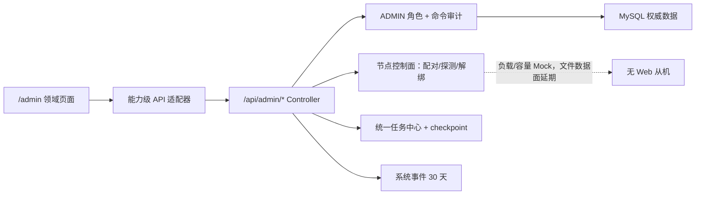

# 管理后台真实 API 接入与节点控制面方案

## 1. 背景与目标

在 REQ-20260913-001 前端原型之后，将代码中已有管理员能力接入管理页，补建用户确认的全站文件/任务治理、系统事件、日指标和节点绑定控制面，同时保留未设计好的存储策略与跨节点数据面边界。

## 2. 用户、场景与业务价值

ADMIN 需要可靠地查看全站状态并执行有后端依据的操作；受限功能应准确标为未接入。真实绑定从机是后续多存储方案的控制面准备，不代表当前已可跨机存取文件。

## 3. 范围与非目标

范围见 REQ-20260913-002。本轮覆盖现有管理员 API、全站文件/任务、持久 checkpoint/人工续跑、系统事件、MySQL 日指标与节点绑定。延期：存储策略 CRUD/实体路由/迁移、真实跨机读写/维护调度、Token 计量，以及分享治理/订单/举报/OAuth 新后端能力。已有设置页中无对应键的表单保持不可保存。

## 4. 验收标准

以 REQ-20260913-002 的八项验收为主；每个页面必须清楚区分 `api`、`mock`、`unavailable` 来源，服务器失败不得回落成“0 条数据”或内存成功，危险命令须在服务端校验权限并记审计。节点的真实绑定与 Mock 遥测必须分区展示。

## 5. 现状、诊断与证据

| 已证实事实 | 证据 | 影响 |
|---|---|---|
| 前端 `AdminDataSource` 只接受 `mode: mock`，通用集合页写死“演示成功”和泛化增删改 | `cloud-frontend/src/features/admin/core/AdminDataSource.tsx`、`components/AdminCollectionPage.tsx` | 需要能力级适配，不能替换一个 URL 即完成接入 |
| 后端已有设置、用户/组/配额、搜索、备份、维护、审计 API | `cloud-server/src/main/java/com/ylcloud/controller/Admin*Controller.java` 等 | 保留并复用，按 DTO 映射 |
| `AdminResourceAccessController` 除 ADMIN 角色外仍要求跨用户资源授权 | 同名 Controller 第 35–45 行 | 本方案显式修改管理员例外路径；普通用户路径不变 |
| `/api/async` 只查当前用户；任务表无归档字段；`checkpoint()` 只检查取消/续租，人工重试仅支持 FAILED | `AsyncTaskController.java`、`V35__unified_async_task_center.sql`、`TaskExecutionContext.java`、`UnifiedTaskCenterService.java` | 全站查询/归档/可恢复检查点要新模型与 API |
| `user_file`、`space_file` 与 `file_info` 在 MySQL 中分离，物理实体可能被多个引用共享 | `V0_1__core_file_and_user_schema.sql`、`V1__space_and_rag.sql` | 管理员删除必须定位引用，不按 Blob 行直接硬删 |
| 当前 MinIO 客户端绑定单个默认 Bucket，无节点注册表 | `MinioclientUtil.java`、`application.yml`、迁移目录 | 本轮不宣称多存储数据面 |
| 安全审计已有专表，知识流水线事件只覆盖单一领域 | `V49__unified_security_audit.sql`、`V8__space_knowledge_pipeline_observability.sql` | 新增通用系统事件，不覆盖审计 |

以上均为静态代码核查；运行环境是否已应用全部迁移、真实服务连通与现存数据规模待实现阶段验证，不把静态事实写成运行验收结果。

## 6. 约束、假设与未决事项

- 继续使用 Spring Boot/MyBatis/MySQL、现有前端请求封装及路由；不要求新增第三方库。
- 用 `Asia/Shanghai` 作为本阶段管理报表的展示/日桶时区，并在 API 响应中回传时区；如部署配置不同，提供配置项并在测试记录标明。
- 节点绑定真实；连通性可真实检测；负载、容量及跨机文件能力 Mock。节点端是无 Web UI 的同版本应用，内部通信须双向鉴权、限定可访问地址；不开放任意 URL 探测。
- 存储策略数据面和 Token 统计延期，用户已接受；本轮没有因此阻断的未决事项。

## 7. 合理候选方案对比

| 固定评价优先级 | 泛化一套 Admin CRUD/立即全域实装 | 逐域契约适配、节点先控制面（用户选定） | 全部继续 Mock |
|---|---|---|---|
| 1 需求/业务价值 | 看似覆盖广，字段语义不匹配 | 真实能力逐项上线、延期边界清楚 | 无真实治理 |
| 2 安全合规 | 易把用户 API 当全站 API | 每域定义服务端权限/审计；ADMIN 全站风险显式接受 | 无真实写风险但持续误导 |
| 3 正确性 | 泛化命令无法覆盖引用/任务状态 | 引用删除、任务续跑、事件幂等各自验证 | 无真实结果 |
| 4 可维护性 | 领域规则藏于通用分支 | 页面共享骨架、领域适配器分离 | 接入延期积累债务 |
| 5 复杂度/周期 | 初期快，返工高 | 分任务渐进交付 | 低但未达目标 |
| 6 性能扩展 | 客户端全量过滤风险 | 服务端分页/日聚合/索引 | 不适用 |
| 7 成本 | 隐性修复成本高 | 需要新增迁移与测试 | 眼前最低 |
| 8 团队适配 | 不符合现有强领域服务 | 沿用现有 Controller/Service/Mapper | 与已完成前端阶段一致但不满足新需求 |
| 9 供应商锁定 | 无新增，但内部通用框架强耦合 | 无新外部依赖，节点协议可版本化 | 无新增 |

节点另有“立即真实多存储路由”路线，因存储策略选址、版本、迁移均被明确延期而不属于本轮可行范围；绑定控制面与全 Mock 路线的取舍已由用户确认。

## 8. 用户选择与架构决策

采用逐领域适配：旧 API 尽量复用，新管理 API 独立命名空间；节点仅真实绑定/测试，其他遥测明确 Mock。ADMIN 免逐资源授权是用户明确选择，但仅针对管理 API，不能删除普通用户操作的资源校验。文件删除按具体 `user_file`/`space_file` 引用走各自生命周期，不直接删 `file_info`。归档用独立标志而不复用执行状态；续跑要有处理器声明和持久 checkpoint。

## 9. 系统边界、职责与关键流程

- 查询：服务端分页和筛选；UI 对错误显示错误，不转换成空结果。客户端不拼造没有后端来源的全站数值。
- 文件解除引用：先查 MySQL 引用和当前状态、检查权限/影响范围、二次确认、按个人或 Space 既有生命周期变更；最后引用清理才由现有异步物理清理处理。
- 节点绑定：管理员输入端点/一次性配对信息，后端限制目标地址并挑战认证、核对协议/版本与唯一节点 ID；成功后持久化绑定。定时探测只报告真实连通性；性能和容量单独标 Mock。解绑只更新绑定状态，不清理文件元数据或对象。
- 任务暂停/续跑：状态请求 → 处理器在安全边界持久化步骤与幂等标识 → 释放执行租约并标 PAUSED → 节点恢复且人工确认 → 以新 attempt 从 checkpoint 续跑。不可安全暂停的处理器不得强杀后宣称可恢复。

## 10. 接口、数据模型与状态设计

接口为建议契约，实施时须对现有 DTO、分页封装和路由冲突做契约测试：

| 域 | 现有/新增接口 | 模型与状态 |
|---|---|---|
| 设置/维护 | 复用 `GET/PUT /api/admin/settings`、`GET/POST /api/admin/maintenance/*` | 只映射真实 setting key；危险开关确认 |
| 用户/权限 | 复用 `/api/admin/users`、`/api/admin/permission-groups`、`/api/admin/quota/groups/{id}` | 角色/状态与归组/覆盖权限分 DTO；不使用通用 patch |
| 搜索/备份/审计 | 复用 `/api/admin/search/files`、`/api/admin/backup/*`、`/api/admin/audit/*` | 仅支持真实查询条件及动作；备份恢复验证 POST 必须提交隔离恢复证据，可能将备份发布为 READY，不能等同于“执行恢复”；脚本专用 `/backup/record` 不做 UI 按钮 |
| 全站文件 | 新增 `GET /api/admin/files?scope=PERSONAL|SPACE...`、`GET /api/admin/files/{scope}/{referenceId}`、`GET /api/admin/files/{scope}/{referenceId}/preview|download`、`POST /api/admin/files/{scope}/{referenceId}/release` | 返回 scope、owner、referenceId、fileUuid、fileInfo 摘要、状态/时间；流读取也须先查 MySQL 引用；不凭模糊 UUID 删除；既有跨用户管理员读取端点同步改为仅 ADMIN 校验 |
| 全站任务 | 新增 `GET /api/admin/tasks`、`GET /api/admin/tasks/{id}`、`POST /api/admin/tasks/{id}/retry|cancel|archive|resume` | `archived_at` 独立于执行状态；pause/checkpoint 状态与 attemptVersion 做 CAS；操作可用性由服务端返回 |
| 系统事件 | 新增 `GET /api/admin/events`、`GET /api/admin/events/{id}` | `system_event` 含 eventKey、category、action、outcome、actor/target、摘要、时间；30 天清理 |
| 首页 | 新增 `GET /api/admin/dashboard/daily?from&to` | 返回引用数、Blob 数、新用户、新 Space 的日桶和时区；Token 返回 unavailable 而非 0 |
| 节点 | 新增 `POST /api/admin/nodes/probe`、`POST /api/admin/nodes/bind`、`GET /api/admin/nodes`、`POST /api/admin/nodes/{id}/recheck`、`POST /api/admin/nodes/{id}/unbind` | `admin_node` 存稳定 nodeId、端点、协议/版本、绑定状态、最近探测与行版本；密钥不回显；遥测 mock 单独标记 |

数据库迁移需新增 `admin_node`、`system_event`、`async_task_checkpoint` 与任务 `archived_at`/暂停状态，并为个人/Space 文件引用及指标时间字段加适用索引。不得修改旧迁移；迁移编号以实施时仓库最新版本为准。

## 11. 异常、幂等、降级与恢复

- 管理命令用 idempotency key 或 `row_version`/attemptVersion 防重复；查询超时、权限拒绝、资源已变更与真实空列表分别呈现。
- 节点探测失败不创建成功绑定；已绑定节点离线标不可达但不删元数据。解绑可审计且允许同一节点重新绑定，绝不自动重新指向其他存储。
- 文件引用删除发生并发共享、回收站或版本任务时按既有领域服务判冲突，禁止直接 SQL 删除；对象清理失败由现有补偿/异步清理流程处理。
- 任务 checkpoint 提交与状态切换保持同事务或有可恢复幂等日志；恢复必须检查节点状态、处理器能力、checkpoint 版本与资源版本。不能安全恢复时返回冲突并保留 PAUSED。
- 系统事件落库失败不能伪称记录成功；关键安全审计沿用现有高可靠路径，事件写入故障按业务重要度决定阻断/降级并记录告警。30 天清理按时间批量、可重入。

## 12. 安全、隐私与合规

- 用户明确接受 ADMIN 免逐资源授权后的全站可见性风险：一名被盗 ADMIN 可浏览全站个人/Space 元数据及允许的文件内容；仅管理端新增/修改的 API 生效，保留 `requireAdmin()`、危险命令二次确认、不可关闭的审计、最小字段返回和速率限制。
- 节点配对使用短期一次性凭据、双向身份校验、协议/版本核对、TLS 与配置化目的地址限制；禁止把任意 URL 探测作为 SSRF 通道。密钥只存安全引用/密文，不回显、不写审计明文。
- 事件仅存脱敏结构化摘要；不存 JWT、密码、API Key、文件体、请求体原文；下载流成功以传输完成判定，不以请求开始判定。
- 不放宽普通用户 `/api/file`、`/api/async` 与 Space 的权限服务。ADMIN 可以执行但不能绕过文件引用计数、任务状态禁令或删除补偿。

## 13. 性能、容量、可靠性与可观测性

- 文件/任务/事件列表强制服务端分页、上限与稳定排序，避免管理页一次拉全库。条件索引按 EXPLAIN 和现有数据量确定。
- 首页按日聚合只扫必要列与时间索引，响应带生成时间/时区，延迟时展示过期标识；不得把接口异常渲染为 0。
- 节点周期探测设置超时、并发限额和退避，不读取 Mock 指标作为告警输入。事件落库监控失败/延迟/清理量。
- 归档不物理删除；归档记录需从现有终态 TTL 物理清理中排除，并监控累积容量。后续如需归档保留期/物理清除，另行审批设计。

## 14. 兼容、迁移、发布与回滚

1. 先添加兼容迁移与新 API，旧普通用户接口保持不变；再按领域接前端，最后切换默认数据源并移除真实页面上的“演示保存”措辞。
2. 权限扩大只在明确的管理员接口上线，发布前在测试库做普通用户/ADMIN/失效会话矩阵与审计验证；正式库先备份，按已批准的发布流程执行。
3. 新表/列采用可回滚的扩展式迁移；前端回滚可恢复旧原型，但不能用删除迁移或生产数据的方式回滚。节点解绑不删除实体，重绑同 nodeId 可恢复控制关系。
4. 存储策略与 Token 计量延期，保留独立后续决策入口，不将本轮节点主张为可用多存储。

## 15. 原子任务与依赖

| ID | 任务 | 前置 |
|---|---|---|
| TASK-20260913-009 | [[10-规划与实施/任务/TASK-20260913-009-管理页能力级数据源]] | 无 |
| TASK-20260913-010 | [[10-规划与实施/任务/TASK-20260913-010-设置维护真实接入]] | 009 |
| TASK-20260913-011 | [[10-规划与实施/任务/TASK-20260913-011-用户管理真实接入]] | 009 |
| TASK-20260913-012 | [[10-规划与实施/任务/TASK-20260913-012-权限组与配额真实接入]] | 009 |
| TASK-20260913-013 | [[10-规划与实施/任务/TASK-20260913-013-全文搜索真实接入]] | 009 |
| TASK-20260913-014 | [[10-规划与实施/任务/TASK-20260913-014-备份真实接入]] | 009 |
| TASK-20260913-015 | [[10-规划与实施/任务/TASK-20260913-015-安全审计真实接入]] | 009 |
| TASK-20260913-016 | [[10-规划与实施/任务/TASK-20260913-016-全站文件引用治理]] | 009 |
| TASK-20260913-017 | [[10-规划与实施/任务/TASK-20260913-017-全站任务查询命令与归档]] | 009 |
| TASK-20260913-018 | [[10-规划与实施/任务/TASK-20260913-018-任务持久检查点与人工续跑]] | 017 |
| TASK-20260913-019 | [[10-规划与实施/任务/TASK-20260913-019-系统事件采集与查询]] | 009 |
| TASK-20260913-020 | [[10-规划与实施/任务/TASK-20260913-020-管理首页按日指标]] | 009 |
| TASK-20260913-021 | [[10-规划与实施/任务/TASK-20260913-021-节点配对控制面]] | 009 |
| TASK-20260913-022 | [[10-规划与实施/任务/TASK-20260913-022-节点页面真实绑定与Mock边界]] | 021 |
| TASK-20260913-023 | [[10-规划与实施/任务/TASK-20260913-023-管理后台集成发布验收]] | 010–022 |

各任务文档写明输入、产物、非目标、验收、测试、失败与回滚，并链接同一测试要求。领域任务可并行，但不得跳过 009 的来源/能力区分。

## 16. 每项功能测试范围与标准

详见 TASK-20260913-009 至 023 及其下游 TEST-20260913-002。必须包含单元、回归、异常/边界、安全；本次跨模块 API/DB/前端还必须执行集成与关键 E2E。节点测试使用受控无 Web 测试从机，不把 Mock 遥测当作连通证明。文件共享引用、任务重复续跑、事件成功/失败/清理和按日口径设专项门禁。

## 17. 实现 Agent 的测试文档要求

每项功能由实现 Agent 生成完整测试用例、执行结果与独立记录，至少包含目标、内容、前置条件、测试数据、步骤、预期、实际、通过标准、日志/截图证据和缺陷。实现未验证只到 `pending-verification`；全部必测通过且验收满足才改 `completed`，并回写 REQ/ADR/任务/导航。

## 18. 风险接受与后续观察

| 风险/决定 | 处理与观察 |
|---|---|
| ADMIN 免逐资源授权，隐私暴露与账号失陷影响扩大（2026-09-13 用户明确接受） | 只限管理员 API；审计、会话保护、敏感确认、最小结果和越权测试；上线后监测异常批量访问 |
| 节点解绑使依赖其存储的文件不可达但不丢元数据（用户确认） | UI 明确“不可达”；不删实体；重绑/恢复路径在后续存储策略方案中设计 |
| 节点当前绑定真实但指标/跨机数据 Mock（用户确认） | 页面字段级来源标记；不可把 Mock 用于实际调度或健康告警 |
| 持久 checkpoint 需逐处理器适配，不能全局强制中断 | 每处理器声明能力；不支持者拒绝暂停/恢复并显示理由，保持任务可追踪 |
| 存储策略和 Token 统计延期（用户确认） | 独立需求再规划；不得为本轮做不可逆文件迁移 |

## 19. 官方资料来源与核验日期

当前方案不引入/升级依赖，也不对尚未选定的 Cloudflare 存储数据面作兼容承诺，故无需要据此确定版本的外部资料。Cloudflare R2 S3 接口/兼容性官方资料在 2026-09-13 仅供后续存储策略设计参考：<https://developers.cloudflare.com/r2/get-started/s3/>、<https://developers.cloudflare.com/r2/api/s3/api/>。本轮事实依据为本仓库 Controller、服务、前端管理页、Flyway 迁移与 REQ-20260913-001/ADR-20260913-001；实现时若新增依赖或确定节点协议，须重新核验官方文档。
